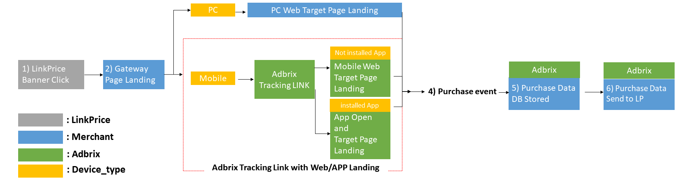
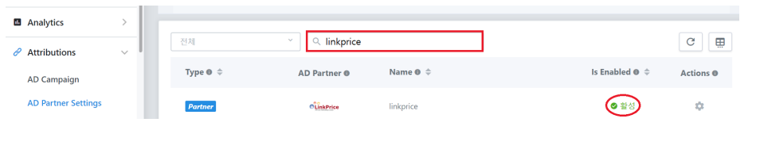

# Adbrix Setup

```
CAUTION)
LinkPrice no supports the original version of Adbrix. 
Supports only the remastered version of the adbricks.
If you are already using the original version of Adbricks, please contact the Link Price.
```



1. Click on the linkPrice banner
2. Deliver the value required for generating LPINFO value (cookie) and the URL of the target page to the advertiser gateway page at the link price
3. Go to the web or app purpose page according to the device_type.
    - Your PC will go to the PC Web Target page.
    - On mobile, go to the Adbrix tracking link, and the mobile web or app will open depending on whether the app is installed or not.
4. Product purchase event occurs
5. When an purchase event occurs, Adbrix the purchase data to the linkPrice performance transfer URL and keeps the performance data internally for cross-contrast.

# Adbrix Setting

- Please refer to the guide depending on the version of the adbrix you use (original version, remaster version).
- Set up according to the guide provided by Adbrix, and Please let the person in charge know after issuing the tracking link.
- There are two ways to deliver real-time performance using Adbrix, and recommended to proceed by sending purchase data directly through Adbrix.
- [Learn the order of settings for measuring advertising performance](https://help.dfinery.io/hc/en-us/articles/360008180254-Step-by-Step-Guide-for-Your-Ad-Tracking)

## AD Landing Settings

Refer to [AD Landing Settings](https://help.dfinery.io/hc/en-us/articles/360003394433-How-to-Set-All-Link-AD-Landing-) and set the default location where users who are introduced through advertisements will land.

Please set the app to allow the use of Deep Link, which is also landing on the specified page.

([AD campain and How to Use It](https://help.dfinery.io/hc/en-us/articles/360024465693-The-Concept-of-AD-Campaign-and-How-to-Use-It))

Please let me know if it is impossible to set up a deep link.

> **What is Deep Link?** When you create an ad address to a media company, don't go to Merchant Home
> You can also create a banner with the details page of the specific product you want to promote.
> These links are called deep links, and the url on the specific product details page is called target url.

## Tracking Link Generating

To measure advertising performance, the Advertising Tracking Link must be applied when landing an advertisement.
Please refer to the tracking link and proceed with the issuance and inform the person in charge of the link price of the tracking link.

Please according to All-Link provided by Adbricks guide ([AD campain and How to Use It](https://help.dfinery.io/hc/en-us/articles/360024465693-The-Concept-of-AD-Campaign-and-How-to-Use-It))

> - Not installed APP User → Web page Landing
> - Installed APP User → deeplink Landing (App open and target page landing)

In the generated ad-brix tracking link, you can send the following values for each parameter

> - cb_1 : lpinfo value
> - cb_2 : merchant_id
> - deeplink_custom_path : IF Installed an app, the details page in the app that you want to go through the app opening
> - m_adtouch_custom_url : URL of the web page to which the app's uninstalled person will land

## AD Partner Settings 

Attribution > AD Partner Settings > Partner name is “linkprice”.

