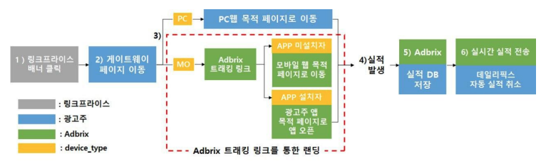

# Adbrix 셋업 개요

1. 링크프라이스 배너 클릭 
2. 링크프라이스에서 광고주 게이트웨이 페이지에 LPINFO (쿠키)생성에 필요한 값과 목적페이지 URL 전달 
3. device_type에 따라 웹 또는 앱 목적페이지로 이동합니다. 
   - PC는 바로 PC웹 목적 페이지로 이동합니다. 
   - 모바일에서는 Adbrix트래킹 링크로 이동하며, 앱 설치 유무에 따라 모바일 웹 또는 앱이 오픈 됩니다. 
4. 상품 구매 이벤트 발생 
5. 이벤트 발생시 Adbrix에서 링크프라이스 실적 전송 URL에 구매 데이터를 전달하며, 상호 대조를 위해 내부적으로 실적 데이터를 보관합니다.

# Adbrix 설정

- 사용하는 애드브릭스 버전(오리지널 버전, 리마스터 버전)에 따라 가이드를 참고해주세요.
- 애드브릭스에서 제공하는 가이드에 따라 설정을 진행하며, Tracking Link 발급 후 링크프라이스 담당자에게 알려주세요.
- Adbrix를 이용하여 실시간 실적 전송을 하는 방법에는 2가지가 있으며, 광고주가 직접 서버에서 전송하는 방법으로 진행할 것을 권장합니다.
- [광고 성과 측정을 위한 설정 순서 알아보기](https://help.dfinery.io/hc/ko/articles/360008180254--%EA%B4%91%EA%B3%A0%EC%84%B1%EA%B3%BC-%EC%B8%A1%EC%A0%95%EC%9D%84-%EC%9C%84%ED%95%9C-%EC%84%A4%EC%A0%95-%EC%88%9C%EC%84%9C-%EC%95%8C%EC%95%84%EB%B3%B4%EA%B8%B0)

## AD Landing Settings

[AD Landing Settings 설정하기](https://help.adbrix.io/hc/ko/articles/360003394433)를 참고하여 광고를 통해 유입된 이용자가 랜딩되는 기본 위치를 설정 합니다.

앱에서도 지정된 페이지로 랜딩되는 딥링크(Deep Link) 사용이 가능하도록 설정해주세요. 
   
([옵션 설정과 발급 참고](https://help.dfinery.io/hc/ko/articles/360024465693-AD-Campaign-%EC%83%9D%EC%84%B1%EA%B3%BC-Tracking-Link-%EB%B0%9C%EA%B8%89#toc7))딥링크 설정이 불가능한 경우 링크프라이스 담당자에게 알려주세요.

> 딥링크(Deep Link)란? 매체사에 광고 주소 생성시에 머천트 홈으로 가지 않고
> 홍보하려는 특정 상품의 상세 페이지로 배너를 생성 할 수도 있습니다. 
> 이러한 링크를 딥링크라고 하며, 이 때의 특정 상품 상세 페이지의 url을 target url 이라고 합니다.

## Tracking Link 발급

광고성과 측정을 위해서는 광고 랜딩시에 애드브릭스 Tracking Link가 반드시 적용되어야 합니다. 
Tracking Link를 참고하여 발급을 진행하고 발급받은 Tracking Link는 링크프라이스 담당자에게 알려 주세요. 

애드브릭스에서 제공하는 All-Link 기능중 [# 앱 미설치 이용자를 웹 페이지로 랜딩](https://help.dfinery.io/hc/ko/articles/360024465693-AD-Campaign-%EA%B0%9C%EB%85%90%EA%B3%BC-%EC%84%A4%EC%A0%95-%EB%B0%A9%EB%B2%95#toc15)에 따라 진행할 것을 권장 합니다.

해당 방법으로 진행이 불가능한 경우 링크프라이스 담당자에게 알려주세요. 

> - 앱 미설치 이용자 → 웹(Web) 페이지 랜딩
> - 앱 설치 이용자 → 딥링크 랜딩 (앱이 실행되며 특정 페이지로 이동)

생성된 애드브릭스 트래킹 링크에서 파라미터는 각각 아래 값이 전달되도록 해주시면 됩니다.
   
> - cb_1 : lpinfo값 
> - cb_2 : merchant_id 
> - deeplink_custom_path : 앱이 있을 때, 앱 오픈을 통해서 이동하고자하는 앱 내 상세 페이지 
> - m_adtouch_custom_url : 앱 미설치자가 랜딩될 웹 페이지 주소

## 광고 파트너 선택

   Attribution > AD Partner Settings > 파트너명은 “linkprice” 입니다.
   
