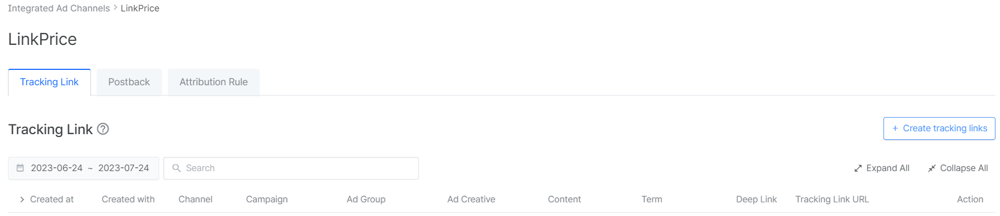
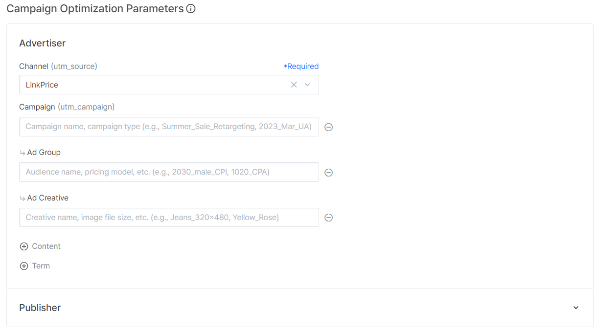
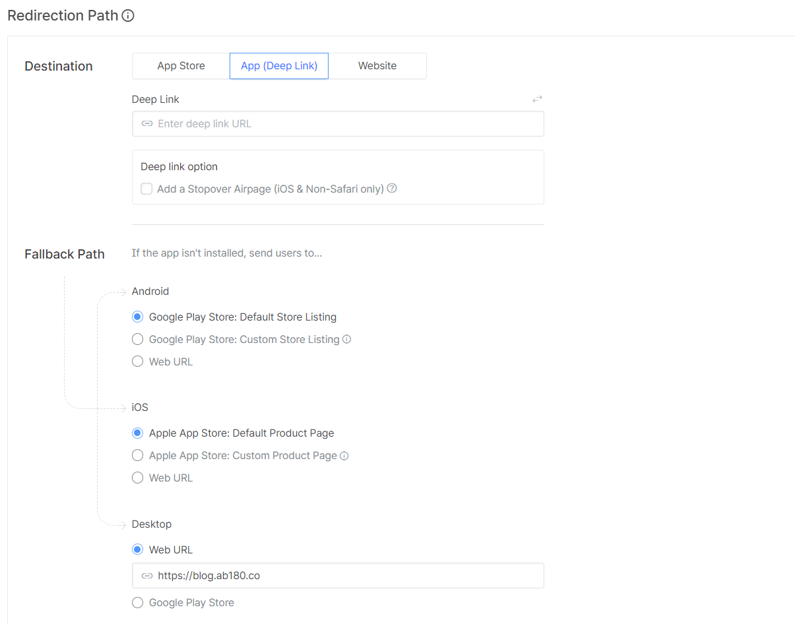
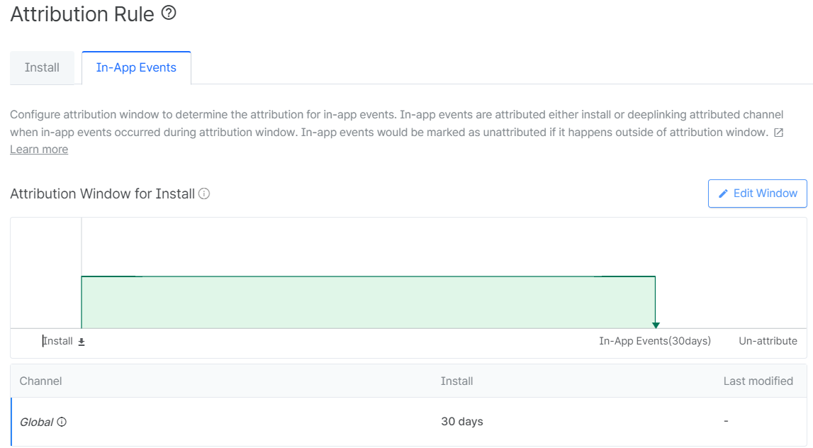
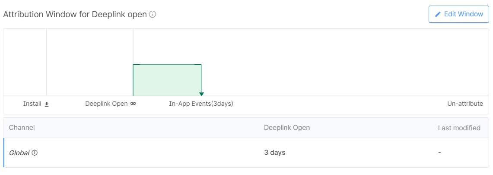
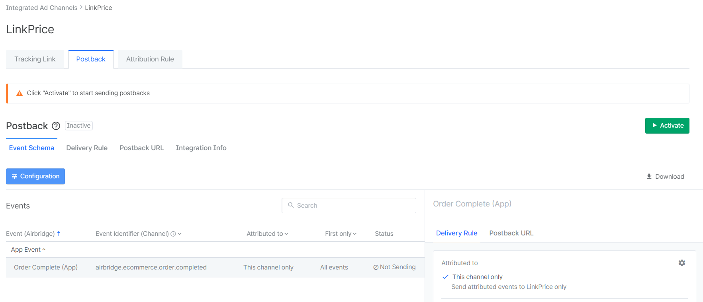
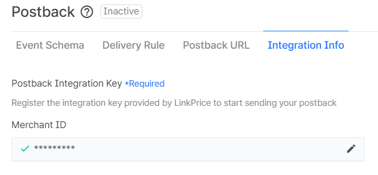
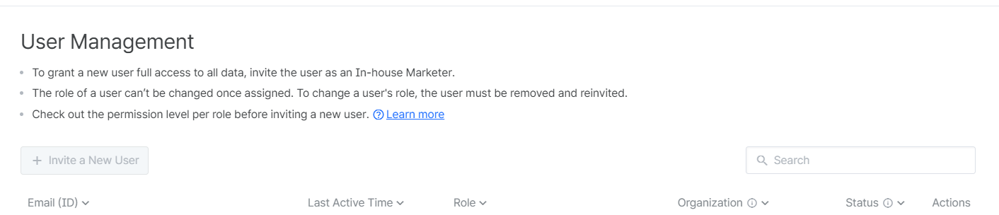

# Integration Airbridge APP 

Use Airbridge, a third-party tool, to measure performance in mobile apps.

LinkPrice is currently registered as an advertising channel on Airbridge.

> Viewable integrated advertising channels

## Integration Process
Through Airbridge, it is possible to introduce apps and transfer performance through our LinkPrice link.

1. Create an air bridge tracking link through the linkPrice advertising channel.

2. When you click the tracking link button, the following screen appears.

3. Set the redirect path to `App (Deep Link)`

Example variables are as follows.

- click_id : LPINFO, which is the performance tracking value of the linkPrice.
  - LPINFO is a value for tracking linkPrice earnings.
- webUrl : Used for web URL of Fallback path.
- appUrl : Used for the internal URL of the App (Deeplink).

An example of a fallback path is as follows.

If an existing gateway page is working, apply the click_id value for LPINFO and the value for url to the gateway page in the Fallback URL.

- Examples of iOS, Android, and Desktop Paths
  - `https://gatewaypage.co.kr/linkprice?lpinfo={click_id}&url={webUrl}`

- appUrl
  - Value for applying the in-app deep link.
  - If you tell me about url in the app in detail, I will apply it to the affiliate link.

## Attribution Rule 

In the case of Airbridge, both installation events and deep link open events are tracked.

Please modify the attribute window for the installation to set the contribution period for the 'Link Price' ** channel to 0 days**.

Please set the attribute window for deep link opening as **Ad effect recognition period** discussed with 'Link Price'.

## After Integration

After linking the air bridge, when the performance occurs, the performance is transmitted to the link price by post-back method.

1. Proceed to set up the postback event schema.

2. Set the postback interlock key in the interlocking information.

Please contact the person in charge for the Merchant ID corresponding to the postback Integration key and we will forward it to you.

3. Please inform the person in charge of the postback event 'Active'.

### Invitation

[Setting] - [User Management] invite a representative to your agency and we'll help you set it up.