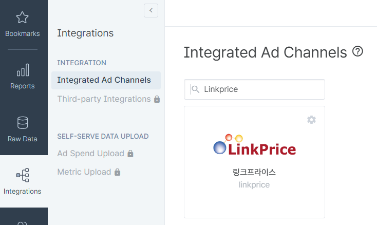
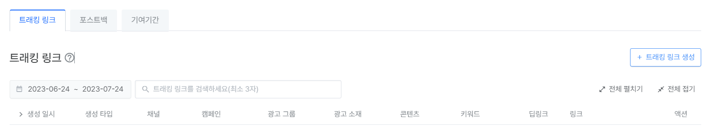
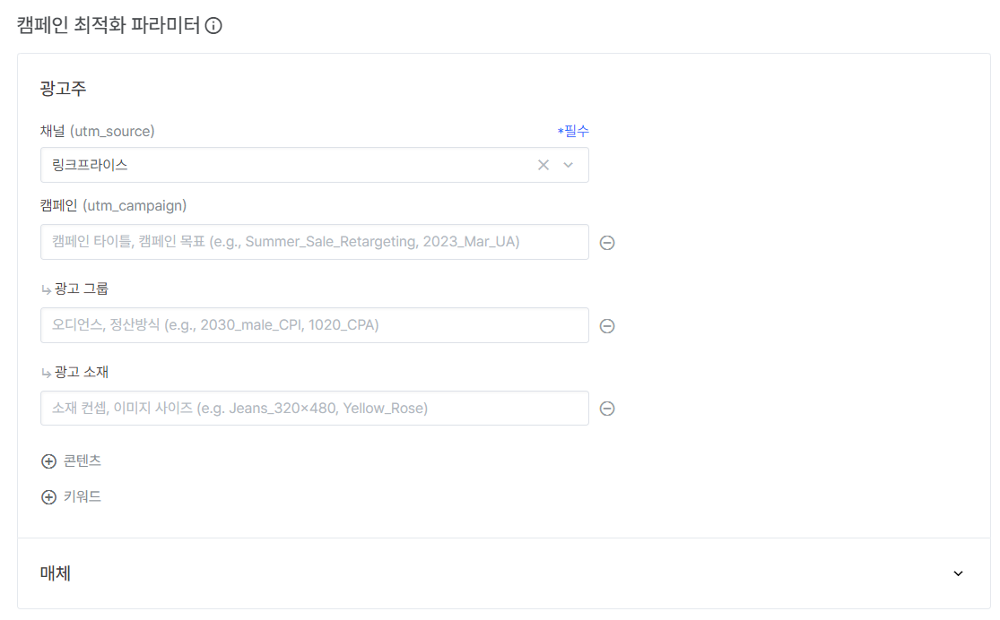
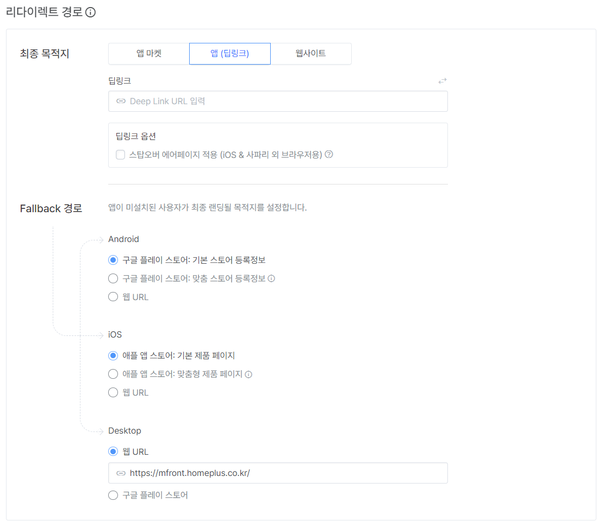
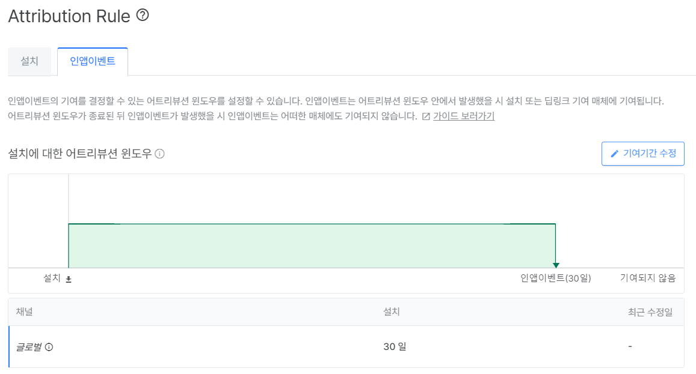
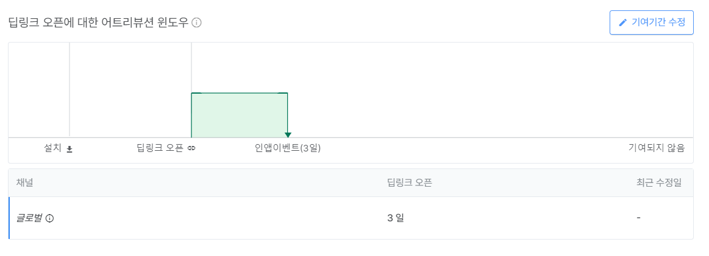
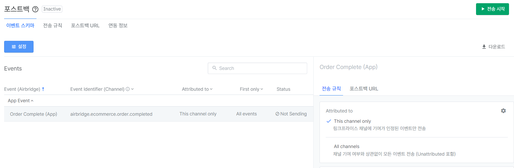
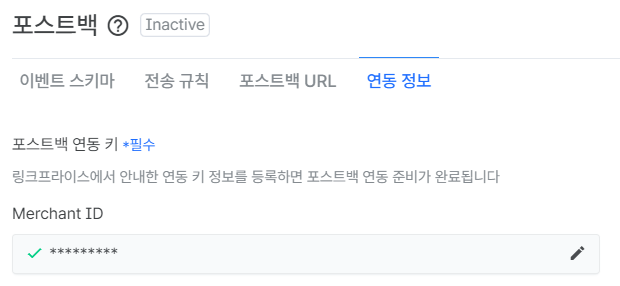
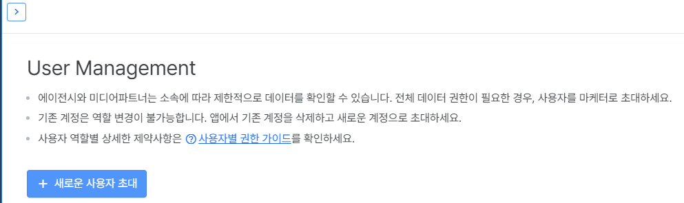

# 에어브릿지 (Airbridge) APP 셋업

3자툴인 에어브릿지(Airbridge)를 활용하여 모바일 앱에서 실적 측정을 할 수 있습니다.

링크프라이스는 현재 에어브릿지에서 광고 채널로 등록이 되어있습니다.

> 확인 가능한 통합 광고 채널

## 연동 과정
에어브릿지를 통해 저희 링크프라이스 제휴링크를 통한 앱 유입과 실적 전송이 가능합니다.

1. 링크프라이스 광고채널을 통해 에어브릿지 트래킹 링크를 생성합니다.

2. 트래킹 링크 버튼 클릭시 다음과 같은 화면이 나옵니다.

3. 리다이렉트 경로를 `앱 (딥링크)` 로 설정합니다.

예시 커스텀 변수는 다음과 같습니다.

- click_id : 링크프라이스의 실적 추적값인 LPINFO를 변수값을 가지고 있습니다.
  - LPINFO는 링크프라이스 실적 추적을 위한 값입니다.
- webUrl : Fallback 경로의 웹 URL에 사용합니다.
- appUrl : 앱 (딥링크)의 내부 URL에 사용합니다.

Fallback 경로의 예시는 다음과 같습니다. 

기존 게이트웨이 페이지가 작업되어 있는 경우, Fallback URL에 게이트웨이 페이지에 LPINFO에 해당하는 click_id 값과 url에 해당하는 값을 적용합니다.

- iOS, Andorid, Desktop 경로 예시
`https://gatewaypage.co.kr/linkprice?lpinfo={click_id}&url={webUrl}`

- appUrl
  - 앱 내 딥링크를 적용하기 위한 값입니다.
  - 앱 내 url에 대해서 상세히 알려주시면 제휴 링크에 적용하겠습니다.

## Attribution Rule 수정

에어브릿지의 경우 설치 이벤트와 딥링크 오픈 이벤트 모두 이벤트 추적을 하고 있습니다.

설치에 대한 어트리뷰션 윈도우를 수정하여 `링크프라이스` **채널에 대한 기여 기간을 0일**로 설정해주시기 바랍니다.

딥링크 오픈에 대한 어트리뷰션 윈도우는 `링크프라이스`와 협의된 **광고 효과 인정기간**으로 설정해주시기 바랍니다.

## 연동 이후

에어브릿지 연동 후 실적 발생 시 포스트백 방식으로 링크프라이스에 실적 전송을 하고 있습니다.

1. 포스트백 이벤트 스키마 설정을 진행합니다.

2. 연동 정보에서 포스트백 연동 키를 설정합니다.

포스트백 연동키에 해당하는 Merchant ID는 담당자에게 문의해주시면 전달해드리겠습니다.

3. 포스트백 이벤트 `전송 시작`을 하기전 담당자에게 알려주시기 바랍니다.

### 담당자 초대

[Setting] - [User Management] 에서 담당자를 대행사로 초대 주시면 설정 확인을 도와드리겠습니다.
