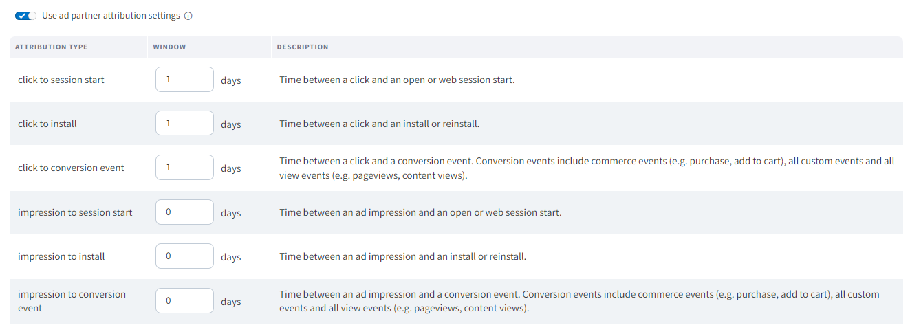

# Branch APP setup

You can take measurements in your mobile app by leveraging a third-party tool called branch.

LinkPrice is currently registered as a network company in Branch, and advertiser(merchants) are requested to register Link Price linked with Branch.

## interlocking process
Through the branch, app inflow and performance transmission are possible through our LinkPrice affiliate link.

#### 1. Please pass the branch ID and password that can be checked after LinkPrice interlocking registration is completed to the branch.

#### 2. Please register ios, android, default Redirects url in the branch.

> Redirects URL registration example

#### 3. Please create and pass a tracking link including custom variables.
-  Example tracking link custom variable
  > - click_id = advertiser(Merchant) id (Fixed inside the link price advertiser(Merchant) id)
  > - targetUrl = Want to laending advertiser(Merchant) page url
  > - customer_ad_name = lpinfo 
- Example tracking link 
  - https://app.app.link/?click_id=linkprice&targetUrl=https://linkprice.com&customer_ad_name=A100000131|280111287pfJhj|0000|B|1

* The variable can be customized after consultation with Link Price, advertiser(Merchant), branch.

#### 4. In ATTRIBUTION WINDOWS, the advertiser (merchant) can set the desired advertising effect recognition period.
   > An example of advertising effect recognition period of 1 day
   

#### 5. Check the performance postback call format sent to LinkPrice from the branch and make corrections.

#### 6. When all settings are completed in LinkPrice, advertiser(Merchant) and branch, the advertiser page landing and performance transmission test are conducted.  
