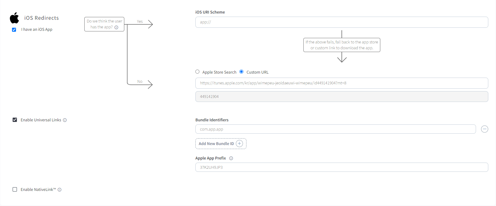

# 브랜치 (branch) APP 셋업

3자툴인 브랜치(branch)를 활용하여 모바일 앱에서 실적 측정을 할 수 있습니다.

링크프라이스는 현재 브랜치에 네트워크사로 등록되어 있습니다.

## 연동 과정
브랜치를 통해 저희 링크프라이스 제휴링크를 통한 앱 유입과 실적 전송이 가능합니다.

### 1. 브랜치에서 링크프라이스를 활성화 해주십시오.
> #### 1. 브랜치 대시보드 사이드바의 Ads -> Partner Management 에 접속 해주세요.
> #### 2. 광고 파트너 검색 창에 linkprice를 검색 해주세요.
> #### 3. linkprice 선택 후 저장 및 활성화를 눌러주세요.
> 

### 2. 브랜치에 ios, android, default Redirects url을 등록해 주십시오.

> Redirects url 등록 예시 

### 3. 커스텀 변수를 포함한 트래킹 링크를 생성하여 전달해주십시오.
-  예시 트래킹 링크 커스텀 변수
  > - click_id = 광고주(머천트) id (링크프라이스 내부 정해져있는 광고주(머천트) id)
  > - targetUrl = 랜딩 하고자 하는 광고주(머천트) 페이지 url
  > - customer_ad_name = lpinfo값 
- 예시 트래킹 링크  
  - https://app.app.link/?click_id=linkprice&targetUrl=https://linkprice.com&customer_ad_name=A100000131|280111287pfJhj|0000|B|1

* 해당 변수는 링크프라이스, 광고주(머천트), 브랜치 3사에서 협의하여 커스텀 가능합니다.

### 4. ATTRIBUTION WINDOWS는 광고주(머천트)에서 원하시는 원하시는 광고효과 인정기간을 설정해주시면 됩니다.
   > 광고효과 인정기간이 1일로 되어있는 예시
   

### 5. 브랜치에서 링크프라이스로 전송되는 실적 포스트백 호출 형식을 확인하여 수정 작업을 진행합니다.

### 6. 링크프라이스, 광고주(머천트), 브랜치 3사에서 모두 셋팅이 완료되면 광고주 페이지 랜딩, 실적 전송 테스트를 진행합니다.   
