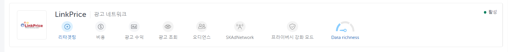
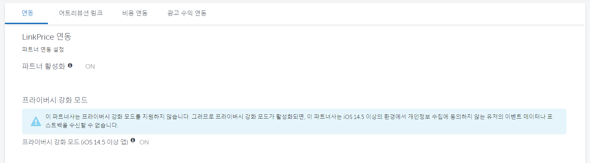
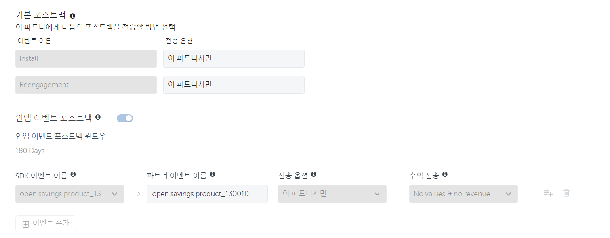
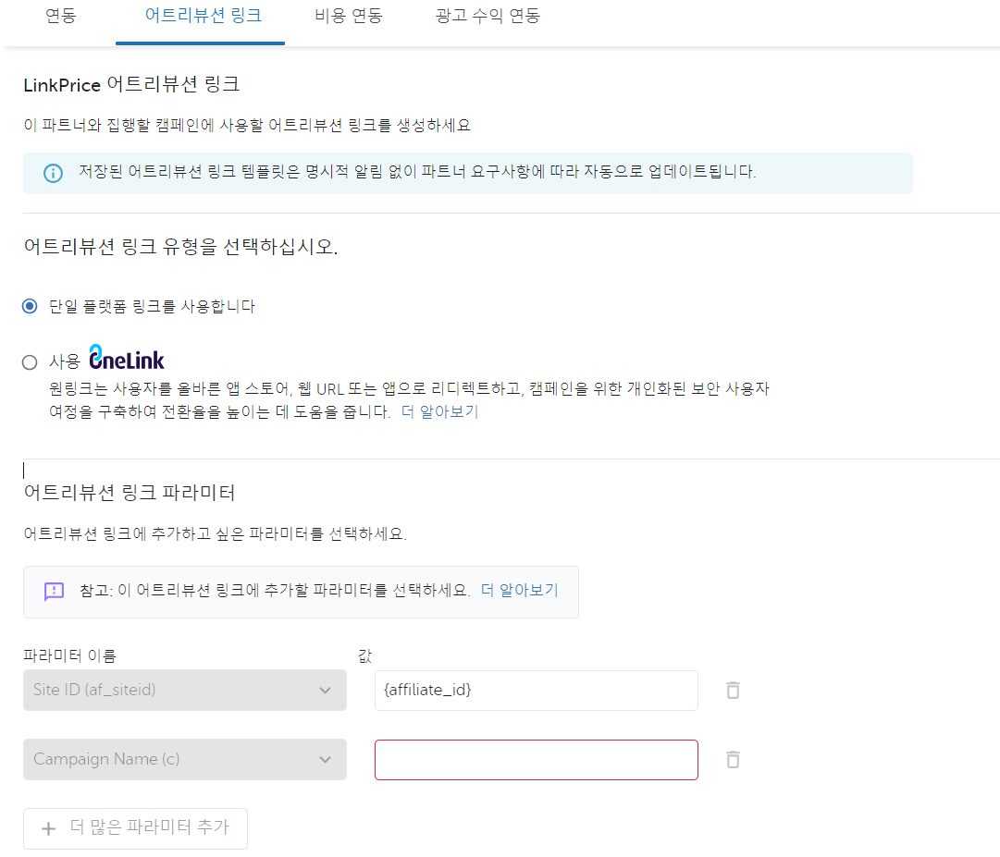
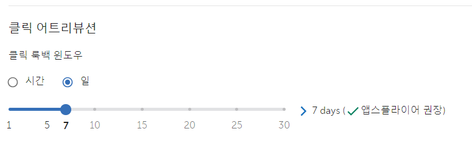

# 앱스플라이어 (Appsflyer) APP 파트너 연동

3자툴인 앱스플라이어(Appsflyer)를 활용하여 모바일 앱에서 실적 측정을 할 수 있습니다.

링크프라이스는 현재 앱스플라이어에서 파트너 채널로 등록이 되어있습니다.

## 연동 과정
앱스플라이어를 통해 저희 링크프라이스 제휴링크를 통한 앱 유입과 실적 전송이 가능합니다.

1. 파트너 활성화를 진행합니다.

2. 링크프라이스에게 전송할 포스트백 이벤트를 설정합니다.

3. 링크프라이스 어트리뷰션 링크를 설정합니다.

어트리뷰션 링크의 파라미터 이름 중 `Site ID(af_siteid)`는 링크프라이스 실적 추적을 위한 값으로 사용됩니다.

## 클릭 어트리뷰션

클릭 어트리뷰션은 링크프라이스와 협의된 `광고 효과 인정기간`을 적용해주시면 됩니다.

### 트래킹 링크 예시

* AOS : https://app.appsflyer.com/com.APP?af_prt=icomas&pid=linkprice_int&af_click_lookback=7d&c=n_lkprc&clickid={clickid}&af_siteid={affiliate_id}&advertising_id={advertising_id}

* IOS : https://app.appsflyer.com/idApp?af_prt=icomas&pid=linkprice_int&af_click_lookback=7d&c=n_lkprc&clickid={clickid}&af_siteid={affiliate_id}&idfa={idfa}

## 연동 이후

앱스플라이어 연동 후 실적 발생 시 설정해주신 포스트백 이벤트에 따라 링크프라이스에 포스트백으로 실적 전송을 하고 있습니다.

설정 후 iOS/AOS 트래킹 링크를 링크프라이스 담당자에게 전달해주시면 iOS/AOS 인입과 실적 전송을 확인하도록 하겠습니다.

