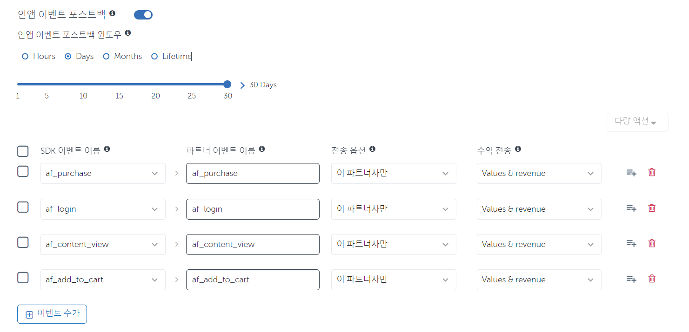

# 앱스플라이어 (Appsflyer) APP 파트너 연동

3자툴인 앱스플라이어(Appsflyer)를 활용하여 모바일 앱에서 실적 측정을 할 수 있습니다.

링크프라이스는 현재 앱스플라이어에서 파트너 채널로 등록이 되어있습니다.

## 연동 과정
앱스플라이어를 통해 저희 링크프라이스 제휴링크를 통한 앱 유입과 실적 전송이 가능합니다.

1. 파트너 활성화를 진행합니다.

### 인앱 이벤트 포스트백

2. 전송할 포스트백 이벤트를 설정합니다.

- 앱에 연동되어 있는 SDK 이벤트 이름으로 설정합니다. 
- 실적 추적을 할 이벤트를 설정합니다. 
- 파트너 이벤트 이름 설정 및 전송 옵션을 `이 파트너사만`으로 설정합니다.

`인앱 이벤트 포스트백 윈도우의 기간`은 링크프라이스와 협의된 `광고 효과 인정기간`으로 설정합니다.

사용자가 주문 완료 시, 아래에 URL에 실적 데이터를 포스트백 전송하도록 설정합니다.

> https://service.linkprice.com/reward/appsflyer.php

- 앱스플라이어 포스트백 이벤트의 `af_purchase`를 설정하였다면, 아래와 같은 값을 전송하도록 설정합니다.

| KEY      | VALUE                                                                                               |
|----------|-----------------------------------------------------------------------------------------------------|
| click_id | 링크프라이스 실적 추적에 필요한 값입니다.                                                                             |
| ua       | 유저에이전트 값입니다. AOS, iOS 디바이스 구분을 위해 사용합니다.                                                            |
| in_cnt   | 상품 수량                                                                                               |
| json     | 구매 정보의 값(`af_purchase`)에는 상품명, 금액, 통화 값 등이 있으며 실적에 필요한 값을 처리합니다.   예) af_revenue, af_currency 등 |

## 어트리뷰션 링크 설정

링크프라이스 어트리뷰션 링크를 설정합니다.

어트리뷰션 링크의 파라미터 이름 중 `Site ID(af_siteid)`는 링크프라이스 실적 추적을 위한 값으로 사용됩니다.

### 이벤트 권한 설정

파트너가 직접 포스트백을 비활성할 수 있습니다.

- 권한(Permission) 페이지에서 `인앱 이벤트 포스트백 설정(Allow to configure in-app event postbacks)` 토글을 ON으로 변경합니다.

파트너사에게 인앱 이벤트 포스트백을 설정하도록 허용할 수 있습니다.

포스트백 URL 설정시 담당자에게 연락주시면 설정을 도와드리겠습니다.

### 트래킹 링크 예시

* AOS : https://app.appsflyer.com/com.APP?af_prt=icomas&pid=linkprice_int&af_click_lookback=7d&c=n_lkprc&clickid={clickid}&af_siteid={affiliate_id}&advertising_id={advertising_id}

* IOS : https://app.appsflyer.com/idApp?af_prt=icomas&pid=linkprice_int&af_click_lookback=7d&c=n_lkprc&clickid={clickid}&af_siteid={affiliate_id}&idfa={idfa}

## 연동 이후

앱스플라이어 연동 후 실적 발생 시 설정해주신 포스트백 이벤트에 따라 링크프라이스에 포스트백으로 실적 전송을 하고 있습니다.

설정 후 iOS/AOS 트래킹 링크를 링크프라이스 담당자에게 전달해주시면 iOS/AOS 인입과 실적 전송을 확인하도록 하겠습니다.

### Reference
- [인앱 이벤트 포스트백 설정](https://support.appsflyer.com/hc/ko/articles/208439256)
- [광고주를 위한 포스트백 문제 해결](https://support.appsflyer.com/hc/ko/articles/14272573202833)
- [연동 파트너 설정](https://support.appsflyer.com/hc/ko/articles/4410395957521)