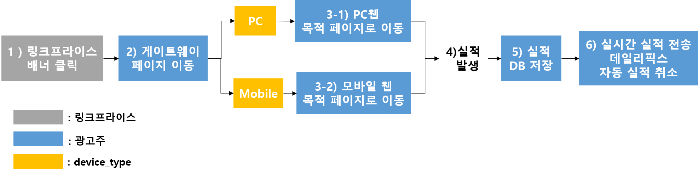

# ata android:host="gw.linkprice.com" android:sAPP Android 직접 셋업

## 1. 제휴 마케팅이란

> 제휴 마케팅이란 제품/ 서비스 등을 판매하는 인터넷 업체(Merchant)가 고객을 끌어들이고 진열, 판매하는 공간으로 자신의 사이트 뿐만 아니라 다른 관련 사이트(Affiliate)로 까지 공간을 확장하여 이때 발생하는 수입을 제휴맺은 사이트(Affiliate)와 공유하는 새로운 형태의 마케팅 기법입니다.
>
> [제휴 마케팅 소개](https://helpdesk.linkprice.com/pages/merchant-faq-introduce)


### 1.1. V2 웹 셋업 개요 



1) 링크프라이스 배너 클릭

2) 링크프라이스에서 광고주 게이트웨이 페이지에 LPINFO (쿠키)생성에 필요한 값과 목적페이지 URL 전달

3) device_type에 따라서 PC웹 또는 모바일웹 목적페이지로 이동

4) 상품구매 

5) 상호 대조를 위해 광고주 DB에 실적 데이터 보관

6) 링크프라이스로 구매 실적 전송, 데일리픽스 및 자동취소 정보 제공 

- V2버전은 클라이언트에서 스크립트 형식으로 보내는 실시간 실적 전송방식을 사용합니다. ([V2버전 웹 셋업 가이드](https://github.com/linkprice/MerchantSetup/blob/v2/Merchant%20Setup%20Guide_Kor_ver2.5.pdf) 참조)


### 1.2. V2 APP 셋업 개요 


1) 링크프라이스 배너 클릭

2) 링크프라이스에서 광고주 게이트웨이 페이지에 LPINFO (쿠키)생성에 필요한 값과 목적페이지 URL 전달

- 배너 클릭시마다 변경되는 LPINFO의 last값을 저장합니다. ([4. 실행(배너 클릭시)할 때 마다 어필리에이트 변경](#4. 실행(배너 클릭시)할 때 마다 어필리에이트 변경) 참조)

3) device_type에 따라 웹 또는 앱 목적페이지로 이동 ([2. AndroidManifest.xml 설정](#2. AndroidManifest.xml 설정) 참조)

	3-2) 앱 미설치자인 경우 

- 모바일 웹 목적페이지로 이동 해야 합니다. 

  3-3) 앱 설치자인 경우 

- 광고주 앱의 목적페이지로 앱이 오픈 되어야 합니다. 

- 목적페이지는 어필리에이트의 사용자 정의 링크 생성에 따라 메인페이지, 특정 상품페이지, 이벤트 페이지 등으로 변경됩니다. ([5.사용자 정의 링크](# 5. 사용자 정의 링크) 참조)

- 타사 앱(카카오톡 / 네이버 / 다음 / 밴드 / 페이스북 / 크롬 / 인터넷 / 사파리 / 매체사 앱 등…)에서 배너를 클릭 한 경우 광고주 앱의 목적페이지로 앱이 오픈 되어야 합니다. 

- 오류 페이지로 이동하지 않도록 주의해주세요.

4) 상품구매 

5) 상호 대조를 위해 광고주 DB에 실적 데이터 보관

6) 링크프라이스로 구매 실적 전송 ([3. 실적 전송](# 3. 실적 전송) 참조) , 데일리픽스, 자동 실적 취소 작업 ([V2버전 웹 셋업 가이드](https://github.com/linkprice/MerchantSetup/blob/v2/Merchant%20Setup%20Guide_Kor_ver2.5.pdf) 참조)


## 2. AndroidManifest.xml 설정

> URL  클릭 시 해당 앱이 설치되어 있으면 앱이 실행되고, 설치가 되어 있지 않으면 Google Play 스토어나 특정 페이지로 redirection 하기 위한 설정 및 앱 설치 시 refferer 값 전달을 위한 설정입니다.

### 2.1. scheme 및 host 설정

* 귀사의 앱의 AndroidManifest.xml파일에서 실행하고자 하는 Activity 아래에 intent-filter를 선언합니다.
* 예를 들어, 귀사의 게이트웨이 페이지에서 지정한 CUSTOM URL이 "lpfront://gw.linkprice.com" 일때, 아래와 같이 선언합니다.

```xml
<activity
	android:name=".MainActivity"
	android:label="@string/your_app_name" >
	<intent-filter>
		<action android:name="android.intent.action.MAIN" />
		<category android:name="android.intent.category.LAUNCHER" />
	</intent-filter>
    
    <!-- 이부분을 선언하여 줍니다 -->
	<intent-filter>
		<action android:name="android.intent.action.VIEW" />
		<category android:name="android.intent.category.DEFAULT" />
		<category android:name="android.intent.category.BROWSABLE" />
		<data android:host="gw.linkprice.com" android:scheme="lpfront"/>
	</intent-filter>
</activity>
```

* \<action 설명\>
  1. **android:name="android.intent.action.VIEW"**: 데이터를 사용자에게 보여주기 위하여 선언합니다.
* \<category\> 설명
  1. **android:name="android.intent.category.DEFAULT"**: 앱이 암시적 인텐트에도 응답 할 수 있게 선언합니다.
  2. **android:name="android.intent.category.BROWSABLE"**: intent-filter가 웹 브라우저에서 접근하기 위해 선언합니다.
* \<data\> 설명
  1. **android:host**: 게이트웨이 페이지의 host부분을 선언합니다.
  2. **android:scheme**: 게이트웨이 페이지의 scheme(http, https가 아닌 custom scheme)을 선언합니다.

### 2.2. 권한 설정

* 인터넷 연결 및 네트워크 상태를 확인 할 수 있도록 AndroidManifest.xml에 권한을 추가해주세요.

```xml
<uses-permission android:name="android.permission.INTERNET" />
<uses-permission android:name="android.permission.ACCESS_NETWORK_STATE" />
<uses-permission android:name="android.permission.ACCESS_WIFI_STATE" />
    
```

### 2.3. 의존성 추가

* 구글 인스톨 리퍼러 API를 통해서만 구글 인스톨 리퍼러 정보를 얻을 수 있습니다.
* build.gradle(:app)에 의존성을 추가해주세요.

```gradle
dependencies {
	implementation 'com.android.installreferrer:installreferrer:1.1'
}
```

### 2.4. 게이트웨이 페이지 수정 (Lpfront)

* AndroidManifest.xml 설정이 완료된 후, 게이트웨이 페이지(Lpfront)의 수정을 해야 합니다.
* user-agent의 값으로부터 계산하여 android일 경우, 아래의 형식으로 url을 생성하여, 이 url로 redirect 합니다.

```
lpfront://gw.linkprice.com?lpinfo=A100000131|2600239200004E|0000|B|1&rd=20&target_url=https://www.linkprice.com/path/page?pid=17234#Intent;scheme=custom scheme;package=com.linkprice.test-app;S.browser_fallback_url=https://www.linkprice.com/your_path/?param=values;end
```

* 각 변수 설명
  1. **lpfront** 게이트웨이 페이지의 scheme: http, https가 아닌 custom scheme으로 지정합니다.
    2. **gw.linkprice.com**  게이트웨이 페이지의 host: 게이트웨이 페이지의 host 부분만 추출합니다
    3. **lpinfo=A100000131|2600239200004E|0000|B|1** 링크프라이스가 게이트웨이 페이지로 넘길 때 같이 넘긴 lpinfo의 값
    4. **target_url=https://www.linkprice.com/path/page?pid=17234**  링크프라이스가 게이트웨이 페이지로 넘길 때 같이 넘긴 target_url의 값
    5. **com.linkprice.test-app** 귀사의 Android APP의 package name
    6. **https://www.linkprice.com/your_path/?param=values** 만일 앱이 설치 되어 있지 않을 경우 redirection할 URL
    7. **rd=20** 광고가 인정되는 기간


## 3. (옵션)Google Play에 연결하여 Install Referrer 값 가져오기(MainActivity.java)

* 머천트 상황에 따라서 연동 여부를 선택할 수 있습니다.
* Play 스토어 앱과 연결이 되면 설치시 전달된 Install Referrer 값을 가져올 수 있습니다.

```java
private InstallReferrerClient mInstallReferrerClient;
private Context mContext;
private SharedPreferences mSharedPreferences;
private String sharedId = "linkprice_shared_id";

@Override
protected void onCreate(Bundle savedInstanceState) {
    super.onCreate(savedInstanceState);
    setContentView(R.layout.activity_main);

    // Install Referrer
    mContext = this;

    mInstallReferrerClient = InstallReferrerClient.newBuilder(mContext).build();
    mSharedPreferences = mContext.getSharedPreferences(sharedId, Context.MODE_PRIVATE);

    // install_referrer 처리 여부 화인
    if (!mSharedPreferences.getBoolean("referrer_check", false)) {

        mInstallReferrerClient.startConnection(new InstallReferrerStateListener() {

            @Override
            public void onInstallReferrerSetupFinished(int responseCode) {
                switch (responseCode) {
                    case InstallReferrerClient.InstallReferrerResponse.OK:
                        // Connection established.
                        // 구글 플레이 앱과 연결이 성공했을 때, 리퍼러 데이터를 얻기 위한 작업을 수행합니다.
                        String referrer = null;

                        try {
                            ReferrerDetails response = mInstallReferrerClient.getInstallReferrer();
                            referrer = response.getInstallReferrer();
                        } catch (RemoteException e) {
                            e.printStackTrace();
                            return;
                        }

                        SharedPreferences.Editor prefEditor = mSharedPreferences.edit();

                        // install_referrer check 처리
                        prefEditor.putBoolean("referrer_check", true);
                        prefEditor.apply();

                        if (null == referrer) {
                            Log.d(sharedId, "referrer - null");
                            return;
                        }

                        Log.d(sharedId, "referrer - " + referrer);

                        try {
                            Map<String, String> referrerParse = parseQuery(referrer);

                            // lpinfo
                            String lpinfo = referrerParse.get("lpinfo");

                            if (null == lpinfo) {
                                Log.d(sharedId, "lpinfo - null");
                                return;
                            }
                            Log.d(sharedId, "lpinfo - " + lpinfo);
                            prefEditor.putString("lpinfo", lpinfo);

                            // 광고 인정 기간
                            String rd = referrerParse.get("rd");
                            int mRd;

                            try {
                                mRd = Integer.parseInt(rd);
                            } catch (Exception e) {
                                mRd = 0;
                            }

                            if (mRd < 0) {
                                mRd = 0;
                            }
                            Log.d(sharedId, "rd - " + mRd);
                            prefEditor.putInt("rd", mRd);
                            // 리퍼러
                            prefEditor.putString("referrer", referrer);
                            // 등록 시간
                            Calendar createCalendar = Calendar.getInstance();
                            long create_time = createCalendar.getTimeInMillis();
                            prefEditor.putLong("create_time", create_time);

                            prefEditor.apply();

                        } catch (Exception e) {
                            e.printStackTrace();
                        }
                        break;
                    case InstallReferrerClient.InstallReferrerResponse.FEATURE_NOT_SUPPORTED:
                        // API not available on the current Play Store app.
                        break;
                    case InstallReferrerClient.InstallReferrerResponse.SERVICE_UNAVAILABLE:
                        // Connection couldn't be established.
                        break;
                }
            }

            @Override
            public void onInstallReferrerServiceDisconnected() {
                // Try to restart the connection on the next request to
                // Google Play by calling the startConnection() method.
            }
        });
    }
}

// referrer 파싱
private Map<String, String> parseQuery(String query)
        throws UnsupportedEncodingException {

    Map<String, String> queryPairs = new LinkedHashMap<>();

    String mQuery = URLDecoder.decode(query, "UTF-8");
    String[] pairs = mQuery.split("&");

    int queryIdx;
    String queryKey = null;
    String queryValue = null;

    for (String pair : pairs) {
        queryIdx = pair.indexOf("=");

        queryKey = pair.substring(0, queryIdx);
        queryValue = pair.substring(queryIdx + 1);

        queryPairs.put(queryKey, queryValue);
    }

    // 광고 인정 기간 초기화
    if (!queryPairs.containsKey("rd")) {
        queryPairs.put("rd", "0");
    }

    return queryPairs;
}
```


## 4. (필수)실행(배너 클릭시)할 때 마다 어필리에이트 변경 

### MainActivity.java

```java
private Context mContext;
private SharedPreferences mSharedPreferences;
private String sharedId = "linkprice_shared_id";

@Override
protected void onCreate(Bundle savedInstanceState) {
    super.onCreate(savedInstanceState);
    setContentView(R.layout.activity_main);

    // url
    mContext = this;
    mSharedPreferences = mContext.getSharedPreferences(sharedId, Context.MODE_PRIVATE);

    Uri data = getIntent().getData();
    if (null == data) {
        Log.d(sharedId, "uri - null");
        return;
    }
    Log.d(sharedId, "uri - " + data.toString());

    SharedPreferences.Editor prefEditor = mSharedPreferences.edit();

    try {
        // lpinfo
        String lpinfo = data.getQueryParameter("lpinfo");

        if (null == lpinfo) {
            Log.d(sharedId, "lpinfo - null");
            return;
        }
        Log.d(sharedId, "lpinfo - " + lpinfo);
        prefEditor.putString("lpinfo", lpinfo);

        // 광고 인정 기간
        String rd = data.getQueryParameter("rd");
        int mRd;

        try {
            mRd = Integer.parseInt(rd);
        } catch (Exception e) {
            mRd = 0;
        }

        if (mRd < 0) {
            mRd = 0;
        }
        Log.d(sharedId, "rd - " + mRd);
        prefEditor.putInt("rd", mRd);
        // 리퍼러
        prefEditor.putString("referrer", data.toString());
        // 등록 시간
        Calendar createCalendar = Calendar.getInstance();
        long create_time = createCalendar.getTimeInMillis();
        prefEditor.putLong("create_time", create_time);

        prefEditor.apply();
    } catch(Exception e) {
        e.printStackTrace();
    }
}
```


## 5. (옵션)사용자 정의 링크

* 머천트 상황에 따라서 연동 여부를 선택할 수 있습니다.
* target_url 변수로 전달 됩니다.
* 사용자 정의 링크에 해당하는 Activity가 존재 하지 않을 경우, 절대 오류가 나오지 않아야 합니다.

~~~java
public class MainActivity extends AppCompatActivity {
    @Override
    protected void onCreate(Bundle savedInstanceState) {
        super.onCreate(savedInstanceState);
        setContentView(R.layout.activity_main);
		
        moveDeepLink();
        
		//target_url에 따라서 activity를 변경하는 함수 생성
        public void moveDeepLink() {            
            /*
            예1) 상품 상세 페이지
            PC target_url: www.linkprice.com/clickbuy/product-detail.php?pid=2342134&show=AHFSD 
            Mobile target_url: m.linkprice.com/shop/product?pid=2342134

            예2) 검색 페이지
            PC target_url:  www.linkprice.com/clickbuy/search-result.php?keyword=%EA%B2%80%EC%83%89%EC%96%B4
            Mobile target_url:  m.linkprice.com/search?keyword=%EA%B2%80%EC%83%89%EC%96%B4
            */
            
            String deeplink = null;
            Uri data = getIntent().getData();

            if(data != null) {
                try{
                    deeplink = data.getQueryParameter("target_url");
                } catch (Exception e){
                }
            }

            URL dl = null;

            try {
                dl = new URL(deeplink);
            } catch (MalformedURLException e) {
                e.printStackTrace();
            }

            Intent intent = new Intent(this, MainActivity.class);

            if((dl.getHost().equals("www.linkprice.com") && dl.getPath().equals("/clickbuy_cps/product-detail.php")) || (dl.getHost().equals("m.linkprice.com") && dl.getPath().equals("/shop/product"))) {
                // 상품 상세 Activity 로 이동
                intent = new Intent(this, productDetailActivity.class);
                String pid = data.getQueryParameter("pid");
                intent.putExtra("pid", pid);
            }
            else if ((dl.getHost().equals("www.linkprice.com") && dl.getPath().equals("/clickbuy_cps/search-result.php")) || (dl.getHost().equals("m.linkprice.com") && dl.getPath().equals("/search"))) {
                // 검색 Activity 로 이동
                intent = new Intent(this, searchActivity.class);
                String keyword = data.getQueryParameter("keyword");
                intent.putExtra("keyword", keyword);
            }
            // 사용자 정의 링크에 해당하는 Activity가 없다면 MainActivity 실행
            startActivity(intent);
        }
    }
~~~


## 6. 샘플코드

- 위 3, 4, 5 단계를 통합한 전체 코드입니다.
- 주석에 (옵션)으로 표기된 코드들은 머천트 상황에 따라서 연동 여부를 선택할 수 있습니다.

```java
public class MainActivity extends AppCompatActivity {
	//---------------------------------------------------------------------
    // [3. (옵션) Google Play에 연결하여 Install Referrer 값 가져오기를 위한 선언]
    private InstallReferrerClient mInstallReferrerClient; 
    //---------------------------------------------------------------------
    private Context mContext;
    private SharedPreferences mSharedPreferences;
    private String sharedId = "linkprice_shared_id";

    @Override
    protected void onCreate(Bundle savedInstanceState) {
        super.onCreate(savedInstanceState);
        setContentView(R.layout.activity_main);

        mContext = this;    
        mSharedPreferences = mContext.getSharedPreferences(sharedId, Context.MODE_PRIVATE);

        // [3. (옵션) Google Play에 연결하여 Install Referrer 값 가져오기 시작]
        mInstallReferrerClient = InstallReferrerClient.newBuilder(mContext).build();

        // install_referrer 처리 여부 화인
        if (!mSharedPreferences.getBoolean("referrer_check", false)) {

            mInstallReferrerClient.startConnection(new InstallReferrerStateListener() {

                @Override
                public void onInstallReferrerSetupFinished(int responseCode) {
                    switch (responseCode) {
                        case InstallReferrerClient.InstallReferrerResponse.OK:
                            // Connection established.
                            // 구글 플레이 앱과 연결이 성공했을 때, 리퍼러 데이터를 얻기 위한 작업을 수행합니다.
                            String referrer = null;

                            try {
                                ReferrerDetails response = mInstallReferrerClient.getInstallReferrer();
                                referrer = response.getInstallReferrer();
                            } catch (RemoteException e) {
                                e.printStackTrace();
                                return;
                            }

                            SharedPreferences.Editor prefEditor = mSharedPreferences.edit();

                            // install_referrer check 처리
                            prefEditor.putBoolean("referrer_check", true);
                            prefEditor.apply();

                            if (null == referrer) {
                                Log.d(sharedId, "referrer - null");
                                return;
                            }

                            Log.d(sharedId, "referrer - " + referrer);

                            try {
                                Map<String, String> referrerParse = parseQuery(referrer);

                                // lpinfo
                                String lpinfo = referrerParse.get("lpinfo");

                                if (null == lpinfo) {
                                    Log.d(sharedId, "lpinfo - null");
                                    return;
                                }
                                Log.d(sharedId, "lpinfo - " + lpinfo);
                                prefEditor.putString("lpinfo", lpinfo);

                                // 광고 인정 기간
                                String rd = referrerParse.get("rd");
                                int mRd;

                                try {
                                    mRd = Integer.parseInt(rd);
                                } catch (Exception e) {
                                    mRd = 0;
                                }

                                if (mRd < 0) {
                                    mRd = 0;
                                }
                                Log.d(sharedId, "rd - " + mRd);
                                prefEditor.putInt("rd", mRd);
                                // 리퍼러
                                prefEditor.putString("referrer", referrer);
                                // 등록 시간
                                Calendar createCalendar = Calendar.getInstance();
                                long create_time = createCalendar.getTimeInMillis();
                                prefEditor.putLong("create_time", create_time);

                                prefEditor.apply();
                                
                                // [5.(옵션) 사용자 정의 링크 함수 호출]        
                                moveDeepLink();

                            } catch (Exception e) {
                                e.printStackTrace();
                            }
                            break;
                        case InstallReferrerClient.InstallReferrerResponse.FEATURE_NOT_SUPPORTED:
                            // API not available on the current Play Store app.
                            break;
                        case InstallReferrerClient.InstallReferrerResponse.SERVICE_UNAVAILABLE:
                            // Connection couldn't be established.
                            break;
                    }
                }

                @Override
                public void onInstallReferrerServiceDisconnected() {
                    // Try to restart the connection on the next request to
                    // Google Play by calling the startConnection() method.
                }
            });
        }
        // [4. 실행(배너 클릭시)할 때 마다 어필리에이트 변경 시작]
        Uri data = getIntent().getData();
        if (null == data) {
            Log.d(sharedId, "uri - null");
            return;
        }
        Log.d(sharedId, "uri - " + data.toString());

        SharedPreferences.Editor prefEditor = mSharedPreferences.edit();

        try {
            // lpinfo
            String lpinfo = data.getQueryParameter("lpinfo");

            if (null == lpinfo) {
                Log.d(sharedId, "lpinfo - null");
                return;
            }
            Log.d(sharedId, "lpinfo - " + lpinfo);
            prefEditor.putString("lpinfo", lpinfo);

            // 광고 인정 기간
            String rd = data.getQueryParameter("rd");
            int mRd;

            try {
                mRd = Integer.parseInt(rd);
            } catch (Exception e) {
                mRd = 0;
            }

            if (mRd < 0) {
                mRd = 0;
            }
            Log.d(sharedId, "rd - " + mRd);
            prefEditor.putInt("rd", mRd);
            // 리퍼러
            prefEditor.putString("referrer", data.toString());
            // 등록 시간
            Calendar createCalendar = Calendar.getInstance();
            long create_time = createCalendar.getTimeInMillis();
            prefEditor.putLong("create_time", create_time);

            prefEditor.apply();

            // [5.(옵션) 사용자 정의 링크 함수 호출]        
            moveDeepLink();
            
        } catch(Exception e) {
            e.printStackTrace();
        }    
    }

    // referrer 파싱
    private Map<String, String> parseQuery(String query)
            throws UnsupportedEncodingException {

        Map<String, String> queryPairs = new LinkedHashMap<>();

        String mQuery = URLDecoder.decode(query, "UTF-8");
        String[] pairs = mQuery.split("&");

        int queryIdx;
        String queryKey = null;
        String queryValue = null;

        for (String pair : pairs) {
            queryIdx = pair.indexOf("=");

            queryKey = pair.substring(0, queryIdx);
            queryValue = pair.substring(queryIdx + 1);

            queryPairs.put(queryKey, queryValue);
        }

        // 광고 인정 기간 초기화
        if (!queryPairs.containsKey("rd")) {
            queryPairs.put("rd", "0");
        }

        return queryPairs;
    }
    
    public void moveDeepLink() {
        
        String deeplink = null;
        Uri data = getIntent().getData();

        if(data != null) {
            try{
                deeplink = data.getQueryParameter("target_url");
            } catch (Exception e){
            }
        }

        URL dl = null;
        
        try {
            dl = new URL(deeplink);
        } catch (MalformedURLException e) {
            e.printStackTrace();
        }
        
        Intent intent = new Intent(this, MainActivity.class);

        if((dl.getHost().equals("www.linkprice.com") && dl.getPath().equals("/clickbuy_cps/product-detail.php")) || (dl.getHost().equals("m.linkprice.com") && dl.getPath().equals("/shop/product"))) {
            // 상품 상세 Activity 로 이동
            intent = new Intent(this, productDetailActivity.class);
            String pid = data.getQueryParameter("pid");
            intent.putExtra("pid", pid);
        }
        else if ((dl.getHost().equals("www.linkprice.com") && dl.getPath().equals("/clickbuy_cps/search-result.php")) || (dl.getHost().equals("m.linkprice.com") && dl.getPath().equals("/search"))) {
            // 검색 Activity 로 이동
            intent = new Intent(this, searchActivity.class);
            String keyword = data.getQueryParameter("keyword");
            intent.putExtra("keyword", keyword);
        }
        // 사용자 정의 링크에 해당하는 Activity가 없다면 MainActivity 실행
        startActivity(intent);
    }
}
```

