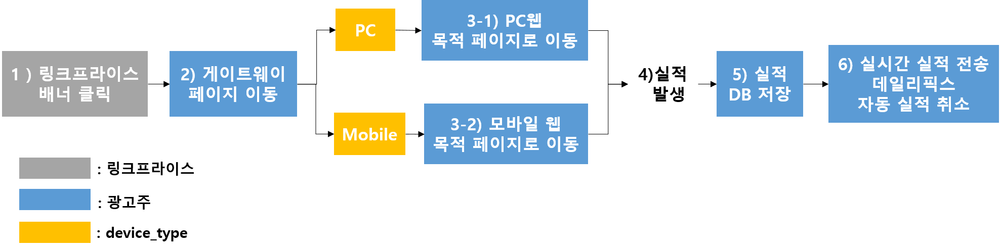
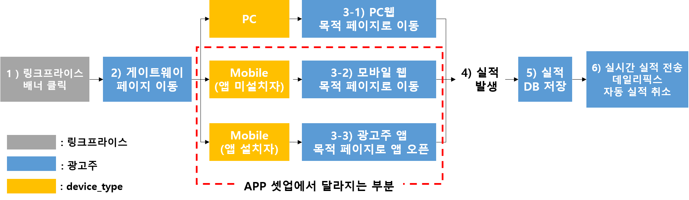
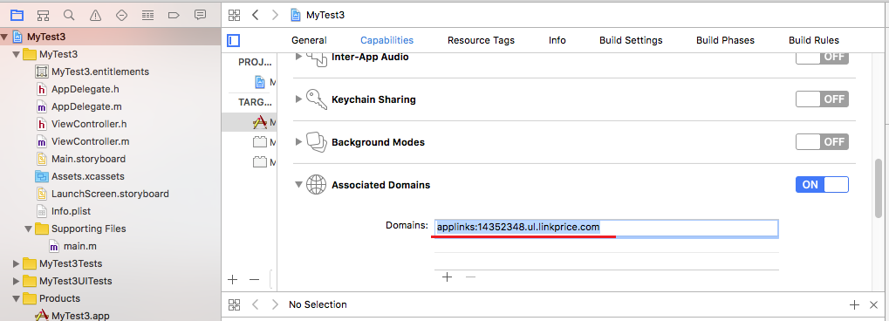
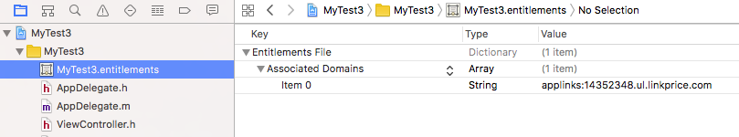

# APP iOS직접 셋업

## 1. 제휴 마케팅이란

> 제휴 마케팅이란 제품/ 서비스 등을 판매하는 인터넷 업체(Merchant)가 고객을 끌어들이고 진열, 판매하는 공간으로 자신의 사이트 뿐만 아니라 다른 관련 사이트(Affiliate)로 까지 공간을 확장하여 
> 이때 발생하는 수입을 제휴맺은 사이트(Affiliate)와 공유하는 새로운 형태의 마케팅 기법입니다.
>
> [제휴 마케팅 소개](https://helpdest.linkprice.com/pages/merchant-faq-introduce)


#### 1.1. V2 웹 셋업 개요 



1) 링크프라이스 배너 클릭

2) 링크프라이스에서 광고주 게이트웨이 페이지에 LPINFO (쿠키)생성에 필요한 값과 목적페이지 URL 전달

3) device_type에 따라서 PC웹 또는 모바일웹 목적페이지로 이동

4) 상품구매 

5) 상호 대조를 위해 광고주 DB에 실적 데이터 보관

6) 링크프라이스로 구매 실적 전송, 데일리픽스 및 자동취소 정보 제공 

- V2버전은 클라이언트에서 스크립트 형식으로 보내는 실시간 실적 전송방식을 사용합니다. ([V2버전 웹 셋업 가이드](https://github.com/linkprice/MerchantSetup/blob/v2/Merchant%20Setup%20Guide_Kor_ver2.5.pdf) 참조)


#### 1.2. V2 APP 셋업 개요 



1) 링크프라이스 배너 클릭

2) 링크프라이스에서 광고주 게이트웨이 페이지에 LPINFO (쿠키)생성에 필요한 값과 목적페이지 URL 전달

- 배너 클릭시마다 변경되는 LPINFO의 last값을 저장합니다. 

3) device_type에 따라 웹 또는 앱 목적페이지로 이동 ([2. Universal Link 설정 ](https://github.com/linkprice/MerchantSetup/tree/master/App/Linkprice_iOS#2-universal-link-%EC%84%A4%EC%A0%95) 참조)

​	3-2) 앱 미설지자인 경우 

- 모바일 웹 목적페이지로 이동 해야 합니다. 

		3-3) 앱 설치자인 경우 

- 광고주 앱의 목적페이지로 앱이 오픈 되어야 합니다. 
- 목적페이지는 어필리에이트의 사용자 정의 링크(deep link)생성에 따라 메인페이지, 특정 상품페이지, 이벤트 페이지 등으로 변경됩니다. 
- 타사 앱(카카오톡 / 네이버 / 다음 / 밴드 / 페이스북 / 크롬 / 인터넷 / 사파리 / 매체사 앱 등…)에서 배너를 클릭 한 경우 광고주 앱의 목적페이지로 앱이 오픈 되어야 합니다. 
- 오류 페이지로 이동하지 않도록 주의해주세요.

4) 상품구매 

5) 상호 대조를 위해 광고주 DB에 실적 데이터 보관

6) 링크프라이스로 구매 실적 전송 ([3. 실적 전송](# 3. 실적 전송) 참조) , 데일리픽스, 자동 실적 취소 작업 ([V2버전 웹 셋업 가이드](https://github.com/linkprice/MerchantSetup/blob/v2/Merchant%20Setup%20Guide_Kor_ver2.5.pdf) 참조)


## 2. Universal Link 설정 

> URL 클릭 시 해당 앱이 설치되어 있으면 앱이 실행되어야 하며, 설치가 되어 있지 않으면 App Store나 특정 페이지로 redirection 하기 위한 설정입니다.


### 2.1 연관 도메인 설정 

* URL을 통해 앱에 진입했을 경우 파라미터를 전달받고 싶거나 deep link를 구현하고 싶다면 해당 설정 작업을 진행합니다. 
* Universal Link는 **https**에서만 실행 가능합니다.

1. 연관 도메인을 활성화 후 등록합니다. 



2. entitlements 파일에서 도메인이 설정되어 있는지 확인합니다.



3. AASA(apple-app-site-association)파일 등록

* AASA파일은 연관 도메인으로 등록된 웹사이트의 루트 또는 ./well-known 디렉토리 하위에 저장합니다.

	* 예시
    	* https://example.com/app-app-site-association
    	* https://example.com/.well-known/app-app-site-association

```json
{
  "applinks": {
    "apps": [],
    "details": [
    {
      "appID": "{team ID}.{bundle ID}",
      "paths": ["*"]
    }
    ]
  }
}
```

* appID: team ID와 bundle ID로 구성되며, 포맷은 {team ID}.{Bundle ID} 입니다.
    * team ID는 [Apple developer center](https://developer.apple.com/membercenter) 에서 확인 할 수 있습니다.

### 2.2 AppDeletegate.swift 에 해당 코드를 추가합니다.

``` swift
/*
예1) 상품 상세 페이지
PC target_url: www.linkprice.com/clickbuy/product-detail.php?pid=2342134&show=AHFSD 
Mobile target_url: m.linkprice.com/shop/product?pid=2342134

예2) 검색 페이지
PC target_url:  www.linkprice.com/clickbuy/search-result.php?keyword=%EA%B2%80%EC%83%89%EC%96%B4
Mobile target_url:  m.linkprice.com/search?keyword=%EA%B2%80%EC%83%89%EC%96%B4

*/


//for iOS >= 9.2 (Universal Link)
func application(_ application: UIApplication,
                     continue userActivity: NSUserActivity,
                     restorationHandler: @escaping ([UIUserActivityRestoring]?) -> Void) -> Bool {

  if(userActivity.activityType == NSUserActivityTypeBrowsingWeb) {
  	return self.handleDeepLink(url: userActivity.webpageURL! as NSURL)
  }

	return true
}

private func handleDeepLink(url: NSURL) -> Bool {
    //track deep link
    self.applicationDidOpen(url as URL!)
    
    // 여기에 <url> 값이 가리키는 페이지로 이동하도록 deep link 기능을 구현해 주어야 합니다.
    var urlComponents = URLComponents(string: url!.absoluteString)
    let path = urlComponents!.path
    let host = urlComponents!.host ?? "no host"
        
    if ((host == "www.linkprice.com" && path == "/clickbuy/product-detail.php") || (host == "m.linkprice.com" && path =="/shop/product")) {
  
         let mainStoryboard:UIStoryboard = UIStoryboard(name: "Main", bundle: nil)
         let productDetail = mainStoryboard.instantiateViewController(withIdentifier: "productDetailViewController") as! productDetailViewController
        let navigationController = self.window?.rootViewController as! UINavigationController
        
        productDetail.pid = params.first(where: { $0.name == "pid" } )
        navigationController.pushViewController(productDetail, animated: false)
    
        return true
        
    } else if((host == "www.linkprice.com" || path == "/clickbuy/search-result.php") || (host == "m.linkprice.com" && path = "/search")) {
        
        let mainStoryboard:UIStoryboard = UIStoryboard(name: "Main", bundle: nil)
        let searchResult = mainStoryboard.instantiateViewController(withIdentifier: "searchResultViewController") as! productDetailViewController
        let navigationController = self.window?.rootViewController as! UINavigationController
        
        productDetail.keyword = params.first(where: { $0.name == "keyword" } )
        navigationController.pushViewController(searchResult, animated: false)
        
        return  true
    }  
   
  return true
}

private func applicationDidOpen:(NSURL *)url {
	var query = self.splitQuery(url.absoluteString)
        
    var daycomp = DateComponents()
    daycomp.day = Int(query["rd"]!) ?? 20

    var dayComponent    = DateComponents()
    let theCalendar     = Calendar.current
    let expiredDate     = theCalendar.date(byAdding: daycomp, to: Date())
        
    var lp: Dictionary<String, Any> = ["lpinfo": query["lpinfo"]!, "date": expDate!]
        
    UserDefaults.standard.set(lp, forKey: "lpinfo")
}

private func splitQuery(url: String) -> Dictionary<String, String>{
    var params = [String : String]()
    let url = url

    for parameter in url.components(separatedBy: "&") {
        let range = parameter.firstIndex(of: "=")
        let range2 = parameter.index(after: range!)

        let keyR = parameter.startIndex..<range!
        let key = parameter[keyR] 
        
        let valueR = range2..<parameter.endIndex
        let value = parameter[valueR]
        
        params.updateValue(String(value), forKey: String(key))
    }
    
    return params
}
```


## 3. 실적 전송

### 3.1 실적 전송이 S2S(서버 to 서버)로 셋업 되있는 경우

1. CPS 웹 셋업을 통하여 이미 실적을 S2S(서버 to 서버)로 보내고 있고, 앱 실적도 서버를 통하여 처리 하는 경우 앱에서는 실적을 전송하지 않으셔도 됩니다.
2. lpinfo(클릭정보)가 서버에 없고 앱에만 있을경우 lpinfo를 서버로 보내줍니다.

```Swift
//lpinfo(클릭정보) 얻기
UserDefaults.standard.string(forKey: "lpinfo")
```

### 3.2 실적 전송이 클라이언트에서 스크립트로 셋업 되있는 경우

1. CPS 웹 실적을 서버가 아닌 클라이언트에서 스크립트 형식으로 보내시고 계신다면, 앱에서 반드시 실적 전송을 하여야 합니다.
2. 머천트가 진행하는 서비스에 맞게 아래의 실적 전송 방식을 선택하여 구현하시면 됩니다.
    * CPS만 진행하신다면, CPS 실적 전송만 하시면 됩니다.
    * CPS와 CPA를 같이 하신다면 CPS와 CPA 실적 전송을 모두 구현 하여 주셔야 합니다. 

#### 3.2.1 CPS 실적 전송 (상품 구매)

```swift
var lpinfo = UserDefaults.standard.string(forKey: "lpinfo")

salesData: [
              "order": [
                "order_id": "o190203-2323213",
                "final_paid_price": 32000,
                "currency": "KRW",
                "user_name": "user"
            ],
            "products": [
                [
                    "product_id": "P87-234-anx87",
                    "product_name": "test",
                    "category_code": "132782",
                    "category_name": ["test1", "test2", "test3"],
                    "quantity": 2,
                    "product_final_price": 14000,
                    "paid_at": "2019-02-12T11:13:44+00:00",
                    "confirmed_at": "",
                    "canceled_at": ""
                ],
                [
                    "product_id": "P23-983-Z3272",
                    "product_name": "test product",
                    "category_code": "237018",
                    "category_name": ["test4", "test5", "test6"],
                    "quantity": 3,
                    "product_final_price": 18000,
                    "paid_at": "2019-02-12T11:13:44+00:00",
                    "confirmed_at": "",
                    "canceled_at": ""
                ]
            ],
            "linkprice": [
                "merchant_id": "clickbuy",
                "lpinfo": lpinfo,
                "user_agent": "Mozilla/5.0...",
                "remote_addr": "127.0.0.1",
                "device_type": "app-ios"
            ]
        ] as [String: Any]

let jsonData = try JSONSerialization.data(withJSONObject: salesData, options: .prettyPrinted)

//saels 데이타 생성 후 링크프라이스로 전송
//End point: https://service.linkprice.com/lppurchase_cps_v4.php         
```

* user agent이 없을 경우 null로 보내 주십시요.

* 쿠폰 및 마일리지 사용에 따른 "product_final_price"는 아래 링크를 확인 하여 주세요.

    [product_final_price 계산](https://github.com/linkprice/MerchantSetup/tree/master/CPS#4-실시간-실적-전송)

* 자세한 데이터에 대한 설명은 아래 링크플 확인 하여 주세요.

    [CPS 실적 데이터 설명](https://github.com/linkprice/MerchantSetup/tree/master/CPS#4-실시간-실적-전송)


