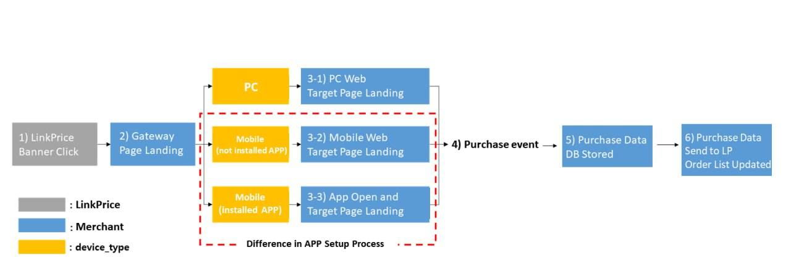

# 1. What is Affiliate Marketing

## 1-1. Outline

```
Affiliate marketing is a space where an Internet company (merchant) that sells products/services attracts, displays, and sells customers.
It is a new type of marketing technique that shares the income generated at this time with affiliated sites.
```

[Go to Affiliate Marketing Details](https://github.com/linkprice/MerchantSetup/blob/master/App/Marketing.md)

## 1-2. Brief Flow Chart



# 2. How to link with the LinkPrice platform

```
Interworking with the Link Price platform is largely divided into two types.

1. Use a third-party solution
2. Direct Implementation

LinkPrice recommends using a proven third-party solution rather than implementing it yourself for stable linkage.
```

## 2-1. Setup with a third-party analytics solution

> This is a setup guide for mobile applications using third-party solutions.

### Third-party solutions supported by the LinkPrice platform

- [Branch](AppSetup/branch-en.md) - https://www.branch.io/
- [Singular](Singular/README-en.md) - https://www.singular.net/
- [Adbrix](Adbrix-remaster/README-en.md) - https://ad-brix.io/

## 2-2. Standalone Setup


```
If you want to set up your own without using a 3rd party solution
In the case of direct app setup, iOS must use Universal Link, and Android can be linked using App Link.
For details, please refer to the link below.
```

### Apple - Universal Link landing page
https://developer.apple.com/ios/universal-links/

### Android - App Link landing page
https://developer.android.com/training/app-links

