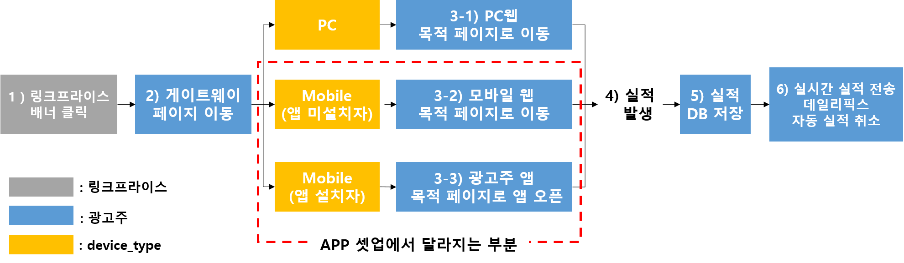

# 1. 제휴 마케팅이란

## 1-1. 개요
```
제휴 마케팅이란 제품/ 서비스 등을 판매하는 인터넷 업체(Merchant)가 고객을 끌어들이고 진열, 판매하는 공간으로 자신의 사이트 뿐만 아니라 다른 관련 사이트(Affiliate)로 까지 공간을 확장하여 
이때 발생하는 수입을 제휴맺은 사이트(Affiliate)와 공유하는 새로운 형태의 마케팅 기법입니다. 
```

[제휴 마케팅 상세 소개 바로가기](https://github.com/linkprice/MerchantSetup/blob/master/App/Marketing.md)

## 1-2. 간략한 흐름도



# 2. 링크프라이스 플랫폼과의 연동 방법

```
링크프라이스 플랫폼과의 연동작업은 크게 두 가지 형태로 나뉩니다.

1. 서드파티 솔루션을 이용
2. 직접 구현

링크프라이스에서는 안정적인 연동 작업을 위해 광고주가 직접 구현하는 것 보다는 검증된 서드파티 솔루션을 이용하는 방법을 권장합니다.
```

## 2-1. 서드파티 애널리틱스 솔루션을 이용한 셋업

> 서드파티 솔루션을 이용한 모바일 어플리케이션에 대한 셋업 가이드 입니다.

### 링크프라이스 플랫폼에서 지원 가능한 서드파티 솔루션

- [Branch](AppSetup/branch.md) - https://www.branch.io/
- [Singular](Singular/README.md) - https://www.singular.net/
- [Adbrix](Adbrix-remaster/README.md) - https://ad-brix.io/
- [Airbridge](Airbridge/README.md) - https://www.airbridge.io/ 

## 2-2. 단독 셋업

```
서드파티 솔루션을 사용하지 않고 독자적인 셋업을 원하는 경우
앱 직접 셋업의 경우, iOS는 Universal Link을 사용해야 하며 Android는 App Link을 이용하여 연동이 가능합니다.
자세한 사항은 아래 링크를 참고 바랍니다.
```

### Apple - Universal Link 소개 페이지
https://developer.apple.com/ios/universal-links/

### Android - App Link 소개 페이지
https://developer.android.com/training/app-links