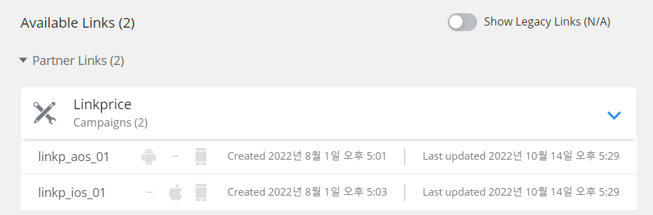
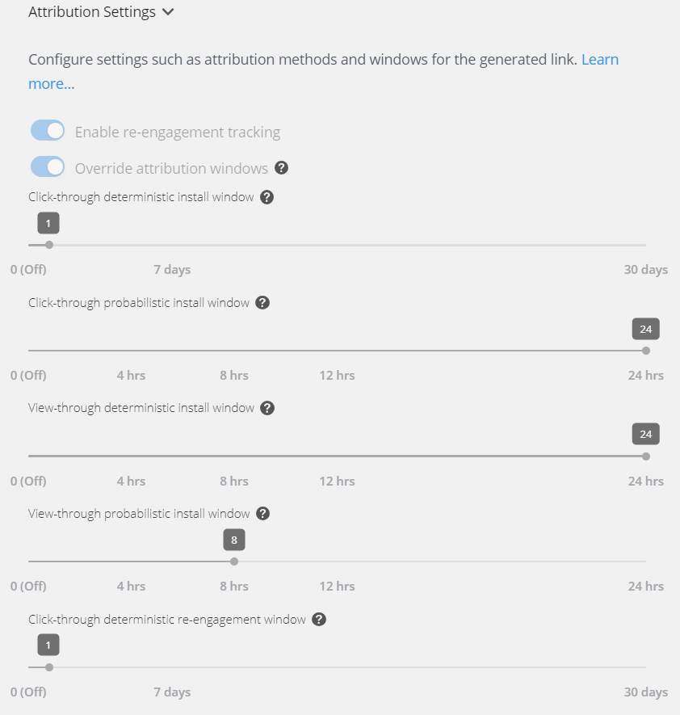

# 싱귤러 (Singular) APP 셋업

3자툴인 싱귤러(Singular)를 활용하여 모바일 앱에서 실적 측정을 할 수 있습니다.

링크프라이스는 현재 싱귤러에서 네트워크사로 등록이 되어있으며, [영문 가이드](https://support.singular.net/hc/en-us/articles/360053018851-How-to-Configure-Partner-Settings-and-Postbacks)에 따라 파트너 설정을 해주시기 바랍니다. 

싱귤러에 등록된 링크프라이스 ID는 [linkprice.staff@gmail.com](mailto:linkprice.staff@gmail.com) 입니다.

## 연동 과정
싱귤러를 통해 저희 링크프라이스 제휴링크를 통한 앱 유입과 실적 전송이 가능합니다.

1. 트래킹 링크를 커스텀 변수를 포함한 트래킹 링크를 iOS와 Android OS 링크를 각각 생성 해주십시오.

예시 커스텀 변수는 다음과 같습니다.

- pcid={campaign_id}&pcn={campaign_name}&mid={m_id}&lpinfo={lpinfo}
- 실제 커스텀 변수에 담길 값은 다음과 같이 전달합니다.
  - pcid=linkprice
  - pcn=linkprice
  - mid=clickbuy 
  - lpinfo=A100000131abcd|276282763XXGfv|0000|B|1
- mid는 링크프라이스에서 사용하는 머천트 ID입니다. 
- lpinfo는 링크프라이스 실적 추적을 위한 값입니다.
- example
```
pcid=linkprice&pcn=linkprice&mid=clickbuy&lpinfo=A100000131abcd|276282763XXGfv|0000|B|1
```


### Android OS 트래킹 링크 예시
https://singularassist.sng.link/D59c0/9ypq?pcid={campaign_id}&pcn={campaign_name}&mid={m_id}&lpinfo={lpinfo}

### iOS 트래킹 링크 예시
https://singularassist.sng.link/D59c0/ywl4?_smtype=3&pcid={campaign_id}&pcn={campaign_name}&mid={m_id}&lpinfo={lpinfo}

> 연동된 파트너 링크 현황 예)
> 

2. 싱귤러 연동 후 실적 발생 시 포스트백 방식으로 링크프라이스로 실적 전송을 하고 있습니다.
3. Attribution Settings는 고객사에서 원하시는 광고효과 인정기간을 설정해주시면 됩니다.

> 1일로 설정된 예시 이미지


4. 설정 후 트래킹 링크를 링크프라이스 담당자에게 전달해주시면 iOS/AOS 인입과 실적 전송을 확인하도록 하겠습니다.


### Reference

- [Singular와 연동하기: 파트너를 위한 가이드 – Singular Help Center](https://support.singular.net/hc/ko/articles/360032246232-Integrating-with-Singular-A-Guide-for-Partners)
- [파트너를 위한 싱귤러 어트리뷰션 연동 FAQ – Singular Help Center](https://support.singular.net/hc/ko/articles/115002742751-%ED%8C%8C%ED%8A%B8%EB%84%88%EB%A5%BC-%EC%9C%84%ED%95%9C-%EC%8B%B1%EA%B7%A4%EB%9F%AC-%EC%96%B4%ED%8A%B8%EB%A6%AC%EB%B7%B0%EC%85%98-%EC%97%B0%EB%8F%99-FAQ)
- [Integrating with Singular Analytics FAQ (Partners)](https://support.singular.net/hc/en-us/articles/360032597931?support=true)
- [How to Configure Partner Settings and Postbacks](https://support.singular.net/hc/en-us/articles/360053018851-How-to-Configure-Partner-Settings-and-Postbacks)