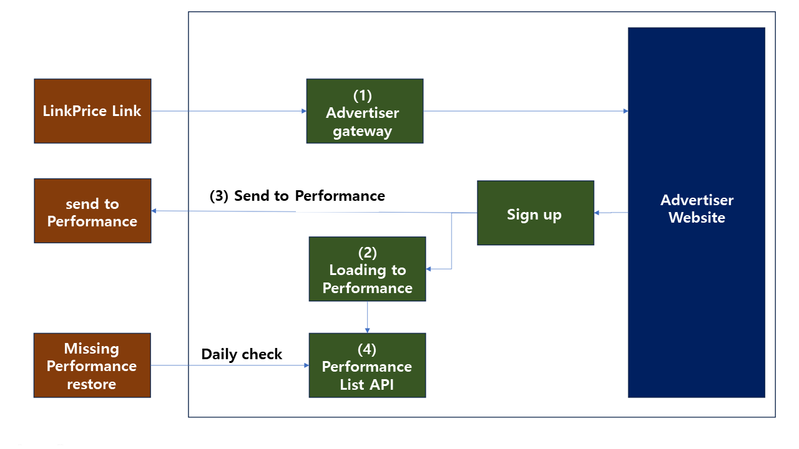

# CPA setup guide

# 1. What is affiliate marketing?

Affiliate  marketing is a marketing technique in which an advertiser (Merchant),  an  internet business that sells  a  product  or  service,  partners  with  another  media  site  (Affiliate)  to  promote  it  in  order  to  attract customers and drive sales.

This is a marketing technique in which the income generated is shared with the media site (Affiliate).

[Learn more about affiliate marketing](https://helpdesk.linkprice.com/pages/merchant-faq-introduce)

# 2. LinkPrice-Advertiser Setup

Before you can use LinkPrice's affiliate marketing platform as an advertiser, you'll need to complete an
integration. This is what we call **"Merchant Setup"**

To get set up, you'll need to do the following.

## 2-1. Integration flow and advertiser action history



(1) Advertiser gateway

[Working with gateway pages inside an advertiser's site](#2-2-working-with-the-advertiser-gateway)

(2) Loading Performance Data DB

[Create and load your own separate DB table when performance occurs](#2-3-create-own-separate-db-table-and-load-when-performance-occurs)

(3) Transferring performance

[Send LinkPrice earnings to LinkPrice when they occur](#2-4-send-linkprice-earnings-to-linkprice-when-they-occur)

(4) Performance List AP

[Working with the Performance List API in Linkprice](#2-5-working-with-link-prices-performance-list-api)


## 2-2. Working with the Advertiser Gateway

### 2-2-1. Why you need to do this

Affiliates[^2] promote their sites or other sites through affiliate links[^3] provided by LinkPrice.

As an advertiser, you need a value (Tracking Code) to determine whether the performance is attributable to LinkPrice.

This tracking code is defined by Linkprice as "LPINFO" [^5].

The advertiser gateway [^4] will generate a cookie on the client, which will be used to track performance.


### 2-2-2. Overview

The Advertiser Gateway [^4] has the following behavior.

```
1. Parameter Validation
2. Create cookies for performance tracking
3. Go to the advertiser's site
```

Your LinkPrice affiliate link will take you through the advertiser gateway page, generate a tracking code, and enter the advertiser's site.


### 2-2-3. How to work

**Step1**. Pass the JavaScript code for performance tracking from Linkprice to the advertiser.

> This JavaScript code is embedded within the advertiser's site to create a cookie for performance tracking and then redirect to the advertiser's site.
>
> However, depending on the environment of the advertiser's site, this code may be set differently.

**Step2**. Create a gateway page URL inside your site and add the JavaScript code delivered by LinkPrice.

> For the gateway implementation, feel free to implement it according to your server environment.
> 
> Example)
> If using php, https://[domain]/linkprice/gateway.php
> If using jsp, https://[domain]/linkprice/gateway.jsp 
> If using html, https://[domain]/linkprice/gateway.html


**Step3**. Be sure to provide the URL of the gateway you implemented to your LinkPrice representative.

**Step4**. LinkPrice reflects the URL received from the advertiser in its internal platform and generates and delivers the affiliate link.

> In the end, the media outlets will be reaching out to the URL below.
> 
> This is a sample URL and will not be the actual URL.
> 
> https://click.linkprice.com/click.php?m=clickbuy&a=A100000131&l=0000

**Step5**. When you enter the affiliate link and navigate to the advertiser's site, make sure that a tracking code cookie named **"LPINFO"** is created in your browser's cookie.


### 2-2-4. Sample Code

During the setup process, Linkprice will deliver the generated JavaScript code to the advertiser.

All you need to do is insert the JavaScript code into your gateway page without modification.

If other code is mixed in, the page landing and LPINFO cookie generation might not work.

If you do not receive this code, please contact your Linkprice representative. The sample code below is for reference only and is not the actual code

```javascript
<!-- Google Tag Manager -->
<script>(function(w,d,s,l,i){w[l]=w[l]||[];w[l].push({'gtm.start':
    new Date().getTime(),event:'gtm.js'});var f=d.getElementsByTagName(s)[0],
    j=d.createElement(s),dl=l!='dataLayer'?'&l='+l:'';j.async=true;j.src=
    'https://www.googletagmanager.com/gtm.js?id='+i+dl;f.parentNode.insertBefore(j,f);
})(window,document,'script','dataLayer','GTM-P3HTV4');</script>
<!-- End Google Tag Manager -->
```

## 2-3. create own separate DB table and load when performance occurs

### 2-3-1. Why you need to do this

Data sent to LinkPrice in real-time may not be sent due to network transmission delay issues or program errors.

We're asking you to save your data so that we can match the data you sent to Linkprice with the data stored at the advertiser for settlement.

The loaded data is utilized for the [2-5. Performance list API]() operations.

### 2-3-2. How to work

**Step1**. Create a table in your DB.

```sql
create table lpinfo(
   id int(10) unsigned NOT NULL AUTO_INCREMENT,     # Unique Key
   unique_id varchar(30),		 				    # Member number to send to Linkprice
   member_id varchar(30),	 					    # Member ID to send to Linkprice
   lpinfo varchar(580),		 				        # LinkPrice tracking code (LPINFO) 
   user_agent varchar(300), 					    # Buyer's User Agent value
   ip varchar(50),					 			    # Buyer's IP
   device_type varchar(11)	 					    # Buyer's OS environment
)
```

> The above table creation query is an example based on Mysql.
>
> If you can store data, you can use NoSql.
>
> The column names can also be customized for the given server environment.

**Step2**. When a result occurs (=Member registration is completed), check whether the LPINFO cookie stored in the browser cookie exists and load it into the DB table.

### 2-3-3. Sample Code

**※ Note**

The sample code is an example of generating JSP and ASP code through Chat GPT based on PHP code.

You do not necessarily need to implement the example code, and please refer to it only as an example.

Implement according to your advertiser server environment.

**JSP Examples**

```jsp
<%@ page language="java" contentType="text/html; charset=UTF-8" pageEncoding="UTF-8"%>
<%@ page import="java.sql.*" %>

<%
  String uniqueId = request.getParameter("unique_id") != null ? request.getParameter("unique_id") : "";
  String memberId = request.getParameter("member_id") != null ? request.getParameter("member_id") : "";
  String lpinfo = request.getCookies() != null ? request.getCookies()[0].getValue() : "";
  String userAgent = request.getHeader("User-Agent") != null ? request.getHeader("User-Agent") : "";
  String ip = request.getRemoteAddr() != null ? request.getRemoteAddr() : "";
  
    /*
    web-pc: Performance from browsers for PCs
    web-mobile: Performance on the mobile web
    app-android: Performance in the Android app environment (including webview)
    app-ios: Performance in the iOS app environment (including webview)
    */
  String deviceType = "web-pc";	

  Connection dbConnection = null;
  Statement statement = null;

  try {
    Class.forName("com.mysql.jdbc.Driver");
    dbConnection = DriverManager.getConnection("jdbc:mysql://localhost/DATABASE_NAME", "ID", "PASSWORD");
    
    if (lpinfo != null && !lpinfo.isEmpty()) {
      // Save results to internal DB
      String query = "INSERT INTO lpinfo (unique_id, member_id, lpinfo, user_agent, ip, device_type) VALUES (?, ?, ?, ?, ?, ?)";
      PreparedStatement preparedStatement = dbConnection.prepareStatement(query);
      preparedStatement.setString(1, uniqueId);
      preparedStatement.setString(2, memberId);
      preparedStatement.setString(3, lpinfo);
      preparedStatement.setString(4, userAgent);
      preparedStatement.setString(5, ip);
      preparedStatement.setString(6, deviceType);
      
      preparedStatement.executeUpdate();
    }
  } catch (SQLException e) {
    e.printStackTrace();
  } catch (ClassNotFoundException e) {
    e.printStackTrace();
  } finally {
    if (statement != null) {
      try {
        statement.close();
      } catch (SQLException e) {
        e.printStackTrace();
      }
    }
    if (dbConnection != null) {
      try {
        dbConnection.close();
      } catch (SQLException e) {
        e.printStackTrace();
      }
    }
  }
%>
```

**ASP examples**

```asp
<%
Dim uniqueId
Dim memberId
Dim lpinfo
Dim userAgent
Dim ip
Dim deviceType

uniqueId = Request("unique_id")
memberId = Request("member_id")
lpinfo = Request.Cookies("LPINFO")
userAgent = Request.ServerVariables("HTTP_USER_AGENT")
ip = Request.ServerVariables("REMOTE_ADDR")

' Set device type
deviceType = "web-pc"

' Connect to MySQL Database
Dim dbConnection
Set dbConnection = Server.CreateObject("ADODB.Connection")
dbConnection.Open "Driver={MySQL ODBC 8.0 Unicode Driver};Server=localhost;Database=DATABASE_NAME;Uid=ID;Pwd=PASSWORD;"

If Not lpinfo = "" Then
    ' Save results to internal DB
    Dim query
    query = "INSERT INTO lpinfo (unique_id, member_id, lpinfo, user_agent, ip, device_type) VALUES (?, ?, ?, ?, ?, ?)"
    
    Dim cmd
    Set cmd = Server.CreateObject("ADODB.Command")
    cmd.ActiveConnection = dbConnection
    cmd.CommandText = query
    cmd.CommandType = 1 ' adCmdText
    
    cmd.Parameters.Append cmd.CreateParameter("@unique_id", 200, 1, 50, uniqueId)
    cmd.Parameters.Append cmd.CreateParameter("@member_id", 200, 1, 50, memberId)
    cmd.Parameters.Append cmd.CreateParameter("@lpinfo", 200, 1, 255, lpinfo)
    cmd.Parameters.Append cmd.CreateParameter("@user_agent", 200, 1, 255, userAgent)
    cmd.Parameters.Append cmd.CreateParameter("@ip", 200, 1, 50, ip)
    cmd.Parameters.Append cmd.CreateParameter("@device_type", 200, 1, 50, deviceType)
    
    cmd.Execute
End If

dbConnection.Close
Set dbConnection = Nothing
%>

```

**PHP Examples**

```php
<?php
  
    $uniqueId   = $_REQUEST['unique_id'] ?? '';
	$memberId 	= $_REQUEST['member_id'] ?? '';
	$lpinfo		= $_COOKIE['LPINFO'] ?? '';
	$userAgent	= $_SERVER['HTTP_USER_AGENT'] ?? '';
	$ip			= $_SERVER["REMOTE_ADDR"] ?? '';
	
	 /*
    web-pc: Performance from browsers for PCs
    web-mobile: Performance on the mobile web
    app-android: Performance in the Android app environment (including webview)
    app-ios: Performance in the iOS app environment (including webview)
    */
	$deviceType	= 'web-pc';	

	$dbConnection = mysqli_connect("localhost", "ID", "PASSWORD", "DATABASE_NAME");
  
  if(isset($_COOKIE['LPINFO']) && !empty($_COOKIE['LPINFO'])) {
    //Save results to internal DB
    $query = "
    INSERT INTO `lpinfo` (
    	unique_id, member_id, lpinfo, user_agent, ip, device_type
    ) VALUE (
    	'$uniqueId', '$memberId', '$lpinfo', '$userAgent', '$ip', '$deviceType' 
    )";
    
    $result = mysqli_query($dbConnection, $query);
  }
```

## 2-4. Send LinkPrice earnings to LinkPrice when they occur

### 2-4-1. Why you need to do this

For earnings generated by LinkPrice's affiliate links, you must transmit earnings in real time according to the specifications required by LinkPrice.

### 2-4-2. Overview

```
1. You've earned it!
2. Check for the presence of LinkPrice tracking code (LPINFO cookie) generated by the gateway
3. If you have a tracking code, send your performance to LinkPrice's performance collection program
```

### 2-4-3. How to work

**Step1**. Refer to the requirements specification below to send performance to the LinkPrice performance collection program.

**2-4-3-1. REQUEST Overview**

| Title                     | Description                                         |
|---------------------------|:----------------------------------------------------|
| Request URL               | https://service.linkprice.com/lppurchase_cpa_v4.php |
| Protocols                 | https                                               |
| HTTP Methods              | POST                                                |
| Request Body Type         | RAW Data                                            |
| Request parameter         | JSON String                                         |
| Response parameter format | JSON String                                         |

**2-4-3-2. REQUEST Parameter**

| KEY                     | Value                                                                                                                                                                                                                                                                        | Type          |
|-------------------------|------------------------------------------------------------------------------------------------------------------------------------------------------------------------------------------------------------------------------------------------------------------------------|---------------|
| action                  | About performance data                                                                                                                                                                                                                                                       | object        |
| action.unique_id        | Member's unique order number <br><span style="font-size:75%">A number that is uniquely assigned based on membership, not member ID</span>                                                                                                                                    | varchar(100)  |
| action.member_id        | User ID                                                                                                                                                                                                                                                                      | varchar(100)  |
| action.final_paid_price | The total amount the buyer actually paid<br><span style="font-size:75%"> Send 0 for free registration and free services.Forward payment for paid memberships and paid services. </span>                                                                                      | float         |
| action.category_code    | Category code corresponding <br><span style="font-size:75%"> Examples) "register", "apply"</span>                                                                                                                                                                            | varchar(100)  |
| action.action_code      | Sends the same as the category_code value above                                                                                                                                                                                                                              | varchar(100)  |
| action.currency         | The currency used to pay for the product<br><span style="font-size:75%">Using ISO 4217 <br>Examples) US: USD, Korean Won: KRW, Chinese Yuan: CNY, Euro: EUR</span>                                                                                                           | varchar(3)    |
| action.action_name      | Service name<br><span style="font-size:75%">For example.) "Sign up for free", "Fill out application"</span>                                                                                                                                                                  | varchar(100)  |
| linkprice               | Data required by Linkprice                                                                                                                                                                                                                                                   | object        |
| linkprice.merchant_id   | Advertiser ID issued by LinkPrice                                                                                                                                                                                                                                            | varchar(10)   |
| linkprice.lpinfo        | Tracking code from LinkPrice (=LPINFO cookie)                                                                                                                                                                                                                                | varchar(500)  |
| linkprice.user_agent    | About USER AGENT                                                                                                                                                                                                                                                             | varchar(1000) |
| linkprice.remote_addr   | Buyer IP addres<br><span style="font-size:75%">Masking or space ("") preferred due to privacy concerns. <br>Example) 118.221.*.* , ""</span>                                                                                                                                 | varchar(100)  |
| linkprice.device_type   | User device type<br><span style="font-size:75%">- web-pc: Performance from a PC web browser<br>- web-mobile: Performance on mobile web browsers<br>- app-ios: Performance from an iOS app (or webview)<br>- app-android: Performance from an Android app (or webview)</span> | varchar(10)   |  | varchar(10)   |

**REQUEST Parameter Sample**

```json
{
    "action": {
        "unique_id": "10002356",
        "final_paid_price": 0,
        "currency": "KRW",
        "member_id": "exampleId",
        "action_name": "Sign up for free",
        "category_code": "register",
        "action_code": "register"
    },
    "linkprice": {
        "merchant_id": "sample",
        "lpinfo": "A123456789|9832|A|m|a8uakljfa",
        "user_agent": "Mozilla/5.0...",
        "remote_addr": "127.0.0.1",
        "device_type": "web-pc"
    }
}
```

**2-4-3-4. Response Overview**

|   Key name    | Value                           |  Type   |
|:-------------:|:--------------------------------|:-------:|
|  is_success   | Successful performance transfer | boolean |
| error_message | Error detail messages           | string  |
|  order_code   | Order Number                    | string  |
| product_code  | Product Item number             | string  |

> The response is sent as a JSON string.
> 
> The response is a two-dimensional array of the number of products purchased.

**2-4-3-5. Sample Response**

* After purchasing 2 items, on successful transfer

```json
[
    {
        "is_success": true,
        "error_message": "",
        "order_code": "order_115",
        "product_code": "product1"
    }
]
```

* After purchasing 2 items, if the transfer fails

```json
[
    {
        "is_success": false,
        "error_message": "lpinfo parameter is empty.",
        "order_code": "order_115",
        "product_code": "product1"
    }
]

```

**2-4-3-6. Response Detailed Reason**

* If the response does not exist in the list below, please provide the request value and response value of the call to the LinkPrice representative.

| Error                                                      | MessagesError Details                                     |
|------------------------------------------------------------|-----------------------------------------------------------|
| This is not a valid JSON string.                           | REQUEST is not in JSON format                             |
| action.unique_id parameter is empty.                       | action.unique_id not entered                              |
| action.final_paid_price parameter is empty.                | action.final_paid_price not entered                       |
| action.final_paid_price is not integer.                    | action.final_paid_price not of type integer               |
| action.currency parameter is empty.                        | action.currency not entered                               |
| action.member_id parameter is empty.                       | action.member_id not entered                              | 
| action.action_name parameter is empty.                     | action.action_name not entered                            |
| action.category_code parameter is empty.                   | action.category_code not entered                          |
| action.user_name parameter is empty.                       | action.user_name not entered                              |
| products parameter is empty.                               | products parameter not entered                            |
| linkprice.merchant_id parameter is empty.                  | linkprice.merchant_id not entered                         |
| linkprice.lpinfo parameter does not conform to the format. | linkprice.lpinfo parameter does not conform to the format |
| linkprice.user_agent parameter is empty.                   | linkprice.user_agent not entered                          |
| linkprice.remote_addr parameter is empty.                  | linkprice.remote_addr not entered                         |
| linkprice.device_type parameter is empty.                  | linkprice.device_type not entered                         |
| There was a problem sending your performance.              | Error sending performance                                 |

**Step2**. Write a program to send performance to the LinkPrice performance collection program according to your server environment.

**Step3**. Check if the response value is output normally after calling LinkPrice's performance transfer URL.

### 2-4-4. Sample Code

**※ Note**

The sample code is an example of generating JSP and ASP code through Chat GPT based on PHP code.

You do not necessarily need to implement the example code, and please refer to it only as an example.

Implement according to your advertiser server environment

**JSP Examples**

```jsp
<%@ page import="java.io.*" %>
<%@ page import="java.net.*" %>
<%@ page import="org.json.*" %>
<
// Order information
JSONObject action = new JSONObject(); 
action.put("unique_id", "ORDER1234"); 
action.put("final_paid_price", 60000); 
action.put("currency", "KRW");
action.put("member_id", " Kim**");
action.put("action_name", "Request a paid consultation");
action.put("category_code", "paid_register"); 
action.put("action_code", "paid_register");

// Data required by LinkPrice
JSONObject linkprice = new JSONObject(); 
linkprice.put("merchant_id", " clickbuy");
linkprice.put("lpinfo", ""); // We need to set the lpinfo value.
linkprice.put("user_agent", request.getHeader("User-Agent"));
linkprice.put("remote_addr", request.getRemoteAddr()); // "" whitespace or masking is recommended.
linkprice.put("device_type", "web-pc"); // handle for user-Agent

// All data
JSONObject purchases = new JSONObject(); 
purchases.put("action", action);
purchases.put("linkprice", linkprice);

// Convert to JSON format
String postData = purchases.toString();

// HTTP POST request
String url = "https://service.linkprice.com/lppurchase_cpa_v4.php"; 
URLConnection connection = new URL(url).openConnection();
connection.setDoOutput(true);
connection.setRequestProperty("Content-Type", " application/json");

try (OutputStream os = connection.getOutputStream()) {
    byte[] input = postData.getBytes("utf-8");
    os.write(input, 0, input.length);
}

try (BufferedReader br = new BufferedReader(new InputStreamReader(connection.getInputStream(), "utf-8"))) {
    StringBuilder response = new StringBuilder();
    String responseLine = null;
    while ((responseLine = br.readLine()) != null) {
        response.append(responseLine.trim());
    }
    
    // Response data from the LinkPrice performance collection program
    out.println(response.toString());
}
%>
```


**ASP Examples**

```asp
<%
' Example of sending earnings to the LinkPrice earnings collection program

' Order information
Dim action
Set action = Server.CreateObject("Scripting.Dictionary") 
action("unique_id") = "ORDER1234"
action("final_paid_price") = 60000 action("currency") = "KRW"
action("member_id") = " KimLink"
action("action_name") = " Sign up for a paid consultation"
action("category_code")  =  "paid_register"  action("action_code") = "paid_register"

' Data required by Linkprice
Dim linkprice
Set linkprice = Server.CreateObject("Scripting.Dictionary") linkprice("merchant_id") = "clickbuy"
linkprice("lpinfo") = " "
linkprice("user_agent") = Request.ServerVariables("HTTP_USER_AGENT")
linkprice("remote_addr") = Request.ServerVariables("REMOTE_ADDR") // "" Blanking or masking is recommended.
linkprice("device_type") = "web-pc" // Handle for user-Agent

' All Data
Dim purchases
Set purchases = Server.CreateObject("Scripting.Dictionary") 
purchases.Add "order", order
purchases.Add " products", products
purchases.Add "linkprice", linkprice

' Convert to JSON format
Function ConvertToJson(obj)
    Dim jsonObj, key
    Set jsonObj = Server.CreateObject("Scripting.Dictionary")
    For Each key In obj.Keys
        jsonObj.Add key, obj(key)
    Next
    ConvertToJson = Join(obj.Keys, ", ")
End Function

Dim postData
postData = ConvertToJson(purchases)

' HTTP POST request
Dim objXMLHTTP
Set objXMLHTTP = Server.CreateObject("MSXML2.ServerXMLHTTP")
objXMLHTTP.Open "POST", "https://service.linkprice.com/lppurchase_cpa_v4.php", False
objXMLHTTP.setRequestHeader "Content-Type", "application/json"
objXMLHTTP.send postData

' Response data from the LinkPrice Performance Collection Program
Response.Write objXMLHTTP.responseText

Set objXMLHTTP = Nothing
%>
```


**PHP Examples**

```php
<?php
/**
 * Example of sending earnings to the LinkPrice earnings collection program
 */

$purchases = [];

//Order information
$purchases['order'] = [
    'unique_id'         => 'ORDER1234',
    'final_paid_price'  => 60000,
    'currency'          => 'KRW',
    'member_id'         => '김링크',
    'action_name'       => '상담 신청',
    'category_code'     => 'paid_register',
    'action_code'       => 'paid_register',

];

$purchases['linkprice'] = [
    'merchant_id'   => 'clickbuy',
    'lpinfo'        => $lpinfo,
    'user_agent'    => $_SERVER['HTTP_USER_AGENT'] ?? '',
    'remote_addr'   => $_SERVER['REMOTE_ADDR'] ?? '', // "" whitespace or masking Recommended
    'device_type'   => 'web-pc' // handle for user-Agent
];

$postData = json_encode($purchases);

$curl = curl_init();

curl_setopt_array($curl, [
  CURLOPT_URL               => 'https://service.linkprice.com/lppurchase_cpa_v4.php',
  CURLOPT_RETURNTRANSFER    => true,
  CURLOPT_HTTP_VERSION      => CURL_HTTP_VERSION_1_1,
  CURLOPT_CUSTOMREQUEST     => 'POST',
  CURLOPT_POSTFIELDS        => $postData
]);

$response = curl_exec($curl);
curl_close($curl);

//Response data from the LinkPrice performance collection program
echo $response;
```


## 2-5. Working with Link Price's Performance List API

### 2-5-1. Why you need to do this

The performance data sent by the advertiser through their performance collection program is loaded into the LinkPrice database. Basically, the performance data in LinkPrice and the performance data that the advertiser has should be the same.

However, it is often the case that even though it is transmitted, the performance is generated but not transmitted to Link Price due to various failures.

So every day, we call the advertiser's API to get the previous day's performance data and compare it to Linkprice's performance, and if it's not there, we recover it.

We also use this API to automatically cancel performances with order minimums or refunds on the 20th of every month.

In order to check your performance on Linkprice, you need to create a performance query API that can be accessed from the Linkprice server according to the specifications set by Linkprice

### 2-5-2. Overview

This API is called the Performance List API.

Linkprice is utilizing the API to process as follows.

```
1. Call the Advertiser Performance API at dawn each day to collect the previous day's performance to begin the performance recovery process.
2. On the 20th of every month, we collect the previous month's cancellations from advertisers and process them automatically.
```

> Collecting previous month's confirmations and cancellations is not a resend of confirmations and cancellations from the advertiser side.
>
> You can indicate this in the API by applying the confirmation and cancellation dates to the confirmed_at and canceled_at of the visible product (products[]) in the performance list API.
>
> Since Linkprice only checks for status, you only need to update the corresponding confirmed_at and canceled_at values.

When Linkprice calls the Advertiser API, it is called 3 times a day as shown below.

1. Call all data based on order completion date to recover performanc

```
# call the date to look up with the query string paid_ymd parameter
https://api.yourdomain.com/linkprice/order_list_v1?paid_ymd=yyyymmdd
```

2. Call based on purchase confirmation date to finalize performance

```
# call the date to look up with the query string confirmed_ymd parameter
https://api.yourdomain.com/linkprice/order_list_v1?confirmed_ymd=yyyymmdd
```

3. Call based on purchase cancellation date to cancel performance

```
# call the date to look up with the query string canceled_ymd parameter
https://api.yourdomain.com/linkprice/order_list_v1?canceled_ymd=yyyymmdd
```

The data you sent to LinkPrice and the data represented in the performance list must be the same.

> If a product name is sent as "Product A" in the performance transmission, but is sent as "Product B" in the performance list API (x)


### 2-5-3. How to work

**Step1**. Refer to the required output specification below to create a performance list API. 

See [2-3-3 Step1](#2-3-3-sample-code)

**Step2**. Create a performance list page and add the order paid date (paid_ymd), purchase confirmed date(comfirmed_ymd), and purchase canceled date(canceled_ymd) to it. so that Linkprice can take a JSON string as shown in the example below

Performance List API Output Example

```json
[
    {
        "action": {
            "unique_id": "o190203-h78X3",
            "final_paid_price": 29000,
            "currency": "KRW",
            "member_id": "ID",
            "action_name": "상담 신청",
            "category_code": "paid_register",
            "action_code": "paid_register",
        }
        "linkprice": {
            "merchant_id": "sample",
            "lpinfo": "A123456789|9832|A|m|a8uakljfa",
            "user_agent": "Mozilla/5.0...",
            "remote_addr": "13.156.*.*",
            "device_type": "web-pc"
        }
    },
    {"action":{"unique_id":"ord-123-01",...},"linkprice":{...}},
    {"action":{"unique_id":"ord-123-03",...},"linkprice":{...}},
    {"action":{"unique_id":"ord-123-04",...},"linkprice":{...}}
]
```

**Step3**. If the firewall policy of your server is blocking inbound, you need to allow the IPs below to be accessible to LinkPrice crawlers.

```
# LinkPrice Server IP
13.125.179.218/32
13.124.188.166/32
```

**Step4**. Pass the completed API URL to your LinkPrice Manager


### 2-5-4. Sample code

**※ Note**

The sample code is an example of generating JSP and ASP code through Chat GPT based on PHP code.

You do not necessarily need to implement the example code, and please refer to it only as an example.

Please implement according to your environment.

* The lpinfo table is based on the table structure you create in the [Integration Guide 2-3-2](#2-3-3-sample-code). Step1 example

* purchase table means the list of purchased products data.

**JSP Examples**

```jsp
<%@ page language="java" contentType="application/json; charset=UTF-8" pageEncoding="UTF-8"%>
<%@ page import="java.sql.*" %>
<%@ page import="java.util.*" %>

<%
// LinkPrice Performance List API
String paidYmd = request.getParameter("paid_ymd");
String confirmYmd = request.getParameter("confirmed_ymd");
String cancelYmd = request.getParameter("canceled_ymd");

String query = null;

if (paidYmd != null && !paidYmd.isEmpty()) {
    // Get data by purchase date
    query = "SELECT a.unique_id, a.member_id, a.final_paid_price, "
            + "a.action_name, a.category_code, a.action_code, a.category_name, "
            + "l.lpinfo, l.device_type, l.user_agent, l.ip "
            + "FROM action a "
            + "JOIN lpinfo l "
            + "ON a.unique_id = l.unique_id "
            + "AND a.member_id = l.member_id "
            + "WHERE DATE_FORMAT(a.paided_at, '%Y%m%d') = ?";
} else if (confirmYmd != null && !confirmYmd.isEmpty()) {
    // Get data by confirmation date
    query = "SELECT a.unique_id, a.member_id, a.final_paid_price, "
            + "a.action_name, a.category_code, a.action_code, a.category_name, "
            + "l.lpinfo, l.device_type, l.user_agent, l.ip "
            + "FROM action a "
            + "JOIN lpinfo l "
            + "ON a.unique_id = l.unique_id "
            + "AND a.member_id = l.member_id "
            + "WHERE a.confirmed_ymd = ?";
} else if (cancelYmd != null && !cancelYmd.isEmpty()) {
    // Get data by cancellation date
    query = "SELECT a.unique_id, a.member_id, a.final_paid_price, "
            + "a.action_name, a.category_code, a.action_code, a.category_name, "
            + "l.lpinfo, l.device_type, l.user_agent, l.ip "
            + "FROM action a "
            + "JOIN lpinfo l "
            + "ON a.unique_id = l.unique_id "
            + "AND a.member_id = l.member_id "
            + "WHERE a.canceled_ymd = ?";
}

// Establish a database connection
String jdbcUrl = "jdbc:mysql://localhost/DATABASE_NAME";
String dbUser = "ID";
String dbPassword = "PASSWORD";

List<Map<String, Object>> products = new ArrayList<>();

try {
    Class.forName("com.mysql.jdbc.Driver");
    Connection dbConnection = DriverManager.getConnection(jdbcUrl, dbUser, dbPassword);
    PreparedStatement statement = dbConnection.prepareStatement(query);

    if (paidYmd != null && !paidYmd.isEmpty()) {
        statement.setString(1, paidYmd);
    } else if (confirmYmd != null && !confirmYmd.isEmpty()) {
        statement.setString(1, confirmYmd);
    } else if (cancelYmd != null && !cancelYmd.isEmpty()) {
        statement.setString(1, cancelYmd);
    }

    ResultSet result = statement.executeQuery();

    while (result.next()) {
        // Group items by order number.
        Map<String, Object> row = new HashMap<>();
        row.put("unique_id", result.getString("unique_id"));
        row.put("final_paid_price", result.getString("final_paid_price"));
        row.put("currency", result.getString("currency"));
        row.put("member_id", result.getString("member_id"));
        row.put("action_name", result.getString("action_name"));
        row.put("category_name", result.getString("category_name"));
        row.put("category_code", result.getInt("category_code"));
        row.put("action_code", result.getDouble("action_code"));
        row.put("lpinfo", result.getString("lpinfo"));
        row.put("device_type", result.getString("device_type"));
        row.put("user_agent", result.getString("user_agent"));
        row.put("remote_addr", result.getString("remote_addr"));
        products.add(row);
    }

    result.close();
    statement.close();
    dbConnection.close();
} catch (Exception e) {
    e.printStackTrace();
}

List<Map<String, Object>> data = new ArrayList<>();
for (Map<String, Object> product : products) {
    // Order information
    Map<String, Object> purchase = new HashMap<>();
    String uniqueId = (String) product.get("unique_id");
    purchase.put("order", Map.of(
            "unique_id", uniqueId,
            "final_paid_price", finalPaudPrice,
            "currency", "KRW",
            "member_id", product.get("member_id"),
            "action_name", product.get("action_name"),
            "category_name", product.get("category_name"),
            "category_code", product.get("category_code"),
    ));

    // linkprice data
    purchase.put("linkprice", Map.of(
            "merchant_id", "clickbuy",
            "lpinfo", product.get("lpinfo"),
            "user_agent", product.get("user_agent"),
            "remote_addr", product.get("ip"),
            "device_type", product.get("device_type")
    ));

    data.add(purchase);
}

// Print performance data
String jsonData = new Gson().toJson(data);
response.setContentType("application/json");
response.setCharacterEncoding("UTF-8");
response.getWriter().write(jsonData);
```


**ASP Examples**

```asp
<%
' Linkprice Performance List API

Dim paidYmd, confirmYmd, cancelYmd
paidYmd = Request.QueryString("paid_ymd")
confirmYmd = Request.QueryString("comfirmed_ymd")
cancelYmd = Request.QueryString("canceled_ymd")

Dim query
query = ""

If Not IsEmpty(paidYmd) Then
    ' Get data by purchase date
    query = "
        SELECT a.unique_id, a.member_id, a.final_paid_price,
            a.action_name, a.category_code, a.action_code, a.category_name,
            l.lpinfo, l.device_type, l.user_agent, l.ip
            FROM action a
            JOIN lpinfo l
            ON a.unique_id = l.unique_id
            AND a.member_id = l.member_id
        WHERE Format(p.paided_at, 'yyyymmdd') = '" & paidYmd & "'"
ElseIf Not IsEmpty(confirmYmd) Then
    ' Get data by confirmation date
    query = "
        SELECT a.unique_id, a.member_id, a.final_paid_price,
            a.action_name, a.category_code, a.action_code, a.category_name,
            l.lpinfo, l.device_type, l.user_agent, l.ip
            FROM action a
            JOIN lpinfo l
            ON a.unique_id = l.unique_id
            AND a.member_id = l.member_id
        WHERE p.confirmed_ymd = '" & confirmYmd & "'"
ElseIf Not IsEmpty(cancelYmd) Then
    ' Get data by cancel date
    query = "
        SELECT a.unique_id, a.member_id, a.final_paid_price,
            a.action_name, a.category_code, a.action_code, a.category_name,
            l.lpinfo, l.device_type, l.user_agent, l.ip
            FROM action a
            JOIN lpinfo l
            ON a.unique_id = l.unique_id
            AND a.member_id = l.member_id
        WHERE p.canceled_ymd = '" & cancelYmd & "'"
End If

' Establish a database connection
Dim dbConnection
Set dbConnection = Server.CreateObject("ADODB.Connection")
dbConnection.Open "Provider=Microsoft.Jet.OLEDB.4.0;Data Source=C:\your\database\path\DATABASE_NAME.mdb;" ' Access Database

Dim products
Set products = Server.CreateObject("ADODB.Recordset")
products.Open query, dbConnection

Dim data
Set data = Server.CreateObject("Scripting.Dictionary")

Do Until products.EOF
    Dim uniqueId
    uniqueId = products("unique_id")

    If Not data.Exists(uniqueId) Then
        Set data(uniqueId) = Server.CreateObject("Scripting.Dictionary")
        data(uniqueId)("unique_id") = uniqueId
        data(uniqueId)("final_paid_price") = 0
        data(uniqueId)("currency") = "KRW"
        data(uniqueId)("member_id") = products("member_id")
        data(uniqueId)("action_name") = products("action_name")
        data(uniqueId)("category_code") = products("category_code")
        data(uniqueId)("action_code") = products("action_code")

    End If

    products.MoveNext
Loop

products.Close
Set products = Nothing

dbConnection.Close
Set dbConnection = Nothing

' Print Performance Data
Response.ContentType = "application/json"
Dim jsonData
jsonData = JSONStringify(data.Items)
Response.Write(jsonData)

Function JSONStringify(obj)
    Dim objString
    Set objString = Server.CreateObject("Scripting.Dictionary")
    For Each key In obj.Keys
        If IsObject(obj(key)) Then
            objString.Add key, JSONStringify(obj(key))
        Else
            objString.Add key, obj(key)
        End If
    Next
    JSONStringify = Join(objString.Items, ",")
    JSONStringify = "{" & JSONStringify & "}"
    Set objString = Nothing
End Function
%>
```


**PHP Examples**

```php
<?php
/*
 * Linkprice Performance List API
 */

$paidYmd      = $_GET['paid_ymd'] ?? '';
$comfirmYmd   = $_GET['comfirmed_ymd'] ?? '';
$cancelYmd    = $_GET['canceled_ymd'] ?? '';

if(!empty($paidYmd)) {
  // Get data by purchase date
 	$query        = "
        SELECT a.unique_id, a.member_id, a.final_paid_price,
            a.action_name, a.category_code, a.action_code, a.category_name,
            l.lpinfo, l.device_type, l.user_agent, l.ip
            FROM action a
            JOIN lpinfo l
            ON a.unique_id = l.unique_id
            AND a.member_id = l.member_id
            WHERE		date_format(p.paided_at, '%Y%m%d') = $paidYmd"; 
} else if(!empty($confirmYmd)) {
  // Get data by confirmation date
 	$query        = "
        SELECT a.unique_id, a.member_id, a.final_paid_price,
            a.action_name, a.category_code, a.action_code, a.category_name,
            l.lpinfo, l.device_type, l.user_agent, l.ip
            FROM action a
            JOIN lpinfo l
            ON a.unique_id = l.unique_id
            AND a.member_id = l.member_id
            WHERE		date_format(p.paided_at, '%Y%m%d') = $confrimedYmd"; 
} else if(!empty($cancelYmd)) {
  // Get data by cancellation date
  $query        = "
        SELECT a.unique_id, a.member_id, a.final_paid_price,
        a.action_name, a.category_code, a.action_code, a.category_name,
        l.lpinfo, l.device_type, l.user_agent, l.ip
        FROM action a
        JOIN lpinfo l
        ON a.unique_id = l.unique_id
        AND a.member_id = l.member_id
        WHERE		date_format(p.paided_at, '%Y%m%d') = $canceledYmd"; 
}

$dbConnection = mysqli_connect("localhost", "ID", "PASSWORD", "DATABASE_NAME");

$products	= [];

$result	= mysqli_query($dbConnection, $query);

while($row = mysqli_fetch_Array($result)) {
 		//Group products by order number.
    $products[$row['unique_id']][] = $row;
}

$data = [];
foreach($products as $uniqueId => $product) {
  // Order information
  $purchase = [];
	$purchase['order'] = [
  	'unique_id'					=> $uniqueId,
  	'final_paid_price'	        => $product_final_price,
    'currency'					=> 'KRW',
    'member_id'					=> $product['member_id'],
    'action_name'				=> $product['action_name'],
    'category_code'				=> $product['category_code'],
    'action_code'				=> $product['action_code']
  ];

  $purchase['linkprice']	= [
    'merchant_id'		=> 'clickbuy',
    'lpinfo'			=> $product['lpinfo'],
    'user_agent'		=> $product['user_agent'],
    'remote_addr'		=> $product['ip'],
    'device_type'		=> $product['device_type']
  ];
    
  $data[] = $purchase;
}

echo json_encode($data);
```

---
[^1]: An entity that has a product or service of a company that needs to be promoted
[^2]: Operating blogs, cafes, and various SNS to attract advertisements from merchants
[^3]: A promotional URL provided to the media on Linkprice. Mainly, they take the promotional URL to the AC center and conduct promotional activities on blogs, cafes, and various SNS
[^4]: A page that plants a tracking code and redirects to the advertiser's site
[^5]: Tracking code to determine whether the performance generated is the performance of Linkprice.
