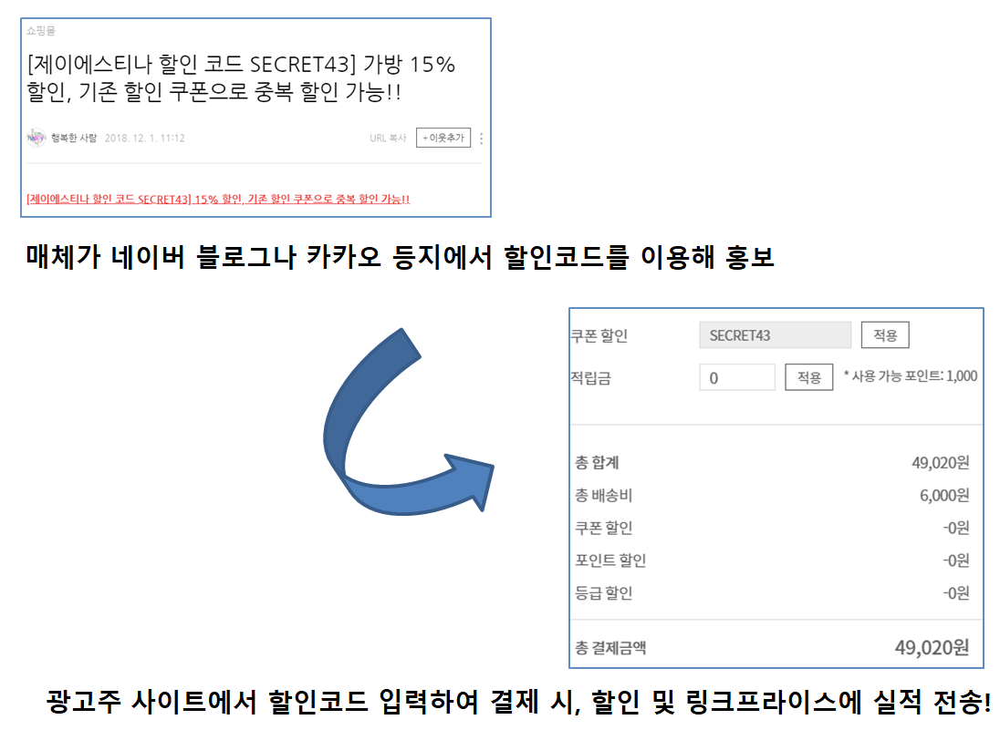

# CPS Setup Guide

# 1. What is affiliate marketing?

Affiliate marketing is a marketing technique in which an **Merchant(advertiser)**[^1], an internet business that sells a product or service, partners with another media site (Affiliate)[^2]  to promote it in order to attract customers and drive sales. 

This is a marketing technique in which the income generated is shared with the media site (Affiliate).


[Learn more about affiliate marketing](https://helpdesk.linkprice.com/pages/merchant-faq-introduce)


# 2. LinkPrice-Merchant Setup

Before you can use LinkPrice's affiliate marketing platform as an advertiser, you'll need to complete an integration.

This is what we call **"Merchant Setup"**.

To get set up, you'll need to do the following


## 2-1. Integration flow and advertiser action history


(1) Advertiser gateway

[Working with the Advertiser Gateway](#2-2-Working-with-the-Advertiser-Gateway)

(2) Loading Performance Data DB

[Create and load your own separate DB table when performance occurs](#2-3-create-own-separate-db-table-and-load-when-performance-occurs)

(3) Transferring performance

[Send LinkPrice earnings to LinkPrice when they occur](#2-4-send-linkprice-earnings-to-linkprice-when-they-occur)

(4) Performance List API

[Working with the Performance List API in Linkprice](#2-5-working-with-link-prices-performance-list-api)

(5) Promotion code CPS Setup

[Promotion code CPS Setup](#3-promotion-code-cps)

(6) Travel Merchant CPS Setup

[Travel Merchant CPS Setup](#4-for-travel-advertiser)


## 2-2. Working with the Advertiser Gateway

### 2-2-1. Why you need to do this

Affiliates[^2] promote their sites or other sites through affiliate links[^3] provided by LinkPrice.

As an advertiser, you need a value (Tracking Code) to determine whether the performance is attributable to  LinkPrice.

This tracking code is defined as "LPINFO" in Linkprice.

The advertiser gateway [^4] will generate a cookie on the client, which will be used to track performance.


### 2-2-2. Overview

The Advertiser Gateway [^4] has the following behavior.

```
1. Parameter Validation
2. Create cookies for performance tracking
3. Go to the advertiser's site
```

Your LinkPrice affiliate link will take you through the advertiser gateway page, generate a tracking code, and enter the advertiser's site.


### 2-2-3. How to work

**Step1**. Pass the JavaScript code for performance tracking from Linkprice to the advertiser.

> This JavaScript code is embedded within the advertiser's site to create a cookie for performance tracking and then redirect to the advertiser's site.
> 
> However, depending on the environment of the advertiser's site, this code may be set differently.

**Step2**. Create a gateway page URL inside your site and add the JavaScript code delivered by LinkPrice

> For the gateway implementation, feel free to implement it according to your server environment.
> 
> Example)
> 
> If using php, https://[domain]/linkprice/gateway.php
> If using jsp, https://[domain]/linkprice/gateway.jsp
> If using html, https://[domain]/linkprice/gateway.html

**Step3**. Be sure to provide the URL of the gateway you implemented to your LinkPrice Manager.

**Step4**. LinkPrice reflects the URL received from the advertiser in its internal platform and generates and
delivers the affiliate link.

> This is a sample URL and will not be the actual URL.
>
> https://click.linkprice.com/click.php?m=clickbuy&a=A100000131&l=0000

**Step5**. When you enter the affiliate link and navigate to the advertiser's site, make sure that a tracking code cookie named "**LPINFO**" is created in your browser's cookie.


### 2-2-4. Sample Code

During the setup process, Linkprice will deliver the generated JavaScript code to the advertiser.

All you need to do is to insert the received JavaScript code on your gateway page without modification.

If other codes are mixed in, the page landing and LPINFO cookie generation may not work. 

If you do not receive this code, please contact your LinkPrice Manager.

The sample code below is for reference only and does not represent the actual code.

```javascript
<!-- Google Tag Manager -->
<script>(function(w,d,s,l,i){w[l]=w[l]||[];w[l].push({'gtm.start':
    new Date().getTime(),event:'gtm.js'});var f=d.getElementsByTagName(s)[0],
    j=d.createElement(s),dl=l!='dataLayer'?'&l='+l:'';j.async=true;j.src=
    'https://www.googletagmanager.com/gtm.js?id='+i+dl;f.parentNode.insertBefore(j,f);
})(window,document,'script','dataLayer','GTM-P3HTV4');</script>
<!-- End Google Tag Manager -->
```

## 2-3. create own separate DB table and load when performance occurs

### 2-3-1. Why you need to do this

Data sent to LinkPrice in real-time may not be sent due to network transmission delay issues or program errors.

We're asking you to save your data so that we can match the data you sent to Linkprice with the data stored at the advertiser for settlement.

The loaded data is utilized for the [2-5. Performance list API operations]().


### 2-3-2. How to work

**Step1**. Create a table in your DB.

```sql
create table lpinfo(
    id int(10) unsigned NOT NULL AUTO_INCREMENT,	# Unique Key
    order_id varchar(30),		 				    # Order number to send to Linkprice
    product_id varchar(30),	 					    # Product number to send to Linkprice
    lpinfo varchar(580),		 				    # Linkprice code tracking code (LPINFO cookie) 
    user_agent varchar(300), 					    # Buyer's User Agent value
    ip varchar(50),					 			    # Buyer's IP
    device_type varchar(11)	 					    # Buyer's OS environment
)
```

> The above table creation query is an example based on Mysql.
>
> If you can store data, you can use NoSql. You can also
>
> create column names based on your server environment

**Step2**. When a payment is made, check whether the LPINFO cookie stored in the browser cookie exists and write it to the DB table.


### 2-3-3. Sample Code

**※ Note**

The sample code is an example of generating JSP and ASP code through Chat GPT based on PHP code.

You do not necessarily need to implement the example code, and please refer to it only  as an example. 

Implement according to your advertiser server environment.

**JSP Examples**

```jsp
<%@ page language="java" contentType="text/html; charset=UTF-8" pageEncoding="UTF-8"%>
<%@ page import="java.sql.*" %>

<%
  String orderId = request.getParameter("order_id") != null ? request.getParameter("order_id") : "";
  String productId = request.getParameter("product_id") != null ? request.getParameter("product_id") : "";
  String lpinfo = request.getCookies() != null ? request.getCookies()[0].getValue() : "";
  String userAgent = request.getHeader("User-Agent") != null ? request.getHeader("User-Agent") : "";
  String ip = request.getRemoteAddr() != null ? request.getRemoteAddr() : "";
  
  /*
  web-pc : Performance from browsers for PCs
  web-mobile :  Performance on the mobile web
  app-android : Performance in the Android app environment (including webview)
  app-ios : Performance in the iOS app environment (including webview)
  */
  String deviceType = "web-pc";	

  Connection dbConnection = null;
  Statement statement = null;

  try {
    Class.forName("com.mysql.jdbc.Driver");
    dbConnection = DriverManager.getConnection("jdbc:mysql://localhost/DATABASE_NAME", "ID", "PASSWORD");
    
    if (lpinfo != null && !lpinfo.isEmpty()) {
      // Save results to internal DB
      String query = "INSERT INTO lpinfo (order_id, product_id, lpinfo, user_agent, ip, device_type) VALUES (?, ?, ?, ?, ?, ?)";
      PreparedStatement preparedStatement = dbConnection.prepareStatement(query);
      preparedStatement.setString(1, orderId);
      preparedStatement.setString(2, productId);
      preparedStatement.setString(3, lpinfo);
      preparedStatement.setString(4, userAgent);
      preparedStatement.setString(5, ip);
      preparedStatement.setString(6, deviceType);
      
      preparedStatement.executeUpdate();
    }
  } catch (SQLException e) {
    e.printStackTrace();
  } catch (ClassNotFoundException e) {
    e.printStackTrace();
  } finally {
    if (statement != null) {
      try {
        statement.close();
      } catch (SQLException e) {
        e.printStackTrace();
      }
    }
    if (dbConnection != null) {
      try {
        dbConnection.close();
      } catch (SQLException e) {
        e.printStackTrace();
      }
    }
  }
%>
```

**ASP Examples**

```asp
<%
'
Dim orderId
Dim productId
Dim lpinfo
Dim userAgent
Dim ip
Dim deviceType

orderId = Request("order_id")
productId = Request("product_id")
lpinfo = Request.Cookies("LPINFO")
userAgent = Request.ServerVariables("HTTP_USER_AGENT")
ip = Request.ServerVariables("REMOTE_ADDR")

' Set device type
deviceType = "web-pc"

' Connect to MySQL Database
Dim dbConnection
Set dbConnection = Server.CreateObject("ADODB.Connection")
dbConnection.Open "Driver={MySQL ODBC 8.0 Unicode Driver};Server=localhost;Database=DATABASE_NAME;Uid=ID;Pwd=PASSWORD;"

If Not lpinfo = "" Then
    ' Save results to internal DB
    Dim query
    query = "INSERT INTO lpinfo (order_id, product_id, lpinfo, user_agent, ip, device_type) VALUES (?, ?, ?, ?, ?, ?)"
    
    Dim cmd
    Set cmd = Server.CreateObject("ADODB.Command")
    cmd.ActiveConnection = dbConnection
    cmd.CommandText = query
    cmd.CommandType = 1 ' adCmdText
    
    cmd.Parameters.Append cmd.CreateParameter("@order_id", 200, 1, 50, orderId)
    cmd.Parameters.Append cmd.CreateParameter("@product_id", 200, 1, 50, productId)
    cmd.Parameters.Append cmd.CreateParameter("@lpinfo", 200, 1, 255, lpinfo)
    cmd.Parameters.Append cmd.CreateParameter("@user_agent", 200, 1, 255, userAgent)
    cmd.Parameters.Append cmd.CreateParameter("@ip", 200, 1, 50, ip)
    cmd.Parameters.Append cmd.CreateParameter("@device_type", 200, 1, 50, deviceType)
    
    cmd.Execute
End If

dbConnection.Close
Set dbConnection = Nothing
%>

```

**PHP Examples**

```php
<?php
    $orderId 		= $_REQUEST['order_id'] ?? '';
    $productId      = $_REQUEST['product_id'] ?? '';
    $lpinfo			= $_COOKIE['LPINFO'] ?? '';
    $userAgent      = $_SERVER['HTTP_USER_AGENT'] ?? '';
    $ip				= $_SERVER["REMOTE_ADDR"] ?? '';
	
	/*
    web-pc: Performance from browsers for PCs
    web-mobile: Performance on the mobile web
    app-android: Performance in the Android app environment (including webview)
	app-ios: Performance in the iOS app environment (including webview)
	*/
	$deviceType	= 'web-pc';	

	$dbConnection = mysqli_connect("localhost", "ID", "PASSWORD", "DATABASE_NAME");
  
  if(isset($_COOKIE['LPINFO']) && !empty($_COOKIE['LPINFO'])) {
    //Save result to internal DB
    $query = "
    INSERT INTO `lpinfo` (
    	order_id, product_id, lpinfo, user_agent, ip, device_type
    ) VALUE (
    	'$orderId', '$productId', '$lpinfo', '$userAgent', '$ip', '$deviceType' 
    )";
    
    $result = mysqli_query($dbConnection, $query);
  }
```


## 2-4. Send LinkPrice earnings to LinkPrice when they occur

### 2-4-1. Why you need to do this

For earnings generated by LinkPrice's affiliate links, you must transmit earnings in real time according to the specifications required by LinkPrice.

If you have difficulty sending performance in real-time, please contact us.


### 2-4-2. Overview

```
1. You've earned it!
2. Check for the presence of LinkPrice tracking code (LPINFO cookie) generated by the gateway
3. If you have a tracking code, send your performance to LinkPrice's performance collection program
```

### 2-4-3. How to work

**Step1**. Refer to the requirements specification below to send performance to the LinkPrice performance collection program.

**2-4-3-1. REQUEST Overview**

| Title              | Description                                         |
|--------------------|:----------------------------------------------------|
| Request URL        | https://service.linkprice.com/lppurchase_cps_v4.php |
| Protocols          | https                                               |
| HTTP Methods       | POST                                                |
| Request Body Type  | RAW Data                                            |
| Request Parameter  | JSON String                                         |
| Response Parameter | JSON String                                         |

**2-4-3-2. REQUEST Parameter**

| KEY                            | Value                                                                                                                                                                                                                                                                                                                                                                                                                                                                                                                                          | Type            |
|--------------------------------|------------------------------------------------------------------------------------------------------------------------------------------------------------------------------------------------------------------------------------------------------------------------------------------------------------------------------------------------------------------------------------------------------------------------------------------------------------------------------------------------------------------------------------------------|-----------------|
| order                          | About order data                                                                                                                                                                                                                                                                                                                                                                                                                                                                                                                               | object          |
| order.order_id                 | Product unique order number <br><span style="font-size:75%">When Linkprice receives a missing inquiry from a media outlet, it uses this order number as the basis for the to see if it's missing</span>                                                                                                                                                                                                                                                                                                                                        | varchar(100)    |
| order.final_paid_price         | The total amount of the buyer's actual payment, excluding shipping costs.<br><span style="font-size:75%"> If the buyer pays for shipping other than free shipping, the full payment excluding shipping costs </span> <br><span style="font-size:75%"> * For discount coupons, the amount must be subtracted </span> <br> <span style="font-size:75%"> * Amounts used as internal points should not be subtracted from the total amount </span>                                                                                                 | float           |
| order.currency                 | The currency used to pay for the product<br><span style="font-size:75%">Using ISO 4217<br> Example) US: USD, Korean Won: KRW, Chinese Yuan: CNY, Euro: EUR</span>                                                                                                                                                                                                                                                                                                                                                                              | varchar(3)      |
| order.user_name                | Buyer Name<br><span style="font-size:75%"In the event of a missing statement, masking or a space ("") is recommended due to privacy issues to be used to distinguish whose performance is being recognized (example) Kim**, Lee**</span>                                                                                                                                                                                                                                                                                                       | varchar(100)    |
| products[]                     | List of individual product data                                                                                                                                                                                                                                                                                                                                                                                                                                                                                                                | array< object > |
| products[].product_id          | Product ID                                                                                                                                                                                                                                                                                                                                                                                                                                                                                                                                     | varchar(100)    |
| products[].product_name        | Product name                                                                                                                                                                                                                                                                                                                                                                                                                                                                                                                                   | varchar(300)    |
| products[].category_code       | Product category codes                                                                                                                                                                                                                                                                                                                                                                                                                                                                                                                         | varchar(200)    |
| products[].category_name       | Product category name <br><span style="font-size:75%">List all of the product's category names, if possible.<br> For example, for Clothing > Men's clothing > Jackets > Outerwear, send it like this<br>  "category_name": ["apparel", "menswear", "jackets", "outerwear"]</span>                                                                                                                                                                                                                                                              | varchar(100)    |
| products[].quantity            | Number of products purchased                                                                                                                                                                                                                                                                                                                                                                                                                                                                                                                   | int(11)         |
| products[].product_final_price | Product final price                                                                                                                                                                                                                                                                                                                                                                                                                                                                                                                            | float           |
| products[].paid_at             | Order completion time<br><span style="font-size:75%">Order fulfillment time means the time when the payment was successful. <br>* Date Format: ISO-8601 (data format must be the same as the example) <br> * Time values are recommended to default to KST time <br><br>Example 1) Order placed on January 10, 2021 at 3:44:52 PM in South Korea (UTC+09:00 time zone) <br>paid_at : “2021-01-10T15:44:52+09:00”<br>                                                                                                                           | datetime        |
| products[].confirmed_at        | Purchase confirmation time<br><span style="font-size:75%">Purchase Confirmation Time means the time when the refund/cancellation period specified by the shopping mall has passed and the purchase can no longer be refunded/canceled. <br>* See [Performance List API]() for confirmation <br>* Date Format: ISO-8601 (The data format should be the same as the example.) <br><br>- Example) Order confirmed for purchase on 01/15/2021 at 3:44:52 PM in South Korea (UTC+09:00 timezone) <br>confirmed_at : “2021-01-15T15:44:52+09:00”<br> | datetime        |
| products[].canceled_at         | Time to cancel a purchase<br><span style="font-size:75%">Purchase cancellation time is when a refund, cancellation, or return is processed at the buyer's request.<br> * See [Performance List API]() for cancellation status <br>Date Format: ISO-8601 (The data format should be the same as the example.)<br><br>- Example 1) January 20, 2021, 07:11 AM in South Korea (UTC+09:00 timezone) <br>canceled_at : “2021-01-15T07:11:13+09:00”<br>                                                                                              | datetime        |
| linkprice                      | Data required by Linkprice                                                                                                                                                                                                                                                                                                                                                                                                                                                                                                                     | object          |
| linkprice.merchant_id          | Advertiser ID issued by LinkPrice                                                                                                                                                                                                                                                                                                                                                                                                                                                                                                              | varchar(10)     |
| linkprice.lpinfo               | Tracking code from LinkPrice (=LPINFO cookie)                                                                                                                                                                                                                                                                                                                                                                                                                                                                                                  | varchar(500)    |
| linkprice.user_agent           | About USER AGENT                                                                                                                                                                                                                                                                                                                                                                                                                                                                                                                               | varchar(1000)   |
| linkprice.remote_addr          | Buyer IP addres<br><span style="font-size:75%">Masking or space ("") preferred due to privacy concerns. <br>Example) 118.221.*.* , ""</span>                                                                                                                                                                                                                                                                                                                                                                                                   | varchar(100)    |
| linkprice.device_type          | User device type<br><span style="font-size:75%">- web-pc: Performance from a PC web browser<br>- web-mobile: Performance on mobile web browsers<br>- app-ios: Performance from an iOS app (or webview)<br>- app-android: Performance from an Android app (or webview)</span>                                                                                                                                                                                                                                                                   | varchar(10)     |

**REQUEST parameter examples**

```json
{
    "order": {
        "order_id": "o190203-h78X3",
        "final_paid_price": 29000,
        "currency": "KRW",
        "user_name": "kim**"
    },
    "products": [
        {
            "product_id": "P87-234-anx87",
            "product_name": "UHD 4K 넥시 HDMI케이블",
            "category_code": "132782",
            "category_name": ["컴퓨터 주변기기", "케이블", "HDMI케이블"],
            "quantity": 2,
            "product_final_price": 12687,
            "paid_at": "2019-02-12T11:13:44+09:00",
            "confirmed_at": "",
            "canceled_at": ""
        },
        {
            "product_id": "P23-983-Z3272",
            "product_name": "농심 오징어짬뽕124g(5개)",
            "category_code": "237018",
            "category_name": ["가공식품", "라면", "봉지라면"],
            "quantity": 3,
            "product_final_price": 16312,
            "paid_at": "2019-02-12T11:13:44+09:00",
            "confirmed_at": "",
            "canceled_at": ""
        }
    ],
    "linkprice": {
        "merchant_id": "sample",
        "lpinfo": "A123456789|9832|A|m|a8uakljfa",
        "user_agent": "Mozilla/5.0...",
        "remote_addr": "118.221.*.*",
        "device_type": "web-pc"
    }
}
```


**2-4-3-4. Response Overview**

| Key name     | Value                           | Type      |
|--------------|---------------------------------|---------|
| is_success   | Successful performance transfer | boolean |
| error_message | Error detail message            | string  |
| order_code   | Order number                    | string  |
| product_code | Item number                     | string  |

>The response is sent as a JSON string.
>
>The response is a two-dimensional array of the number of products purchased.


**2-4-3-5. Sample Response**

* After purchasing 2 items, on successful transfer

```json
[
    {
        "is_success": true,
        "error_message": "",
        "order_code": "o190203-h78X3",
        "product_code": "P87-234-anx87"
    },
    {
        "is_success": true,
        "error_message": "",
        "order_code": "o190203-h78X3",
        "product_code": "P23-983-Z3272"
    }
]
```

* After purchasing 2 items, if the transfer fails

```json
[
    {
        "is_success": false,
        "error_message": "lpinfo parameter is empty.",
        "order_code": "o190203-h78X3",
        "product_code": "P87-234-anx87"
    },
    {
        "is_success": false,
        "error_message": "lpinfo parameter is empty.",
        "order_code": "o190203-h78X3",
        "product_code": "P23-983-Z3272"
    }
]
```


**2-4-3-6. Response Detailed Reason**

* If the response does not exist in the list below, please provide the request value and response value of the call to the LinkPrice Manager.


| Error Messages                                                                                        | MessagesError Details                                                          |
|-------------------------------------------------------------------------------------------------------|--------------------------------------------------------------------------------|
| This is not a valid JSON string.                                                                      | REQUEST Data is not in JSON format                                             |
| order.order_id parameter is empty.                                                                    | order.order_id not entered                                                     |
| order.final_paid_price parameter is empty.                                                            | order.final_paid_price not entered                                             |
| order.final_paid_price is not integer.                                                                | order.final_paid_price not integer                                             |
| order.currency parameter is empty.                                                                    | order.currency not entered                                                     |
| order.user_name parameter is empty.                                                                   | order.member_id not entered                                                    |
| products parameter is empty.                                                                          | products parameter not entered                                                 |
| linkprice.lpinfo parameter is empty.                                                                  | linkprice.lpinfo not entered                                                   |
| linkprice.lpinfo parameter does not conform to the format.                                            | linkprice.lpinfo does not confirm to the format                                |
| linkprice.user_agent parameter is empty.                                                              | linkprice.user_agent not entered                                               |
| linkprice.remote_addr parameter is empty.                                                             | linkprice.remote_addr not entered                                              |
| linkprice.device_type parameter is empty.                                                             | linkprice.device_type not entered                                              |
| products[i].product_id parameter is empty.                                                            | products ith product_id not entered                                            |
| products[i].product_name parameter is empty.                                                          | products ith product_name not entered                                          |
| products[i].category_code parameter is empty.                                                         | products ith category_code not entered                                         |
| products[i].product_final_price parameter is empty.                                                   | products ith product_final_price not entered                                   |
| The amount of order.final_paid_price does not match the total amount of products.product_final_price. | The total amount of products does not match the order.final_paid_price amount. |
| There was a problem sending your performance.                                                         | Error sending performance                                                      |


**Step2**. Write a program to send performance to the LinkPrice performance collection program


according to your server environment. [2-4-4. Sample code for sending performance]()

Here are some scenarios you can expect as you work through your tasks.

**Expected scenarios when sending performance)**

```
A shopper clicked on your LinkPrice affiliate link and entered the shopping cart.
In a shopping mall, I added two HDMI cables for 7,000 won and three bagged ramen for 6,000 won to my cart. The items were eligible for free shipping, and I used a 3,000 won discount coupon at the checkout.
```

**How to calculate the amount)**

```
Formula to apply the discount amount to the final amount of the product)
Product final price - Discount amount * Product final price / Order final price = Discounted final price

The total amount to be paid before the discount coupon is applied is 32,000 won.
Since you used a 3000 won discount coupon, the final amount that the buyer will pay is 29000 won.
Before the discount coupon was used, the final price of the HDMI cable (products[].product_final_price) was set to
It was 14,000 won, but you used a discount coupon of 3,000 won, so 14,000 - 3,000 * 14,000 / 32,000 = 12,687.5 won.

The final price of the bagged ramen (products[].product_final_price) is 18,000 before the discount coupon is applied.
But since you used a 3,000 won discount coupon, 18,000 - 3,000 * 18,000 / 32,000 = 16,312.5 won.
The sum of the product final price (products[].product_final_price) is the order final amount (order.final_paid_price), but truncation due to decimalization can cause single-digit amounts to differ.

The LinkPrice earnings collection program allows for single-digit differences in amounts.

Example of calculating the final amount of an order)
12687.5(products[].product_final_price) + 16312.5(products[].product_final_price) = 29000(order.final_paid_price)

```

**Step3**. Check if the response value is output normally after calling LinkPrice's performance transfer URL.


### 2-4-4. Sample Code

**※ Note**

The sample code is an example of generating JSP and ASP code through Chat GPT based on PHP code. 

You do not necessarily need to implement the example code, and please refer to it only as an example.

Implement according to your advertiser server environment.

**JSP Examples**

```jsp
<%@ page import="java.io.*" %>
<%@ page import="java.net.*" %>
<%@ page import="org.json.*" %>

<%
// Order information
JSONObject order = new JSONObject();
order.put("order_id", "ORDER1234");
order.put("final_paid_price", 60000);
order.put("currency", "KRW");
order.put("user_name", "김링크");

// Product information
JSONArray products = new JSONArray();

// Product item 1
JSONObject product1 = new JSONObject();
product1.put("product_id", "product_id1");
product1.put("product_name", "상품 이름1");
product1.put("category_code", "상품 카테고리1");
product1.put("category_name", "상품 카테고리 이름1");
product1.put("quantity", 2);
product1.put("product_final_price", 10000);
product1.put("paid_at", "2023-09-22T11:13:44+09:00");
product1.put("confirmed_at", "");
product1.put("canceled_at", "");
products.put(product1);

// Product item 2
JSONObject product2 = new JSONObject();
product2.put("product_id", "product_id2");
product2.put("product_name", "상품 이름2");
product2.put("category_code", "상품 카테고리2");
product2.put("category_name", "상품 카테고리 이름2");
product2.put("quantity", 3);
product2.put("product_final_price", 50000);
product2.put("paid_at", "2023-09-22T11:13:44+09:00");
product2.put("confirmed_at", "");
product2.put("canceled_at", "");
products.put(product2);

// Data required by Linkprice
JSONObject linkprice = new JSONObject();
linkprice.put("merchant_id", "clickbuy");
linkprice.put("lpinfo", ""); // lpinfo 값을 설정해야 합니다.
linkprice.put("user_agent", request.getHeader("User-Agent"));
linkprice.put("remote_addr", request.getRemoteAddr());
linkprice.put("device_type", "web-pc");

// All about Data
JSONObject purchases = new JSONObject();
purchases.put("order", order);
purchases.put("products", products);
purchases.put("linkprice", linkprice);

// Convert to JSON format
String postData = purchases.toString();

// HTTP POST request
String url = "https://service.linkprice.com/lppurchase_cps_v4.php";
URLConnection connection = new URL(url).openConnection();
connection.setDoOutput(true);
connection.setRequestProperty("Content-Type", "application/json");

try (OutputStream os = connection.getOutputStream()) {
    byte[] input = postData.getBytes("utf-8");
    os.write(input, 0, input.length);
}

try (BufferedReader br = new BufferedReader(new InputStreamReader(connection.getInputStream(), "utf-8"))) {
    StringBuilder response = new StringBuilder();
    String responseLine = null;
    while ((responseLine = br.readLine()) != null) {
        response.append(responseLine.trim());
    }
    
    // Response data from the LinkPrice performance collection program
    out.println(response.toString());
}
%>
```


**ASP Examples**

```asp
<%
' Example of sending earnings to the LinkPrice earnings collection program

' Order information
Dim order
Set order = Server.CreateObject("Scripting.Dictionary")
order("order_id") = "ORDER1234"
order("final_paid_price") = 60000
order("currency") = "KRW"
order("user_name") = "김링크"

' Product information
Dim products
Set products = Server.CreateObject("Scripting.Dictionary")

' Product item 1
Dim product1
Set product1 = Server.CreateObject("Scripting.Dictionary")
product1("product_id") = "product_id1"
product1("product_name") = "상품 이름1"
product1("category_code") = "상품 카테고리1"
product1("category_name") = "상품 카테고리 이름1"
product1("quantity") = 2
product1("product_final_price") = 10000
product1("paid_at") = "2023-09-22T11:13:44+09:00"
product1("confirmed_at") = ""
product1("canceled_at") = ""
products.Add product1("product_id"), product1

' Product item 1
Dim product2
Set product2 = Server.CreateObject("Scripting.Dictionary")
product2("product_id") = "product_id2"
product2("product_name") = "상품 이름2"
product2("category_code") = "상품 카테고리2"
product2("category_name") = "상품 카테고리 이름2"
product2("quantity") = 3
product2("product_final_price") = 50000
product2("paid_at") = "2023-09-22T11:13:44+09:00"
product2("confirmed_at") = ""
product2("canceled_at") = ""
products.Add product2("product_id"), product2

' Data required by Linkprice
Dim linkprice
Set linkprice = Server.CreateObject("Scripting.Dictionary")
linkprice("merchant_id") = "clickbuy"
linkprice("lpinfo") = ""
linkprice("user_agent") = Request.ServerVariables("HTTP_USER_AGENT")
linkprice("remote_addr") = Request.ServerVariables("REMOTE_ADDR")
linkprice("device_type") = "web-pc"

' All about Data
Dim purchases
Set purchases = Server.CreateObject("Scripting.Dictionary")
purchases.Add "order", order
purchases.Add "products", products
purchases.Add "linkprice", linkprice

' Convert to JSON format
Function ConvertToJson(obj)
    Dim jsonObj, key
    Set jsonObj = Server.CreateObject("Scripting.Dictionary")
    For Each key In obj.Keys
        jsonObj.Add key, obj(key)
    Next
    ConvertToJson = Join(obj.Keys, ", ")
End Function

Dim postData
postData = ConvertToJson(purchases)

' HTTP POST request
Dim objXMLHTTP
Set objXMLHTTP = Server.CreateObject("MSXML2.ServerXMLHTTP")
objXMLHTTP.Open "POST", "https://service.linkprice.com/lppurchase_cps_v4.php", False
objXMLHTTP.setRequestHeader "Content-Type", "application/json"
objXMLHTTP.send postData

' Response data from the LinkPrice Performance Collection Program
Response.Write objXMLHTTP.responseText

Set objXMLHTTP = Nothing
%>
```


**PHP Examples**

```php
<?php
/**
 * Example of sending earnings to the LinkPrice earnings collection program
 */

$purchases = [];

// Product information
$purchases['order'] = [
    'order_id'          => 'ORDER1234',
    'final_paid_price'  => 60000,
    'currency'          => 'KRW',
    'user_name'         => '김링크' 
];

// Product 
$purchases['products'] = [];

// Product item 1
$purchases['products'][] = [
    'product_id'            => 'product_id1',
    'product_name'          => '상품 이름1',
    'category_code'         => '상품 카테고리1',
    'category_name'         => '상품 카테고리 이름1',
    'quantity'              => 2,
    'product_final_price'   => 10000,
    'paid_at'               => '2023-09-22T11:13:44+09:00',
    'confirmed_at'          => '',
    'canceled_at'           => ''
];

// Product item 2
$purchases['products'][] = [
    'product_id'            => 'product_id2',
    'product_name'          => '상품 이름2',
    'category_code'         => '상품 카테고리2',
    'category_name'         => '상품 카테고리 이름2',
    'quantity'              => 3,
    'product_final_price'   => 50000,
    'paid_at'               => '2023-09-22T11:13:44+09:00',
    'confirmed_at'          => '',
    'canceled_at'           => ''
];

// Data required by LinkPrice
$purchases['linkprice'] = [
    'merchant_id'   => 'clickbuy',
    'lpinfo'        => $lpinfo,
    'user_agent'    => $_SERVER['HTTP_USER_AGENT'] ?? '',
    'remote_addr'   => $_SERVER['REMOTE_ADDR'] ?? '',
    'device_type'   => 'web-pc'
];

$postData = json_encode($purchases);

$curl = curl_init();

curl_setopt_array($curl, [
  CURLOPT_URL               => 'https://service.linkprice.com/lppurchase_cps_v4.php',
  CURLOPT_RETURNTRANSFER    => true,
  CURLOPT_HTTP_VERSION      => CURL_HTTP_VERSION_1_1,
  CURLOPT_CUSTOMREQUEST     => 'POST',
  CURLOPT_POSTFIELDS        => $postData
]);

$response = curl_exec($curl);
curl_close($curl);

// Response data from the LinkPrice performance collection program
echo $response;
```

## 2-5. Working with Link Price's Performance List API

### 2-5-1. Why the action is needed

The performance data sent by the advertiser through their performance collection program is loaded into the LinkPrice database. Basically, the performance data in LinkPrice and the
performance data that the advertiser has should be the same.

However, it is often the case that even though it is transmitted, the performance is generated but not transmitted to Link Price due to various failures.

So every day, we call the advertiser's API to get the previous day's performance data and compare it to Linkprice's performance, and if it's not there, we recover it.

We also use this API to automatically cancel performances with order minimums or refunds on the 20th of every month. 

In order to check your performance on Linkprice, you need to create a performance query API that can be accessed from the Linkprice server according to the specifications set by Linkprice.


### 2-5-2. Overview

This API is called the Performance List API.

Linkprice is utilizing the API to process as follows

```
1. Call the Advertiser Performance API at dawn each day to collect the previous day's performance to begin the performance recovery process.
2. On the 20th of every month, we collect the previous month's cancellations from advertisers and process them automatically
```

> Collecting previous month's confirmations and cancellations is not a resend of confirmations and cancellations from the advertiser side.
> 
> You can indicate this in the API by applying the confirmation and cancellation dates to the confirmed_at and canceled_at of the visible product (products[]) in the performance list API.
> 
> Since Linkprice only checks for status, you only need to update the corresponding confirmed_at and canceled_at values

When Linkprice calls the Advertiser API, it is called 3 times a day as shown below.

1. Call all data based on order completion date to recover performance

```
# call the date to look up with the query string paid_ymd parameter
https://api.yourdomain.com/linkprice/order_list_v1?paid_ymd=yyyymmdd
```

2. Call based on purchase confirmation date to finalize performance

```
# call the date to look up with the query string confirmed_ymd parameter
https://api.yourdomain.com/linkprice/order_list_v1?confirmed_ymd=yyyymmdd
```

3. Call based on purchase cancellation date to cancel performance

```
# call the date to look up with the query string canceled_ymd parameter
https://api.yourdomain.com/linkprice/order_list_v1?canceled_ymd=yyyymmdd
```

The data you send to LinkPrice and the data represented in the performance list must be the same.

> If a product name is sent as "Product A" in the performance transmission, but is sent as "Product B" in the performance list API (x)


### 2-5-3. How to work

**Step1**.  Refer to the required output specification below to create a performance list API. See 2-3-3 Step1

**Step2**. Create a performance list page and add the order paid date (paid_ymd), purchase confirmed date (comfirmed_ymd), and purchase canceled date to it (canceled_ymd).

so that Linkprice can take a JSON string as shown in the example below.

Performance List API Response Example

```json
[
    {
        "order": {
            "order_id": "o190203-h78X3",
            "final_paid_price": 29000,
            "currency": "KRW",
            "user_name": "구**"
        },
        "products": [
            {
                "product_id": "P87-234-anx87",
                "product_name": "UHD 4K 넥시 HDMI케이블",
                "category_code": "132782",
                "category_name": ["컴퓨터 주변기기", "케이블", "HDMI케이블"],
                "quantity": 2,
                "product_final_price": 12687,
                "paid_at": "2019-02-12T11:13:44+09:00",
                "confirmed_at": "",
                "canceled_at": ""
            },
            {
                "product_id": "P23-983-Z3272",
                "product_name": "농심 오징어짬뽕124g(5개)",
                "category_code": "237018",
                "category_name": ["가공식품", "라면", "봉지라면"],
                "quantity": 3,
                "product_final_price": 16312,
                "paid_at": "2019-02-12T11:13:44+09:00",
                "confirmed_at": "",
                "canceled_at": "2019-02-12T11:15:44+09:00"
            }
        ],
        "linkprice": {
            "merchant_id": "sample",
            "lpinfo": "A123456789|9832|A|m|a8uakljfa",
            "user_agent": "Mozilla/5.0...",
            "remote_addr": "13.156.*.*",
            "device_type": "web-pc"
        }
    },
    {"order":{"order_id":"ord-123-01",...},"products":[...],"linkprice":{...}},
    {"order":{"order_id":"ord-123-03",...},"products":[...],"linkprice":{...}},
    {"order":{"order_id":"ord-123-04",...},"products":[...],"linkprice":{...}}
]
```

**Step3**. If the firewall policy of your server is blocking inbound, you need to allow the IPs below to be accessible to LinkPrice crawlers

```
# LinkPrice Server(Outbound) IP
13.125.179.218/32
13.124.188.166/32
```

**Step4**. forward the completed API URL to the LinkPrice

### 2-5-4. Sample code

**※ Note**

The sample code is an example of generating JSP and ASP code through Chat GPT based on PHP code.

You do not necessarily need to implement the example code, and please refer to it only as an example.

Please implement according to your environment.

* The lpinfo table is based on the table structure you create in the [Integration Guide 2-3](#2-3-create-own-separate-db-table-and-load-when-performance-occurs). See Step1 example.  

* purchase table refers to the purchased product list data


**JSP Example**

```jsp
<%@ page language="java" contentType="application/json; charset=UTF-8" pageEncoding="UTF-8"%>
<%@ page import="java.sql.*" %>
<%@ page import="java.util.*" %>

<%
// LinkPrice Performance List API
String paidYmd = request.getParameter("paid_ymd");
String confirmYmd = request.getParameter("confirmed_ymd");
String cancelYmd = request.getParameter("canceled_ymd");

String query = null;

if (paidYmd != null && !paidYmd.isEmpty()) {
    // Get data by purchase date
    query = "SELECT p.order_id, p.product_id, p.user_name, "
            + "p.product_id, p.product_name, p.category_code, p.category_name, "
            + "p.quantity, p.product_final_price, "
            + "DATE_FORMAT(p.paided_at, '%Y%m%d') as paid_at, "
            + "DATE_FORMAT(p.confirmed_at, '%Y%m%d') as confirmed_at, "
            + "DATE_FORMAT(p.canceled_at, '%Y%m%d') as canceled_at, "
            + "l.lpinfo, l.device_type, l.user_agent, l.ip "
            + "FROM purchase p "
            + "JOIN lpinfo l "
            + "ON p.order_id = l.order_id "
            + "AND p.product_id = l.product_id "
            + "WHERE DATE_FORMAT(p.paided_at, '%Y%m%d') = ?";
} else if (confirmYmd != null && !confirmYmd.isEmpty()) {
    // Get data by confirmation dat
    query = "SELECT p.order_id, p.product_id, p.user_name, "
            + "p.product_id, p.product_name, p.category_code, p.category_name, "
            + "p.quantity, p.product_final_price, "
            + "DATE_FORMAT(p.paided_at, '%Y%m%d') as paid_at, "
            + "DATE_FORMAT(p.confirmed_at, '%Y%m%d') as confirmed_at, "
            + "DATE_FORMAT(p.canceled_at, '%Y%m%d') as canceled_at, "
            + "l.lpinfo, l.device_type, l.user_agent, l.ip "
            + "FROM purchase p "
            + "JOIN lpinfo l "
            + "ON p.order_id = l.order_id "
            + "AND p.product_id = l.product_id "
            + "WHERE p.confirmed_ymd = ?";
} else if (cancelYmd != null && !cancelYmd.isEmpty()) {
    // Get data by cancellation date
    query = "SELECT p.order_id, p.product_id, p.user_name, "
            + "p.product_id, p.product_name, p.category_code, p.category_name, "
            + "p.quantity, p.product_final_price, "
            + "DATE_FORMAT(p.paided_at, '%Y%m%d') as paid_at, "
            + "DATE_FORMAT(p.confirmed_at, '%Y%m%d') as confirmed_at, "
            + "DATE_FORMAT(p.canceled_at, '%Y%m%d') as canceled_at, "
            + "l.lpinfo, l.device_type, l.user_agent, l.ip "
            + "FROM purchase p "
            + "JOIN lpinfo l "
            + "ON p.order_id = l.order_id "
            + "AND p.product_id = l.product_id "
            + "WHERE p.canceled_ymd = ?";
}

// Establish a database connection
String jdbcUrl = "jdbc:mysql://localhost/DATABASE_NAME";
String dbUser = "ID";
String dbPassword = "PASSWORD";

List<Map<String, Object>> products = new ArrayList<>();

try {
    Class.forName("com.mysql.jdbc.Driver");
    Connection dbConnection = DriverManager.getConnection(jdbcUrl, dbUser, dbPassword);
    PreparedStatement statement = dbConnection.prepareStatement(query);

    if (paidYmd != null && !paidYmd.isEmpty()) {
        statement.setString(1, paidYmd);
    } else if (confirmYmd != null && !confirmYmd.isEmpty()) {
        statement.setString(1, confirmYmd);
    } else if (cancelYmd != null && !cancelYmd.isEmpty()) {
        statement.setString(1, cancelYmd);
    }

    ResultSet result = statement.executeQuery();

    while (result.next()) {
        // Group items by order number
        Map<String, Object> row = new HashMap<>();
        row.put("order_id", result.getString("order_id"));
        row.put("product_id", result.getString("product_id"));
        row.put("user_name", result.getString("user_name"));
        row.put("product_name", result.getString("product_name"));
        row.put("category_code", result.getString("category_code"));
        row.put("category_name", result.getString("category_name"));
        row.put("quantity", result.getInt("quantity"));
        row.put("product_final_price", result.getDouble("product_final_price"));
        row.put("paid_at", result.getString("paid_at"));
        row.put("confirmed_at", result.getString("confirmed_at"));
        row.put("canceled_at", result.getString("canceled_at"));
        row.put("lpinfo", result.getString("lpinfo"));
        row.put("device_type", result.getString("device_type"));
        row.put("user_agent", result.getString("user_agent"));
        row.put("ip", result.getString("ip"));
        products.add(row);
    }

    result.close();
    statement.close();
    dbConnection.close();
} catch (Exception e) {
    e.printStackTrace();
}

List<Map<String, Object>> data = new ArrayList<>();
for (Map<String, Object> product : products) {
    // Order information
    Map<String, Object> purchase = new HashMap<>();
    String orderId = (String) product.get("order_id");
    purchase.put("order", Map.of(
            "order_id", orderId,
            "final_paid_price", calculateFinalPaidPrice(products, orderId),
            "currency", "KRW",
            "user_name", product.get("user_name")
    ));

    // Product information
    List<Map<String, Object>> productDetails = new ArrayList<>();
    for (Map<String, Object> productOne : products) {
        if (orderId.equals(productOne.get("order_id"))) {
            productDetails.add(Map.of(
                    "product_id", productOne.get("product_id"),
                    "product_name", productOne.get("product_name"),
                    "category_code", productOne.get("category_code"),
                    "category_name", productOne.get("category_name"),
                    "quantity", productOne.get("quantity"),
                    "product_final_price", productOne.get("product_final_price"),
                    "paid_at", productOne.get("paid_at"),
                    "confirmed_at", productOne.get("confirmed_at"),
                    "canceled_at", productOne.get("canceled_at")
            ));
        }
    }
    purchase.put("products", productDetails);

    // linkprice data
    purchase.put("linkprice", Map.of(
            "merchant_id", "clickbuy",
            "lpinfo", product.get("lpinfo"),
            "user_agent", product.get("user_agent"),
            "remote_addr", product.get("ip"),
            "device_type", product.get("device_type")
    ));

    data.add(purchase);
}

// Print performance data
String jsonData = new Gson().toJson(data);
response.setContentType("application/json");
response.setCharacterEncoding("UTF-8");
response.getWriter().write(jsonData);

/**
 * Calculate the total checkout price of the products corresponding to the Order ID
 */
private double calculateFinalPaidPrice(List<Map<String, Object>> products, String orderId) {
    double totalFinalPaidPrice = 0.0;
    for (Map<String, Object> product : products) {
        if (orderId.equals(product.get("order_id"))) {
            totalFinalPaidPrice += (double) product.get("product_final_price");
        }
    }
    return totalFinalPaidPrice;
}
%>
```


**ASP Examples**

```asp
<%
' Linkprice Performance List API

Dim paidYmd, confirmYmd, cancelYmd
paidYmd = Request.QueryString("paid_ymd")
confirmYmd = Request.QueryString("comfirmed_ymd")
cancelYmd = Request.QueryString("canceled_ymd")

Dim query
query = ""

If Not IsEmpty(paidYmd) Then
    ' Get data by purchase date
    query = "
        SELECT p.order_id, p.product_id, p.user_name,
               p.product_id, p.product_name, p.category_code, p.category_name,
               p.quantity, p.product_final_price,
               Format(p.paided_at, 'yyyymmdd') as paid_at,
               Format(p.confirmed_at, 'yyyymmdd') as confirmed_at,
               Format(p.canceled_at, 'yyyymmdd') as canceled_at,
               l.lpinfo, l.device_type, l.user_agent, l.ip
        FROM purchase p
        INNER JOIN lpinfo l
        ON p.order_id = l.order_id
        AND p.product_id = l.product_id
        WHERE Format(p.paided_at, 'yyyymmdd') = '" & paidYmd & "'"
ElseIf Not IsEmpty(confirmYmd) Then
    ' Get data by confirmation date
    query = "
        SELECT p.order_id, p.product_id, p.user_name,
               p.product_id, p.product_name, p.category_code, p.category_name,
               p.quantity, p.product_final_price,
               Format(p.paided_at, 'yyyymmdd') as paid_at,
               Format(p.confirmed_at, 'yyyymmdd') as confirmed_at,
               Format(p.canceled_at, 'yyyymmdd') as canceled_at,
               l.lpinfo, l.device_type, l.user_agent, l.ip
        FROM purchase p
        INNER JOIN lpinfo l
        ON p.order_id = l.order_id
        AND p.product_id = l.product_id
        WHERE p.confirmed_ymd = '" & confirmYmd & "'"
ElseIf Not IsEmpty(cancelYmd) Then
    ' Get data by canceled date
    query = "
        SELECT p.order_id, p.product_id, p.user_name,
               p.product_id, p.product_name, p.category_code, p.category_name,
               p.quantity, p.product_final_price,
               Format(p.paided_at, 'yyyymmdd') as paid_at,
               Format(p.confirmed_at, 'yyyymmdd') as confirmed_at,
               Format(p.canceled_at, 'yyyymmdd') as canceled_at,
               l.lpinfo, l.device_type, l.user_agent, l.ip
        FROM purchase p
        INNER JOIN lpinfo l
        ON p.order_id = l.order_id
        AND p.product_id = l.product_id
        WHERE p.canceled_ymd = '" & cancelYmd & "'"
End If

' Establish a database connection
Dim dbConnection
Set dbConnection = Server.CreateObject("ADODB.Connection")
dbConnection.Open "Provider=Microsoft.Jet.OLEDB.4.0;Data Source=C:\your\database\path\DATABASE_NAME.mdb;" ' Access Database

Dim products
Set products = Server.CreateObject("ADODB.Recordset")
products.Open query, dbConnection

Dim data
Set data = Server.CreateObject("Scripting.Dictionary")

Do Until products.EOF
    ' Group products by order number
    Dim orderId
    orderId = products("order_id")

    If Not data.Exists(orderId) Then
        Set data(orderId) = Server.CreateObject("Scripting.Dictionary")
        data(orderId)("order_id") = orderId
        data(orderId)("final_paid_price") = 0
        data(orderId)("currency") = "KRW"
        data(orderId)("user_name") = products("user_name")
        Set data(orderId)("products") = Server.CreateObject("Scripting.Dictionary")
    End If

    ' Add product information
    Dim productDetails
    Set productDetails = data(orderId)("products")
    Dim product
    Set product = Server.CreateObject("Scripting.Dictionary")
    product("product_id") = products("product_id")
    product("product_name") = products("product_name")
    product("category_code") = products("category_code")
    product("category_name") = products("category_name")
    product("quantity") = products("quantity")
    product("product_final_price") = products("product_final_price")
    product("paid_at") = products("paid_at")
    product("confirmed_at") = products("confirmed_at")
    product("canceled_at") = products("canceled_at")
    productDetails.Add productDetails.Count + 1, product

    ' Calculate the total checkout price for an order
    data(orderId)("final_paid_price") = data(orderId)("final_paid_price") + products("product_final_price")

    products.MoveNext
Loop

products.Close
Set products = Nothing

dbConnection.Close
Set dbConnection = Nothing

' Print Performance Data
Response.ContentType = "application/json"
Dim jsonData
jsonData = JSONStringify(data.Items)
Response.Write(jsonData)

Function JSONStringify(obj)
    Dim objString
    Set objString = Server.CreateObject("Scripting.Dictionary")
    For Each key In obj.Keys
        If IsObject(obj(key)) Then
            objString.Add key, JSONStringify(obj(key))
        Else
            objString.Add key, obj(key)
        End If
    Next
    JSONStringify = Join(objString.Items, ",")
    JSONStringify = "{" & JSONStringify & "}"
    Set objString = Nothing
End Function
%>
```


**PHP Examples**

```php
<?php
/*
 * Linkprice Performance List API
 */

$paidYmd      = $_GET['paid_ymd'] ?? '';
$comfirmYmd   = $_GET['comfirmed_ymd'] ?? '';
$cancelYmd    = $_GET['canceled_ymd'] ?? '';

if(!empty($paidYmd)) {
  // Get data by purchase date
 	$query        = "
  SELECT	p.order_id, p.product_id, p.user_name, 
  				p.product_id, p.product_name, p.category_code, p.category_name, 
  				p.quantity, p.product_final_price,
  				date_format(p.paided_at, '%Y%m%d') as paid_at,
  				date_format(p.confirmed_at, '%Y%m%d') as confirmed_at,
  				date_format(p.canceled_at, '%Y%m%d') as canceled_at,
  				l.lpinfo, l.device_type, l.user_agent, l.ip
  FROM    purchase p
  JOIN		lpinfo l
  ON			p.order_id = l.order_id
  AND			p.product_id = p.product_id
  WHERE		date_format(p.paided_at, '%Y%m%d') = $paidYmd"; 
} else if(!empty($confirmYmd)) {
  // Get data by confirmation date
 	$query        = "
  SELECT	p.order_id, p.product_id, p.user_name, 
  				p.product_id, p.product_name, p.category_code, p.category_name, 
  				p.quantity, p.product_final_price,
  				date_format(p.paided_at, '%Y%m%d') as paid_at,
  				date_format(p.confirmed_at, '%Y%m%d') as confirmed_at,
  				date_format(p.canceled_at, '%Y%m%d') as canceled_at,
  				l.lpinfo, l.device_type, l.user_agent, l.ip
  FROM    purchase p
  JOIN		lpinfo l
  ON			p.order_id = l.order_id
  AND			p.product_id = p.product_id
  WHERE		p.paid_ymd"; 
} else if(!empty($cancelYmd)) {
  // Get data by cancellation date
  $query        = "
  SELECT	p.order_id, p.product_id, p.user_name, 
  				p.product_id, p.product_name, p.category_code, p.category_name, 
  				p.quantity, p.product_final_price,
  				date_format(p.paided_at, '%Y%m%d') as paid_at,
  				date_format(p.confirmed_at, '%Y%m%d') as confirmed_at,
  				date_format(p.canceled_at, '%Y%m%d') as canceled_at,
  				l.lpinfo, l.device_type, l.user_agent, l.ip
  FROM    purchase p
  JOIN		lpinfo l
  ON			p.order_id = l.order_id
  AND			p.product_id = p.product_id
  WHERE		p.paid_ymd"; 
}

$dbConnection = mysqli_connect("localhost", "ID", "PASSWORD", "DATABASE_NAME");

$products	= [];

$result	= mysqli_query($dbConnection, $query);

while($row = mysqli_fetch_Array($result)) {
 		//Group products by order number.
    $products[$row['order_id']][] = $row;
}

$data = [];
foreach($products as $orderId => $product) {
  // Order information
  $purchase = [];
	$purchase['order'] = [
  	'order_id'					=> $orderId,
  	'final_paid_price'	=> array_sum(array_column($product, 'product_final_price')),
    'currency'					=> 'KRW',
    'user_name'					=> $product['user_name'],
  ];
  
  //Product information
  $purchase['products'] = [];
  foreach($product as $productOne) {
    $purchase['products'][] = [
      'product_id'            => $productOne['product_id'],
      'product_name'          => $productOne['product_name'],
      'category_code'         => $productOne['category_code'],
      'category_name'         => $productOne['category_name'],
      'quantity'              => $productOne['quantity'],
      'product_final_price'   => $productOne['product_final_price'],
      'paid_at'               => $productOne['paid_at'] ?? '',
      'confirmed_at'          => $productOne['confirmed_at'] ?? '',
      'canceled_at'           => $productOne['canceled_at'] ?? ''
    ];
  }
  
  //linkprice data
  $purchase['linkprice']	= [
    'merchant_id'		=> 'clickbuy',
    'lpinfo'			=> $product['lpinfo'],
    'user_agent'		=> $product['user_agent'],
    'remote_addr'		=> $product['ip'],
    'device_type'		=> $product['device_type']
  ];
    
  $data[] = $purchase;
}

//Output performance data
echo json_encode($data);
```

# 3. Promotion code CPS

Promotion code means that the media conducts promotional activities using an exclusive discount code issued  by  Linkprice,  and  when  a  buyer  makes  a  purchase  or  reservation  using  the  discount  code,  the performance is sent to Linkprice at the same time as the discount



## 3-1. Integration flow and advertiser action history


## Note

> Multiple Linkprice discount codes cannot be used in the same order. The sent discount code (promo_code) determines the performance of the medium.
> 
> However, the LinkPrice discount code and the advertiser's own discount code (such as a coupon) can be used at the same time.
>
> If a user comes in through a LinkPrice banner and uses a LinkPrice discount code with LPINFO present, it should work so that only the discount code performance is sent.

For merchandise that already has CPS set up, you can send it in the following scenario

| Whether to enter affiliate links |           Use a Promotion code            |    Not using a Promotion code     |
|:--------------------------------:|:-----------------------------------------:|:---------------------------------:|
|      Enter (LPINFO exists)       | Transfer discount code to CPS performance | Transfer to Linkprice performance |
| Not entered (LPINFO not present) | Transfer discount code to CPS performance |              Send X               |

## 3-2. Create your own separate DB table and load it when performance occurs

Data sent in real time may not be transmitted due to network transmission delay issues or program errors.

We are asking you to save the data so that we can compare the data sent to LinkPrice with the saved data and proceed with settlement.

The saved data will be further utilized for the performance list

| KEY         | Value                                                                                                                                                                                                                                                                            | Type            |
|-------------|----------------------------------------------------------------------------------------------------------------------------------------------------------------------------------------------------------------------------------------------------------------------------------|---------------|
| event_code  | Apply as a fixed value with a unique code generated by Linkprice                                                                                                                                                                                                                 | varchar(20)   |
| promo_code  | Discount code used by real buyers (used for media promotion) Please issue a discount code for Linkprice and let us know the code.                                                                                                                                                | varcahr(50)   |
| user_agent  | USER_AGENT Information                                                                                                                                                                                                                                                           | varchar(1000) |
| ip          | Buyer IP address<br><span style="font-size:75%">Preferably masked or blank ("") due to privacy concerns. <br> Example) 118.221.\*.\* , ""</span>                                                                                                                                 | varchar(100)  |
| device_type | User device type <br><span style="font-size:75%">- web-pc: Performance from a PC web browser <br>- web-mobile:  Performance on mobile web browsers<br>- app-ios: Performance from an iOS app (or webview) <br>- app-android: Performance from an Android app (or webview)</span> | varchar(10)   |

### 3-2-1. Reasons for changing database tables

- Change the table storing the **linkprice data (LPINFO)** to the following.

```sql
# Add event_code, promo_code columns
alter table lpinfo add event_code varchar(20);
alter table lpinfo add promo_code varchar(50);
```

- When generating discount code CPS performance, you need to store Link Price discount code data in the columns you added.
- Use the event_code and promo_code columns for performance using LinkPrice-only discount codes.

### 3-3. Send real-time performance
For the performance generated by Link Price's discount code, the performance must be transmitted in real-time according to the specifications required by LinkPrice.

If you have difficulty sending performance in real-time, please contact us.

> 1. Promotion code works!
> 2. Transferring performance to LinkPrice's performance collection program

### 3-3-1 How to work with

Step1. Refer to the following requirement specification for sending performance to the LinkPrice
performance collection program.

| Title                   | Description                                         |
|-------------------------|:----------------------------------------------------|
| Request URL             | https://service.linkprice.com/lppurchase_cps_v4.php |
| Protocols               | https                                               |
| HTTP Methods            | POST                                                |
| Request Body Type       | RAW Data                                            |
| Request Parameter Type  | JSON String                                         |
| Response Parameter Type | JSON String                                         |

**3-3-2. REQUEST Parameter**


| KEY                            | Value                                                                                                                                                                                                                                                                                                                                                                                                                                                                                                                                          | Type            |
|--------------------------------|------------------------------------------------------------------------------------------------------------------------------------------------------------------------------------------------------------------------------------------------------------------------------------------------------------------------------------------------------------------------------------------------------------------------------------------------------------------------------------------------------------------------------------------------|-----------------|
| order                          | About order data                                                                                                                                                                                                                                                                                                                                                                                                                                                                                                                               | object          |
| order.order_id                 | Product unique order number <br><span style="font-size:75%">When Linkprice receives a missing inquiry from a media outlet, it uses this order number as the basis for the to see if it's missing</span>                                                                                                                                                                                                                                                                                                                                        | varchar(100)    |
| order.final_paid_price         | The total amount of the buyer's actual payment, excluding shipping costs.<br><span style="font-size:75%"> If the buyer pays for shipping other than free shipping, the full payment excluding shipping costs </span> <br><span style="font-size:75%"> * For discount coupons, the amount must be subtracted </span> <br> <span style="font-size:75%"> * Amounts used as internal points should not be subtracted from the total amount </span>                                                                                                 | float           |
| order.currency                 | The currency used to pay for the product<br><span style="font-size:75%">Using ISO 4217<br> Example) US: USD, Korean Won: KRW, Chinese Yuan: CNY, Euro: EUR</span>                                                                                                                                                                                                                                                                                                                                                                              | varchar(3)      |
| order.user_name                | Buyer Name<br><span style="font-size:75%"In the event of a missing statement, masking or a space ("") is recommended due to privacy issues to be used to distinguish whose performance is being recognized (example) Kim**, Lee**</span>                                                                                                                                                                                                                                                                                                       | varchar(100)    |
| products[]                     | List of individual product data                                                                                                                                                                                                                                                                                                                                                                                                                                                                                                                | array< object > |
| products[].product_id          | Product ID                                                                                                                                                                                                                                                                                                                                                                                                                                                                                                                                     | varchar(100)    |
| products[].product_name        | Product name                                                                                                                                                                                                                                                                                                                                                                                                                                                                                                                                   | varchar(300)    |
| products[].category_code       | Product category codes                                                                                                                                                                                                                                                                                                                                                                                                                                                                                                                         | varchar(200)    |
| products[].category_name       | Product category name <br><span style="font-size:75%">List all of the product's category names, if possible.<br> For example, for Clothing > Men's clothing > Jackets > Outerwear, send it like this<br>  "category_name": ["apparel", "menswear", "jackets", "outerwear"]</span>                                                                                                                                                                                                                                                              | varchar(100)    |
| products[].quantity            | Number of products purchased                                                                                                                                                                                                                                                                                                                                                                                                                                                                                                                   | int(11)         |
| products[].product_final_price | Product final price                                                                                                                                                                                                                                                                                                                                                                                                                                                                                                                            | float           |
| products[].paid_at             | Order completion time<br><span style="font-size:75%">Order fulfillment time means the time when the payment was successful. <br>* Date Format: ISO-8601 (data format must be the same as the example) <br> * Time values are recommended to default to KST time <br><br>Example 1) Order placed on January 10, 2021 at 3:44:52 PM in South Korea (UTC+09:00 time zone) <br>paid_at : “2021-01-10T15:44:52+09:00”<br>                                                                                                                           | datetime        |
| products[].confirmed_at        | Purchase confirmation time<br><span style="font-size:75%">Purchase Confirmation Time means the time when the refund/cancellation period specified by the shopping mall has passed and the purchase can no longer be refunded/canceled. <br>* See [Performance List API]() for confirmation <br>* Date Format: ISO-8601 (The data format should be the same as the example.) <br><br>- Example) Order confirmed for purchase on 01/15/2021 at 3:44:52 PM in South Korea (UTC+09:00 timezone) <br>confirmed_at : “2021-01-15T15:44:52+09:00”<br> | datetime        |
| products[].canceled_at         | Time to cancel a purchase<br><span style="font-size:75%">Purchase cancellation time is when a refund, cancellation, or return is processed at the buyer's request.<br> * See [Performance List API]() for cancellation status <br>Date Format: ISO-8601 (The data format should be the same as the example.)<br><br>- Example 1) January 20, 2021, 07:11 AM in South Korea (UTC+09:00 timezone) <br>canceled_at : “2021-01-15T07:11:13+09:00”<br>                                                                                              | datetime        |
| linkprice                      | Data required by Linkprice                                                                                                                                                                                                                                                                                                                                                                                                                                                                                                                     | object          |
| linkprice.merchant_id          | Advertiser ID issued by LinkPrice                                                                                                                                                                                                                                                                                                                                                                                                                                                                                                              | varchar(10)     |
| linkprice.event_code           | A unique code generated by LinkPrice and written as a fixed value, for the event code, please contact your manager.                                                                                                                                                                                                                                                                                                                                                                                                                            | varchar(500)    |
| linkprice.promo_code           | Discount code used by actual buyers (for media promotions) <br> <span style="font-size:75%"> Issue a LinkPrice exclusive discount code and share it with your Manager </span>                                                                                                                                                                                                                                                                                                                                                                  | varchar(500)    |
| linkprice.user_agent           | About USER AGENT                                                                                                                                                                                                                                                                                                                                                                                                                                                                                                                               | varchar(1000)   |
| linkprice.remote_addr          | Buyer IP addres<br><span style="font-size:75%">Masking or space ("") preferred due to privacy concerns. <br>Example) 118.221.*.* , ""</span>                                                                                                                                                                                                                                                                                                                                                                                                   | varchar(100)    |
| linkprice.device_type          | User device type<br><span style="font-size:75%">- web-pc: Performance from a PC web browser<br>- web-mobile: Performance on mobile web browsers<br>- app-ios: Performance from an iOS app (or webview)<br>- app-android: Performance from an Android app (or webview)</span>                                                                                                                                                                                                                                                                   | varchar(10)     |

**REQUEST Parameter Sample**

Where it differs from traditional performance sending is that it sends linkprice.event_code and linkprice.promo_code instead of linkprice.lpinfo

```json
   {
    "order": {
        "order_id": "o190203-h78X3",
        "final_paid_price": 30200,
        "currency": "KRW",
        "user_name": "구**"
    },
    "products": [
        {
            "product_id": "P87-234-anx87",
            "product_name": "UHD 4K 넥시 HDMI케이블",
            "category_code": "132782",
            "category_name": ["컴퓨터 주변기기", "케이블", "HDMI케이블"],
            "quantity": 2,
            "product_final_price": 14000,
            "paid_at": "2019-02-12T11:13:44+00:00",
            "confirmed_at": "",
            "canceled_at": ""
        },
        {
            "product_id": "P23-983-Z3272",
            "product_name": "농심 오징어짬뽕124g(5개)",
            "category_code": "237018",
            "category_name": ["가공식품", "라면", "봉지라면"],
            "quantity": 3,
            "product_final_price": 16200,
            "paid_at": "2019-02-12T11:13:44+00:00",
            "confirmed_at": "",
            "canceled_at": ""
        }
    ],
    "linkprice": {
        "merchant_id": "sample",
        "event_code" : "LINKPRICE_EVENT_CODE",
        "promo_code" : "PROMO_CODE01",
        "user_agent": "Mozilla/5.0...",
        "remote_addr": "127.0.*.*",
        "device_type": "web-pc"
    }
}
```

**3-3-2-1. Response Overview**

| Key name      | Value                          | Type    |
|---------------|--------------------------------|---------|
| is_success    | Successful performance transfe | boolean |
| error_message | Error detail messages          | string  |
| order_code    | Order Number                   | string  |
| product_code  | Product Item Number            | string  |

>The response is sent as a JSON string.
>
>The response is a two-dimensional array of the number of products purchased.


**3-3-2-2. Sample Response **

* After purchasing 2 items, on successful transfer

```json
[
    {
        "is_success": true,
        "error_message": "",
        "order_code": "o190203-h78X3",
        "product_code": "P87-234-anx87"
    },
    {
        "is_success": true,
        "error_message": "",
        "order_code": "o190203-h78X3",
        "product_code": "P23-983-Z3272"
    }
]
```

* After purchasing 2 items, if the transfer fails

```json
[
    {
        "is_success": false,
        "error_message": "event is nothing.",
        "order_code": "o190203-h78X3",
        "product_code": "P87-234-anx87"
    },
    {
        "is_success": false,
        "error_message": "event is nothing.",
        "order_code": "o190203-h78X3",
        "product_code": "P23-983-Z3272"
    }
]
```

**3-3-2-3. Response Detailed Reason**

* If the response does not exist in the list below, please provide the request value and response value of the call to the LinkPrice Manager

| Error Messages                                                                                        | MessagesError Details                                                          |
|-------------------------------------------------------------------------------------------------------|--------------------------------------------------------------------------------|
| This is not a valid JSON string.                                                                      | REQUEST Data is not in JSON format                                             |
| order.order_id parameter is empty.                                                                    | order.order_id not entered                                                     |
| order.final_paid_price parameter is empty.                                                            | order.final_paid_price not entered                                             |
| order.final_paid_price is not integer.                                                                | order.final_paid_price not integer                                             |
| order.currency parameter is empty.                                                                    | order.currency not entered                                                     |
| order.user_name parameter is empty.                                                                   | order.member_id not entered                                                    |
| products parameter is empty.                                                                          | products parameter not entered                                                 |
| linkprice.lpinfo parameter is empty.                                                                  | linkprice.lpinfo not entered                                                   |
| linkprice.lpinfo parameter does not conform to the format.                                            | linkprice.lpinfo does not confirm to the format                                |
| linkprice.user_agent parameter is empty.                                                              | linkprice.user_agent not entered                                               |
| linkprice.remote_addr parameter is empty.                                                             | linkprice.remote_addr not entered                                              |
| linkprice.device_type parameter is empty.                                                             | linkprice.device_type not entered                                              |
| products[i].product_id parameter is empty.                                                            | products ith product_id not entered                                            |
| products[i].product_name parameter is empty.                                                          | products ith product_name not entered                                          |
| products[i].category_code parameter is empty.                                                         | products ith category_code not entered                                         |
| products[i].product_final_price parameter is empty.                                                   | products ith product_final_price not entered                                   |
| The amount of order.final_paid_price does not match the total amount of products.product_final_price. | The total amount of products does not match the order.final_paid_price amount. |
| There was a problem sending your performance.                                                         | Error sending performance                                                      |
| event_code parameter is empty.                                                                        | linkprice.event_code not entered                                               |
| promo_code parameter is empty.                                                                        | linkprice.promo_code not entered                                               |
| event is nothing.                                                                                     | Event not registered. <br> Contact your Manager if you receive this error      |


**Step2**. Write a program to send performance to the LinkPrice performance collection program according to your server environment

### 3-4. Working with the Linkprice Discount Code CPS Performance List API

The performance data sent by the advertiser through their performance collection program is loaded into the LinkPrice database. 

Basically, the performance data in LinkPrice and the performance data that the advertiser has should be the same.

However, it is often the case that even though it is transmitted, the performance is generated but not transmitted to Link Price due to various failures.

So every day, we call the advertiser's API to get the previous day's performance data and compare it to Linkprice's performance, and if it's not there, we recover it.

We also use this API to automatically cancel performances with order minimums or refunds on the 20th of every month.

In order to check your performance on Linkprice, you need to create a performance query API that can be accessed from the Linkprice server according to the specifications set by Linkprice.

### 3-4-1. Overview

This API is called the Performance List API.

Linkprice is utilizing the API to process as follows.

```
1. Call the Advertiser Performance API at dawn each day to collect the previous day's performance to begin the performance recovery process.
2. On the 20th of every month, we collect the previous month's cancellations from advertisers and process them automatically.
```

**Merchants who are using the performance list in the regular CPS program will need to work to ensure that when you call the performance list you are using, orders from the discount code CPS performance are also printed**

> Collecting previous month's confirmations and cancellations is not a resend of confirmations and cancellations from the advertiser side.
>
> You can indicate this in the API by applying the confirmation and cancellation dates to the confirmed_at and canceled_at of the visible product (products[]) in the performance list API.
>
> Since Linkprice only checks for status, you only need to update the corresponding confirmed_at and canceled_at values


When Linkprice calls the Advertiser API, it is called 3 times a day as shown below.

1. Call all data based on order completion date to recover performance

```
# call the date to look up with the query string paid_ymd parameter
https://api.yourdomain.com/linkprice/order_list_v1?paid_ymd=yyyymmdd
```

2. Call based on purchase confirmation date to finalize performance

```
# call the date to look up with the query string confirmed_ymd parameter
https://api.yourdomain.com/linkprice/order_list_v1?confirmed_ymd=yyyymmdd
```

3. Call based on purchase cancellation date to cancel performance

```
# call the date to look up with the query string canceled_ymd parameter
https://api.yourdomain.com/linkprice/order_list_v1?canceled_ymd=yyyymmdd
```


The data you send to LinkPrice and the data represented in the performance list must be the same.

> Example) If a product name is sent as "Product A" in the performance transmission, but is sent as "Product B" in the performance list API (x)


### 3-4-2. How to work

**Step1**. Refer to the required output specification below to write the Performance List API.

**Step2**. Create a performance list page and add the order paid date (paid_ymd), purchase confirmed date(comfirmed_ymd), and purchase canceled date to it(canceled_ymd). so that Linkprice can take a JSON string as shown in the example below.

**Performance List API Output Example**

This is in the form of event_code, promo_code instead of linkprice.lpinfo in existing performance list data.

```json
[
    {
        "order": {
            "order_id": "o190203-h78X3",
            "final_paid_price": 29000,
            "currency": "KRW",
            "user_name": "구**"
        },
        "products": [
            {
                "product_id": "P87-234-anx87",
                "product_name": "UHD 4K 넥시 HDMI케이블",
                "category_code": "132782",
                "category_name": ["컴퓨터 주변기기", "케이블", "HDMI케이블"],
                "quantity": 2,
                "product_final_price": 12687,
                "paid_at": "2019-02-12T11:13:44+09:00",
                "confirmed_at": "",
                "canceled_at": ""
            },
            {
                "product_id": "P23-983-Z3272",
                "product_name": "농심 오징어짬뽕124g(5개)",
                "category_code": "237018",
                "category_name": ["가공식품", "라면", "봉지라면"],
                "quantity": 3,
                "product_final_price": 16312,
                "paid_at": "2019-02-12T11:13:44+09:00",
                "confirmed_at": "",
                "canceled_at": "2019-02-12T11:15:44+09:00"
            }
        ],
        "linkprice": {
            "merchant_id": "sample",
            "event_code": "LINKPRICE_EVENT_CODE",
            "promo_code": "PROMO_CODE01",
            "user_agent": "Mozilla/5.0...",
            "remote_addr": "13.156.*.*",
            "device_type": "web-pc"
        }
    },
    {"order":{"order_id":"ord-123-01",...},"products":[...],"linkprice":{...}},
    {"order":{"order_id":"ord-123-03",...},"products":[...],"linkprice":{...}},
    {"order":{"order_id":"ord-123-04",...},"products":[...],"linkprice":{...}}
]
```

**Step3**. If the firewall policy of your server is blocking inbound, you need to allow the IPs below to be accessible to LinkPrice crawlers.

```
# LinkPrice Server(OutBound) IP
13.125.179.218/32
13.124.188.166/32
```

**Step4**. forward the completed API URL to the LinkPrice Manager.

### 2-5-4. Sample code

**※ Note**

The sample code is an example of generating JSP and ASP code through Chat GPT based on PHP code.

You do not necessarily need to implement the example code, and please refer to it only as an example.

Please implement according to your environment.

The lpinfo table is based on the table structure that you changed in the [integration guide 3-2-1](#3-2-1-reasons-for-changing-database-tables).


Step1 example. The purchase table refers to the purchased product list data

**JSP Examples**

```jsp
<%@ page language="java" contentType="application/json; charset=UTF-8" pageEncoding="UTF-8"%>
<%@ page import="java.sql.*" %>
<%@ page import="java.util.*" %>

<%
// LinkPrice Performance List API
String paidYmd = request.getParameter("paid_ymd");
String confirmYmd = request.getParameter("confirmed_ymd");
String cancelYmd = request.getParameter("canceled_ymd");

String query = null;

if (paidYmd != null && !paidYmd.isEmpty()) {
// Get data by purchase date
query = "SELECT p.order_id, p.product_id, p.user_name, "
    + "p.product_id, p.product_name, p.category_code, p.category_name, "
    + "p.quantity, p.product_final_price, "
    + "DATE_FORMAT(p.paided_at, '%Y%m%d') as paid_at, "
    + "DATE_FORMAT(p.confirmed_at, '%Y%m%d') as confirmed_at, "
    + "DATE_FORMAT(p.canceled_at, '%Y%m%d') as canceled_at, "
    + "l.lpinfo, l.device_type, l.user_agent, l.ip "
    + "l.event_code, l.promo_code "
    + "FROM purchase p "
    + "JOIN lpinfo l "
    + "ON p.order_id = l.order_id "
    + "AND p.product_id = l.product_id "
    + "WHERE DATE_FORMAT(p.paided_at, '%Y%m%d') = ?";
    } else if (confirmYmd != null && !confirmYmd.isEmpty()) {
    // Get data by confirmation date
    query = "SELECT p.order_id, p.product_id, p.user_name, "
    + "p.product_id, p.product_name, p.category_code, p.category_name, "
    + "p.quantity, p.product_final_price, "
    + "DATE_FORMAT(p.paided_at, '%Y%m%d') as paid_at, "
    + "DATE_FORMAT(p.confirmed_at, '%Y%m%d') as confirmed_at, "
    + "DATE_FORMAT(p.canceled_at, '%Y%m%d') as canceled_at, "
    + "l.lpinfo, l.device_type, l.user_agent, l.ip "
    + "l.event_code, l.promo_code "
    + "FROM purchase p "
    + "JOIN lpinfo l "
    + "ON p.order_id = l.order_id "
    + "AND p.product_id = l.product_id "
    + "WHERE p.confirmed_ymd = ?";
    } else if (cancelYmd != null && !cancelYmd.isEmpty()) {
    // Get data by cancellation date
    query = "SELECT p.order_id, p.product_id, p.user_name, "
    + "p.product_id, p.product_name, p.category_code, p.category_name, "
    + "p.quantity, p.product_final_price, "
    + "DATE_FORMAT(p.paided_at, '%Y%m%d') as paid_at, "
    + "DATE_FORMAT(p.confirmed_at, '%Y%m%d') as confirmed_at, "
    + "DATE_FORMAT(p.canceled_at, '%Y%m%d') as canceled_at, "
    + "l.lpinfo, l.device_type, l.user_agent, l.ip "
    + "l.event_code, l.promo_code "
    + "FROM purchase p "
    + "JOIN lpinfo l "
    + "ON p.order_id = l.order_id "
    + "AND p.product_id = l.product_id "
    + "WHERE p.canceled_ymd = ?";
    }
    
    // Establish a database connection
    String jdbcUrl = "jdbc:mysql://localhost/DATABASE_NAME";
    String dbUser = "ID";
    String dbPassword = "PASSWORD";
    
    List<Map<String, Object>> products = new ArrayList<>();

    try {
    Class.forName("com.mysql.jdbc.Driver");
    Connection dbConnection = DriverManager.getConnection(jdbcUrl, dbUser, dbPassword);
    PreparedStatement statement = dbConnection.prepareStatement(query);
    
        if (paidYmd != null && !paidYmd.isEmpty()) {
            statement.setString(1, paidYmd);
        } else if (confirmYmd != null && !confirmYmd.isEmpty()) {
            statement.setString(1, confirmYmd);
        } else if (cancelYmd != null && !cancelYmd.isEmpty()) {
            statement.setString(1, cancelYmd);
        }
    
        ResultSet result = statement.executeQuery();
    
        while (result.next()) {
            // Group items by order number.
            Map<String, Object> row = new HashMap<>();
            row.put("order_id", result.getString("order_id"));
            row.put("product_id", result.getString("product_id"));
            row.put("user_name", result.getString("user_name"));
            row.put("product_name", result.getString("product_name"));
            row.put("category_code", result.getString("category_code"));
            row.put("category_name", result.getString("category_name"));
            row.put("quantity", result.getInt("quantity"));
            row.put("product_final_price", result.getDouble("product_final_price"));
            row.put("paid_at", result.getString("paid_at"));
            row.put("confirmed_at", result.getString("confirmed_at"));
            row.put("canceled_at", result.getString("canceled_at"));
            row.put("lpinfo", result.getString("lpinfo"));
            row.put("device_type", result.getString("device_type"));
            row.put("user_agent", result.getString("user_agent"));
            row.put("ip", result.getString("ip"));
            row.put("event_code", result.getString("event_code"));
            row.put("promo_code", result.getString("promo_code"));
            products.add(row);
        }
    
        result.close();
        statement.close();
        dbConnection.close();
    } catch (Exception e) {
    e.printStackTrace();
    }

    List<Map<String, Object>> data = new ArrayList<>();
    for (Map<String, Object> product : products) {
    // Order information
    Map<String, Object> purchase = new HashMap<>();
    String orderId = (String) product.get("order_id");
    purchase.put("order", Map.of(
    "order_id", orderId,
    "final_paid_price", calculateFinalPaidPrice(products, orderId),
    "currency", "KRW",
    "user_name", product.get("user_name")
    ));

    // Product information
    List<Map<String, Object>> productDetails = new ArrayList<>();
    for (Map<String, Object> productOne : products) {
        if (orderId.equals(productOne.get("order_id"))) {
            productDetails.add(Map.of(
                    "product_id", productOne.get("product_id"),
                    "product_name", productOne.get("product_name"),
                    "category_code", productOne.get("category_code"),
                    "category_name", productOne.get("category_name"),
                    "quantity", productOne.get("quantity"),
                    "product_final_price", productOne.get("product_final_price"),
                    "paid_at", productOne.get("paid_at"),
                    "confirmed_at", productOne.get("confirmed_at"),
                    "canceled_at", productOne.get("canceled_at")
            ));
        }
    }
    purchase.put("products", productDetails);

    // linkprice data
    purchase.put("linkprice", Map.of(
            "merchant_id", "clickbuy",
            "lpinfo", product.get("lpinfo"),
            "user_agent", product.get("user_agent"),
            "remote_addr", product.get("ip"),
            "device_type", product.get("device_type"),
            "event_code", product.get("event_code"),
            "promo_code", product.get("promo_code")
    ));
    
    // Use event_code and promo_code instead of lpifno for discount code performance
    if (product.containsKey("event_code") && product.containsKey("promo_code")) {
        purchase.remove("linkprice").remove("lpinfo");
        purchase.get("linkprice").put("event_code", product.get("event_code"));
        purchase.get("linkprice").put("promo_code", product.get("promo_code"));
    }

    data.add(purchase);
}

// Print performance data
String jsonData = new Gson().toJson(data);
response.setContentType("application/json");
response.setCharacterEncoding("UTF-8");
response.getWriter().write(jsonData);

/**
* Calculate the total checkout price of the products corresponding to the Order ID.
*/
private double calculateFinalPaidPrice(List<Map<String, Object>> products, String orderId) {
    double totalFinalPaidPrice = 0.0;
    for (Map<String, Object> product : products) {
        if (orderId.equals(product.get("order_id"))) {
            totalFinalPaidPrice += (double) product.get("product_final_price");
            }
    }
    return totalFinalPaidPrice;
  }
%>
```

**ASP Examples**

```asp
<%
' Linkprice Performance List API

Dim paidYmd, confirmYmd, cancelYmd
paidYmd = Request.QueryString("paid_ymd")
confirmYmd = Request.QueryString("comfirmed_ymd")
cancelYmd = Request.QueryString("canceled_ymd")

Dim query
query = ""

If Not IsEmpty(paidYmd) Then
' Get data by purchase date
query = "
SELECT p.order_id, p.product_id, p.user_name,
p.product_id, p.product_name, p.category_code, p.category_name,
p.quantity, p.product_final_price,
Format(p.paided_at, 'yyyymmdd') as paid_at,
Format(p.confirmed_at, 'yyyymmdd') as confirmed_at,
Format(p.canceled_at, 'yyyymmdd') as canceled_at,
l.lpinfo, l.device_type, l.user_agent, l.ip,
l.event_code, l.promo_code
FROM purchase p
INNER JOIN lpinfo l
ON p.order_id = l.order_id
AND p.product_id = l.product_id
WHERE Format(p.paided_at, 'yyyymmdd') = '" & paidYmd & "'"
ElseIf Not IsEmpty(confirmYmd) Then
' Get data by confirmation date
query = "
SELECT p.order_id, p.product_id, p.user_name,
p.product_id, p.product_name, p.category_code, p.category_name,
p.quantity, p.product_final_price,
Format(p.paided_at, 'yyyymmdd') as paid_at,
Format(p.confirmed_at, 'yyyymmdd') as confirmed_at,
Format(p.canceled_at, 'yyyymmdd') as canceled_at,
l.lpinfo, l.device_type, l.user_agent, l.ip,
l.event_code, l.promo_code
FROM purchase p
INNER JOIN lpinfo l
ON p.order_id = l.order_id
AND p.product_id = l.product_id
WHERE p.confirmed_ymd = '" & confirmYmd & "'"
ElseIf Not IsEmpty(cancelYmd) Then
' Get data by cancel date
query = "
SELECT p.order_id, p.product_id, p.user_name,
p.product_id, p.product_name, p.category_code, p.category_name,
p.quantity, p.product_final_price,
Format(p.paided_at, 'yyyymmdd') as paid_at,
Format(p.confirmed_at, 'yyyymmdd') as confirmed_at,
Format(p.canceled_at, 'yyyymmdd') as canceled_at,
l.lpinfo, l.device_type, l.user_agent, l.ip,
l.event_code, l.promo_code
FROM purchase p
INNER JOIN lpinfo l
ON p.order_id = l.order_id
AND p.product_id = l.product_id
WHERE p.canceled_ymd = '" & cancelYmd & "'"
End If

' Establish a database connection
Dim dbConnection
Set dbConnection = Server.CreateObject("ADODB.Connection")
dbConnection.Open "Provider=Microsoft.Jet.OLEDB.4.0;Data Source=C:\your\database\path\DATABASE_NAME.mdb;" ' Access Database

Dim products
Set products = Server.CreateObject("ADODB.Recordset")
products.Open query, dbConnection

Dim data
Set data = Server.CreateObject("Scripting.Dictionary")

Do Until products.EOF
' Group products by order number
Dim orderId
orderId = products("order_id")

    If Not data.Exists(orderId) Then
        Set data(orderId) = Server.CreateObject("Scripting.Dictionary")
        data(orderId)("order_id") = orderId
        data(orderId)("final_paid_price") = 0
        data(orderId)("currency") = "KRW"
        data(orderId)("user_name") = products("user_name")
        Set data(orderId)("products") = Server.CreateObject("Scripting.Dictionary")
    End If

    ' Add product information
    Dim productDetails
    Set productDetails = data(orderId)("products")
    Dim product
    Set product = Server.CreateObject("Scripting.Dictionary")
    product("product_id") = products("product_id")
    product("product_name") = products("product_name")
    product("category_code") = products("category_code")
    product("category_name") = products("category_name")
    product("quantity") = products("quantity")
    product("product_final_price") = products("product_final_price")
    product("paid_at") = products("paid_at")
    product("confirmed_at") = products("confirmed_at")
    product("canceled_at") = products("canceled_at")
    productDetails.Add productDetails.Count + 1, product
    
    ' Add linkprice information
    Dim linkprice
    Set linkprice = data(orderId)("linkprice")
    linkprice("merchant_id") = "clickbuy"
    linkprice("lpinfo") = products("lpinfo")
    linkprice("user_agent") = products("user_agent")
    linkprice("remote_addr") = products("ip")
    linkprice("device_type") = products("device_type")

    ' For Promotion code performance, use event_code and promo_code
    If Not IsNull(product("event_code")) And product("event_code") <> "" Then
        purchase("linkprice")("event_code") = product("event_code")
        purchase("linkprice")("promo_code") = product("promo_code")
        ' Delete lpinfo key
        purchase("linkprice").Remove("lpinfo")
    Else
        ' Use lpinfo if you don't have a discount code
        purchase("linkprice")("lpinfo") = product("lpinfo")
        ' Delete event_code and promo_code keys
        purchase("linkprice").Remove("event_code")
        purchase("linkprice").Remove("promo_code")
    End If
    
    ' Calculate the total checkout price for an order
    data(orderId)("final_paid_price") = data(orderId)("final_paid_price") + products("product_final_price")

    products.MoveNext
Loop

products.Close
Set products = Nothing

dbConnection.Close
Set dbConnection = Nothing

' Print Performance Data
Response.ContentType = "application/json"
Dim jsonData
jsonData = JSONStringify(data.Items)
Response.Write(jsonData)

Function JSONStringify(obj)
Dim objString
Set objString = Server.CreateObject("Scripting.Dictionary")
For Each key In obj.Keys
If IsObject(obj(key)) Then
objString.Add key, JSONStringify(obj(key))
Else
objString.Add key, obj(key)
End If
Next
JSONStringify = Join(objString.Items, ",")
JSONStringify = "{" & JSONStringify & "}"
Set objString = Nothing
End Function
%>
```

**PHP Examples**

```php
<?php
/*
 * Linkprice Performance List API
 */

$paidYmd      = $_GET['paid_ymd'] ?? '';
$comfirmYmd   = $_GET['comfirmed_ymd'] ?? '';
$cancelYmd    = $_GET['canceled_ymd'] ?? '';

if(!empty($paidYmd)) {
  // Linkprice Performance List API
 	$query        = "
  SELECT	p.order_id, p.product_id, p.user_name, 
  				p.product_id, p.product_name, p.category_code, p.category_name, 
  				p.quantity, p.product_final_price,
  				date_format(p.paided_at, '%Y%m%d') as paid_at,
  				date_format(p.confirmed_at, '%Y%m%d') as confirmed_at,
  				date_format(p.canceled_at, '%Y%m%d') as canceled_at,
  				l.lpinfo, l.device_type, l.user_agent, l.ip,
  				l.event_code, l.promo_code
  FROM    purchase p
  JOIN		lpinfo l
  ON			p.order_id = l.order_id
  AND			p.product_id = p.product_id
  WHERE		date_format(p.paided_at, '%Y%m%d') = $paidYmd"; 
} else if(!empty($confirmYmd)) {
  // Get data by confirmation date
 	$query        = "
  SELECT	p.order_id, p.product_id, p.user_name, 
  				p.product_id, p.product_name, p.category_code, p.category_name, 
  				p.quantity, p.product_final_price,
  				date_format(p.paided_at, '%Y%m%d') as paid_at,
  				date_format(p.confirmed_at, '%Y%m%d') as confirmed_at,
  				date_format(p.canceled_at, '%Y%m%d') as canceled_at,
  				l.lpinfo, l.device_type, l.user_agent, l.ip,
  				l.event_code, l.promo_code
  FROM    purchase p
  JOIN		lpinfo l
  ON			p.order_id = l.order_id
  AND			p.product_id = p.product_id
  WHERE		p.paid_ymd"; 
} else if(!empty($cancelYmd)) {
  // Get data by cancellation date
  $query        = "
  SELECT	p.order_id, p.product_id, p.user_name, 
  				p.product_id, p.product_name, p.category_code, p.category_name, 
  				p.quantity, p.product_final_price,
  				date_format(p.paided_at, '%Y%m%d') as paid_at,
  				date_format(p.confirmed_at, '%Y%m%d') as confirmed_at,
  				date_format(p.canceled_at, '%Y%m%d') as canceled_at,
  				l.lpinfo, l.device_type, l.user_agent, l.ip,
  				l.event_code, l.promo_code
  FROM    purchase p
  JOIN		lpinfo l
  ON			p.order_id = l.order_id
  AND			p.product_id = p.product_id
  WHERE		p.paid_ymd"; 
}

$dbConnection = mysqli_connect("localhost", "ID", "PASSWORD", "DATABASE_NAME");

$products	= [];

$result	= mysqli_query($dbConnection, $query);

while($row = mysqli_fetch_Array($result)) {
 		//Group products by order number
    $products[$row['order_id']][] = $row;
}

$data = [];
foreach($products as $orderId => $product) {
  // Order information
  $purchase = [];
	$purchase['order'] = [
  	'order_id'					=> $orderId,
  	'final_paid_price'	=> array_sum(array_column($product, 'product_final_price')),
    'currency'					=> 'KRW',
    'user_name'					=> $product['user_name'],
  ];
  
  //Product information
  $purchase['products'] = [];
  foreach($product as $productOne) {
    $purchase['products'][] = [
      'product_id'            => $productOne['product_id'],
      'product_name'          => $productOne['product_name'],
      'category_code'         => $productOne['category_code'],
      'category_name'         => $productOne['category_name'],
      'quantity'              => $productOne['quantity'],
      'product_final_price'   => $productOne['product_final_price'],
      'paid_at'               => $productOne['paid_at'] ?? '',
      'confirmed_at'          => $productOne['confirmed_at'] ?? '',
      'canceled_at'           => $productOne['canceled_at'] ?? ''
    ];
  }
  
  //linkprice data
  $purchase['linkprice']	= [
    'merchant_id'		=> 'clickbuy',
    'user_agent'		=> $product['user_agent'],
    'remote_addr'		=> $product['ip'],
    'device_type'		=> $product['device_type']
  ];
  
  // For discount code performance, use event_code and promo_code
  if (isset($product['event_code']) && !empty($product['event_code'])) {
        $purchase['linkprice']['event_code'] = $product['event_code'];
        $purchase['linkprice']['promo_code'] = $product['promo_code'];
        // Delete the lpinfo key
        unset($purchase['linkprice']['lpinfo']);
    } else {
        // Use lpinfo if there is no discount code
        $purchase['linkprice']['lpinfo'] = $product['lpinfo'];
        // Delete the event_code and promo_code keys
        unset($purchase['linkprice']['event_code']);
        unset($purchase['linkprice']['promo_code']);
    }
  
  $data[] = $purchase;
}

//Output performance data
echo json_encode($data);
```


# 4. For Travel advertiser

For travel advertiser, you can develop as you would for a normal CPS setup, but there are factors to consider, such as booking date, checkout date, and product start date.

Please update the Confirmed time based on the product type to the Performance List API and we will check it in Linkprice.

**Travel advertise [performance list API](#2-5-working-with-link-prices-performance-list-api) Update overview

|  Product type   | Paid                      | Confirmed                        | Canceled                                    |
|:---------------:|---------------------------|----------------------------------|---------------------------------------------|
|     Lodging     | Immediately after payment | Checkout date                    | immediately upon completion of cancellation |
|   Car rental    | Immediately after payment | Argument day start time          | immediately upon completion of cancellation |
| Travel products | Immediately after payment | Immediately after product launch | immediately upon completion of cancellation |

**Example when calling the Performance List API https://api.yourdomain.com/linkprice/order_list_v1?paid_ymd=20230211**

1. For the performance with order number 202302112113, you check out on February 11 and check in on February 15, resulting in a confirmed_at value, which is the checkout (confirmed) date, in the Performance List API.
2. For the performance with order number 202302111613, the payment was made on February 11 and the reservation was canceled on February 13, resulting in a canceled_at value in the Performance List API.

```json
[
    {
        "order": {
            "order_id": "202302112113",
            "final_paid_price": 50000,
            "currency": "KRW",
            "user_name": "구**"
        },
        "products": [
            {
                "product_id": "A100000000",
                "product_name": "2023-02-14 ~ 2023-02-15 서울 호텔",
                "category_code": "HOTEL",
                "category_name": [],
                "quantity": 1,
                "product_final_price": 50000,
                "paid_at": "2023-02-11T21:13:44+09:00",
                "confirmed_at": "2023-02-15T12:13:44+09:00",
                "canceled_at": ""
            }
        ],
        "linkprice": {
            "merchant_id": "sample",
            "lpinfo": "A123456789|9832|A|m|a8uakljfa",
            "user_agent": "Mozilla/5.0...",
            "remote_addr": "13.156.*.*",
            "device_type": "web-pc"
        }
    },{
        "order": {
            "order_id": "202302111613",
            "final_paid_price": 45000,
            "currency": "KRW",
            "user_name": "구**"
        },
        "products": [
            {
                "product_id": "A200000000",
                "product_name": "2023-02-20 ~ 2023-02-21 강원 리조트",
                "category_code": "RESORT",
                "category_name": [],
                "quantity": 3,
                "product_final_price": 45000,
                "paid_at": "2023-02-11T16:13:44+09:00",
                "confirmed_at": "",
                "canceled_at": "2023-02-13T11:15:44+09:00"
            }
        ],
        "linkprice": {
            "merchant_id": "sample",
            "lpinfo": "A123456789|9832|A|m|a8uakljfa",
            "user_agent": "Mozilla/5.0...",
            "remote_addr": "13.156.*.*",
            "device_type": "web-pc"
        }
    },
    {"order":{"order_id":"ord-123-03",...},"products":[...],"linkprice":{...}},
    {"order":{"order_id":"ord-123-04",...},"products":[...],"linkprice":{...}}
]
```

[^1]: An entity that has a product or service of a company that needs to be promoted 
[^2]: Operating blogs, cafes, and various SNS to attract advertisements from merchants
[^3]: A promotional URL provided to the media on Linkprice. Mainly, they take the promotional URL to the AC center and conduct promotional activities on blogs, cafes, and various SNS
[^4]: A page that plants a tracking code and redirects to the advertiser's site
[^5]: Tracking code to determine whether the performance generated is the performance of Linkprice