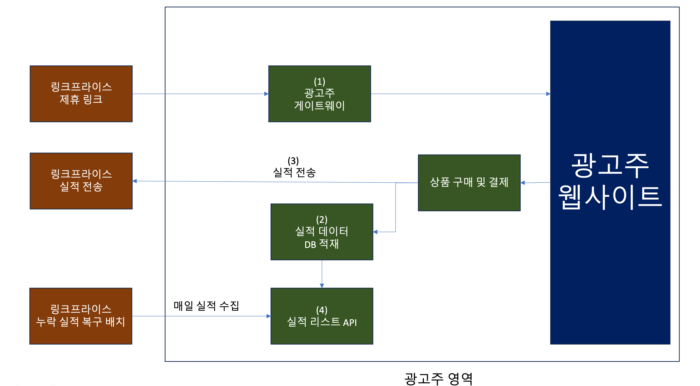

# CPS 셋업 가이드


# 1. 제휴 마케팅이란?

제휴 마케팅이란 제품/서비스 등을 판매하는 인터넷 업체인 광고주(Merchant)[^1]가 고객을 끌어들이고 판매 촉진을 위해 다른 매체 사이트(Affiliate)[^2]와 제휴를 통해 홍보 활동을 진행합니다.
이 때 발생하는 수입을 홍보 활동을 진행했던 매체(Affiliate)와 공유하는 마케팅 기법입니다.

[제휴 마케팅에 대해 좀 더 자세히 알아보기](https://helpdesk.linkprice.com/pages/merchant-faq-introduce)


# 2. 링크프라이스-광고주 간 셋업

먼저 광고주로서 링크프라이스의 제휴마케팅 플랫폼을 이용하기 위해선 연동 작업을 필수적으로 해주셔야 합니다.
이러한 작업을 저희는 **"머천트 셋업(Merchant Setup)"이라고 정의**합니다.

셋업 작업을 위해선 아래 작업들을 진행해주셔야 합니다.


## 2-1. 연동 흐름과 광고주 작업 내역



(1) 광고주 게이트웨이

[광고주 사이트 내부에 게이트웨이 페이지 작업하기](#2-2-광고주-게이트웨이-작업)

(2) 실적 데이터 DB 적재

[실적 발생 시, 자체 별도 DB 테이블 생성 후 적재하기](#2-3-실적-발생-시-자체-별도-db-테이블-생성-후-적재-작업)

(3) 실적 전송

[링크프라이스 실적 발생 시, 링크프라이스에게 실적 전송하기](#2-4-링크프라이스-실적-발생-시-링크프라이스에게-실적-전송하기)

(4) 실적 리스트 API

[링크프라이스의 실적으로 실적 리스트 API 작업하기](#2-5-링크프라이스의-실적으로-실적-리스트-api-작업하기)

(5) 할인코드 CPS 셋업

[할인코드 CPS 셋업](#3-할인코드-cps-셋업)

(6) 여행 머천트 CPS 셋업

[여행 머천트 CPS](#4-여행-머천트-셋업)


## 2-2. 광고주 게이트웨이 작업

### 2-2-1. 작업이 필요한 이유

링크프라이스에 소속된 매체(Affiliate)[^2]들은 링크프라이스에서 제공하는 제휴 링크[^3]를 통해 자신의 사이트 혹은 타 사이트에서 홍보활동을 진행합니다.

광고주 입장에서는 발생되는 실적이 링크프라이스의 실적인지를 판단할 수 있는 값(Tracking Code)이 필요합니다.

이 트래킹 코드를 링크프라이스에서는 **"LPINFO" 라고 정의**합니다.

광고주 게이트웨이[^4]를 통해 클라이언트에 쿠키가 생성되고 이 생성된 쿠키를 가지고 실적을 트래킹하게 됩니다.


### 2-2-2. 개요

광고주 게이트웨이[^4]에서는 아래와 같은 동작을 합니다.

```
1. 파라미터 유효성 체크
2. 실적 트래킹을 위한 쿠키 생성
3. 광고주 사이트로 이동
```

링크프라이스의 제휴링크를 통해 광고주 게이트웨이 페이지를 거쳐서 트래킹 코드가 생성된 이후, 광고주 사이트로 진입하게 됩니다.


### 2-2-3. 작업 방법

**Step1**. 링크프라이스에서 광고주에게 실적 트래킹을 위한 자바스크립트 코드를 전달합니다.

> 해당 자바스크립트 코드는 광고주 사이트 내에 실적 트래킹을 위한 쿠키 생성 후 광고주 사이트로 리다이렉션하는 코드가 내장되어 있습니다.
>
> 다만 광고주 사이트의 환경에 따라 해당 코드는 다르게 셋팅될 수 있습니다.

**Step2**. 사이트 내부에 게이트웨이 페이지 URL를 생성 후, 링크프라이스에서 전달받은 자바스크립트 코드를 추가해주십시오.

> 게이트웨이 구현의 경우 사용하시는 서버 환경에 따라 편하게 구현해주시면 됩니다.
>
> 예시)
>
> php 사용 시, https://[도메인]/linkprice/gateway.php
>
> jsp 사용 시, https://[도메인]/linkprice/gateway.jsp
>
> html 사용 시, https://[도메인]/linkprice/gateway.html

**Step3**. 구현한 게이트웨이 URL을 반드시 링크프라이스 담당자에게 전달바랍니다.

**Step4**. 링크프라이스에서는 광고주로부터 전달받은 URL을 내부 플랫폼에 반영한 이후, 제휴링크를 생성하여 전달드립니다.

> 최종적으로 아래 URL로 매체에서는 홍보활동을 진행합니다.
>
> 샘플 URL로 실제 URL과는 다릅니다.
>
> https://click.linkprice.com/click.php?m=clickbuy&a=A100000131&l=0000

**Step5**. 제휴링크로 진입하고 광고주 사이트로 이동 시, 브라우저 쿠키에 **\"LPINFO\"이라는 이름의 트래킹 코드 쿠키**가 생성되었는지 확인합니다.


### 2-2-4. 샘플 코드

링크프라이스에서는 셋팅 작업 시, 광고주에게 생성된 자바스크립트 코드를 전달해 드립니다.

게이트웨이 페이지에 **전달받으신 자바스크립트 코드만 수정없이 삽입**바랍니다.

다른 코드가 혼재되어 있을 경우 페이지 랜딩과 LPINFO 쿠키 생성이 작동되지 않을 수 있습니다.

해당 코드를 전달받지 못했을 시, 링크프라이스 담당자에게 연락바랍니다.


아래 샘플코드는 참고용으로 실제 코드와는 다릅니다.

```javascript
<!-- Google Tag Manager -->
<script>(function(w,d,s,l,i){w[l]=w[l]||[];w[l].push({'gtm.start':
    new Date().getTime(),event:'gtm.js'});var f=d.getElementsByTagName(s)[0],
    j=d.createElement(s),dl=l!='dataLayer'?'&l='+l:'';j.async=true;j.src=
    'https://www.googletagmanager.com/gtm.js?id='+i+dl;f.parentNode.insertBefore(j,f);
})(window,document,'script','dataLayer','GTM-P3HTV4');</script>
<!-- End Google Tag Manager -->
```


## 2-3. 실적 발생 시, 자체 별도 DB 테이블 생성 후 적재 작업

### 2-3-1. 작업이 필요한 이유

링크프라이스로 실시간으로 전송한 데이터가 네트워크 전송 지연 이슈나 프로그램 오류로 인해 전송되지 않을 수가 있습니다.

링크프라이스로 전송한 데이터와 광고주에 저장된 데이터를 대조하여 정산을 진행하고자 저장을 요청드리고 있습니다.

적재하신 데이터는 [2-5. 실적 리스트 API 작업](#2-5-링크프라이스의-실적으로-실적-리스트-api-작업하기)에 활용됩니다.


### 2-3-2. 작업 방법

**Step1**. 사용하시는 DB에 테이블을 생성합니다.

```sql
create table lpinfo(
    id int(10) unsigned NOT NULL AUTO_INCREMENT,	# Unique Key
    order_id varchar(30),		 				    # 링크프라이스에 전송할 주문번호
    product_id varchar(30),	 					    # 링크프라이스에 전송할 상품코드
    lpinfo varchar(580),		 				    # 링크프라이스 트래킹 코드 (쿠키명 LPINFO) 
    user_agent varchar(300), 					    # 구매자의 User Agent 값
    ip varchar(50),					 			    # 구매자의 IP
    device_type varchar(11)	 					    # 구매자의 운영체제 환경
)
```

> 위 테이블 생성 쿼리는 Mysql 기준으로 드린 예시입니다.
>
> 데이터를 저장할 수 있다면 NoSql을 사용하셔도 됩니다.
>
> 컬럼 이름도 주어진 서버 환경에 맞춰 생성하시면 됩니다.

**Step2**. 실적 발생(=결제 완료) 시,  브라우저 쿠키에 저장된 LPINFO 쿠키가 존재 여부를 체크 후 DB 테이블에 적재해주십시오.


### 2-3-3. 샘플 코드

**※ 주의**

샘플 코드는 PHP 코드를 기준으로 작성하여 Chat GPT를 통해 JSP, ASP 코드를 생성한 예제입니다.

반드시 예제 코드로 구현을 해야 할 필요는 없으며 예제로만 참고 부탁드립니다.

광고주 서버 환경에 맞춰 구현 바랍니다.


**JSP 예제**

```jsp
<%@ page language="java" contentType="text/html; charset=UTF-8" pageEncoding="UTF-8"%>
<%@ page import="java.sql.*" %>

<%
  // 실적 발생!!
  
  String orderId = request.getParameter("order_id") != null ? request.getParameter("order_id") : "";
  String productId = request.getParameter("product_id") != null ? request.getParameter("product_id") : "";
  String lpinfo = request.getCookies() != null ? request.getCookies()[0].getValue() : "";
  String userAgent = request.getHeader("User-Agent") != null ? request.getHeader("User-Agent") : "";
  String ip = request.getRemoteAddr() != null ? request.getRemoteAddr() : "";
  
  /*
  web-pc : PC용 브라우저에서 발생된 실적
  web-mobile : 모바일 웹에서 발생된 실적
  app-android : 안드로이드 앱 환경에서 발생한 실적 (웹뷰 포함)
  app-ios : iOS 앱 환경에서 발생한 실적 (웹뷰 포함)
  */
  String deviceType = "web-pc";	

  Connection dbConnection = null;
  Statement statement = null;

  try {
    Class.forName("com.mysql.jdbc.Driver");
    dbConnection = DriverManager.getConnection("jdbc:mysql://localhost/DATABASE_NAME", "ID", "PASSWORD");
    
    if (lpinfo != null && !lpinfo.isEmpty()) {
      // 내부 DB에 실적 저장
      String query = "INSERT INTO lpinfo (order_id, product_id, lpinfo, user_agent, ip, device_type) VALUES (?, ?, ?, ?, ?, ?)";
      PreparedStatement preparedStatement = dbConnection.prepareStatement(query);
      preparedStatement.setString(1, orderId);
      preparedStatement.setString(2, productId);
      preparedStatement.setString(3, lpinfo);
      preparedStatement.setString(4, userAgent);
      preparedStatement.setString(5, ip);
      preparedStatement.setString(6, deviceType);
      
      preparedStatement.executeUpdate();
    }
  } catch (SQLException e) {
    e.printStackTrace();
  } catch (ClassNotFoundException e) {
    e.printStackTrace();
  } finally {
    if (statement != null) {
      try {
        statement.close();
      } catch (SQLException e) {
        e.printStackTrace();
      }
    }
    if (dbConnection != null) {
      try {
        dbConnection.close();
      } catch (SQLException e) {
        e.printStackTrace();
      }
    }
  }
%>
```

**ASP 예제**

```asp
<%
' 실적 발생!!
Dim orderId
Dim productId
Dim lpinfo
Dim userAgent
Dim ip
Dim deviceType

orderId = Request("order_id")
productId = Request("product_id")
lpinfo = Request.Cookies("LPINFO")
userAgent = Request.ServerVariables("HTTP_USER_AGENT")
ip = Request.ServerVariables("REMOTE_ADDR")

' 디바이스 유형 설정
deviceType = "web-pc"

' MySQL 데이터베이스 연결
Dim dbConnection
Set dbConnection = Server.CreateObject("ADODB.Connection")
dbConnection.Open "Driver={MySQL ODBC 8.0 Unicode Driver};Server=localhost;Database=DATABASE_NAME;Uid=ID;Pwd=PASSWORD;"

If Not lpinfo = "" Then
    ' 내부 DB에 실적 저장
    Dim query
    query = "INSERT INTO lpinfo (order_id, product_id, lpinfo, user_agent, ip, device_type) VALUES (?, ?, ?, ?, ?, ?)"
    
    Dim cmd
    Set cmd = Server.CreateObject("ADODB.Command")
    cmd.ActiveConnection = dbConnection
    cmd.CommandText = query
    cmd.CommandType = 1 ' adCmdText
    
    cmd.Parameters.Append cmd.CreateParameter("@order_id", 200, 1, 50, orderId)
    cmd.Parameters.Append cmd.CreateParameter("@product_id", 200, 1, 50, productId)
    cmd.Parameters.Append cmd.CreateParameter("@lpinfo", 200, 1, 255, lpinfo)
    cmd.Parameters.Append cmd.CreateParameter("@user_agent", 200, 1, 255, userAgent)
    cmd.Parameters.Append cmd.CreateParameter("@ip", 200, 1, 50, ip)
    cmd.Parameters.Append cmd.CreateParameter("@device_type", 200, 1, 50, deviceType)
    
    cmd.Execute
End If

dbConnection.Close
Set dbConnection = Nothing
%>

```

**PHP 예제**

```php
<?php
    // 실적 발생!!
    $orderId 	= $_REQUEST['order_id'] ?? '';
	$productId 	= $_REQUEST['product_id'] ?? '';
	$lpinfo		= $_COOKIE['LPINFO'] ?? '';
	$userAgent	= $_SERVER['HTTP_USER_AGENT'] ?? '';
	$ip			= $_SERVER["REMOTE_ADDR"] ?? '';
	
	/*
	web-pc : PC용 브라우저에서 발생된 실적
	web-mobile : 모바일 웹에서 발생된 실적
	app-android : 안드로이드 앱 환경에서 발생한 실적 (웹뷰 포함)
	app-ios : iOS 앱 환경에서 발생한 실적 (웹뷰 포함)
	*/
	$deviceType	= 'web-pc';	

	$dbConnection = mysqli_connect("localhost", "ID", "PASSWORD", "DATABASE_NAME");
  
  if(isset($_COOKIE['LPINFO']) && !empty($_COOKIE['LPINFO'])) {
    //내부 DB에 실적 저장
    $query = "
    INSERT INTO `lpinfo` (
    	order_id, product_id, lpinfo, user_agent, ip, device_type
    ) VALUE (
    	'$orderId', '$productId', '$lpinfo', '$userAgent', '$ip', '$deviceType' 
    )";
    
    $result = mysqli_query($dbConnection, $query);
  }
```


## 2-4. 링크프라이스 실적 발생 시, 링크프라이스에게 실적 전송하기

### 2-4-1. 작업이 필요한 이유

링크프라이스의 제휴링크로 유입되어 발생된 실적에 대해서 링크프라이스가 요구하는 스펙에 맞춰 반드시 실시간으로 실적 전송을 해주셔야 합니다.

실시간으로 실적 전송이 어려우시다면 담당자에게 문의바랍니다.


### 2-4-2. 개요

```
1. 실적 발생!
2. 게이트웨이에서 생성된 링크프라이스 트래킹 코드(LPINFO 쿠키) 존재하는지 여부 확인
3. 트래킹 코드가 있다면 링크프라이스의 실적 수집 프로그램으로 실적을 전송
```


### 2-4-3. 작업 방법

**Step1**. 링크프라이스 실적 수집 프로그램에 실적을 전송하기 위해 아래 요구 스펙을 참고합니다.


**2-4-3-1. REQUEST 개요**


| 제목         | 내용                                                  |
|------------|:----------------------------------------------------|
| 요청 URL     | https://service.linkprice.com/lppurchase_cps_v4.php |
| 프로토콜       | https                                               |
| HTTP 메서드   | POST                                                |
| 요청 바디 타입   | RAW Data                                            |
| 요청 파라미터 형식 | JSON 문자열                                            |
| 응답 파라미터 형식 | JSON 문자열                                            |

**2-4-3-2. REQUEST 파라미터**

| KEY                            | 값                                                                                                                                                                                                                                                                                                                                                                                                                                                                                                                                                                                                                                            | 타입              |
|--------------------------------|----------------------------------------------------------------------------------------------------------------------------------------------------------------------------------------------------------------------------------------------------------------------------------------------------------------------------------------------------------------------------------------------------------------------------------------------------------------------------------------------------------------------------------------------------------------------------------------------------------------------------------------------|-----------------|
| order                          | 주문 데이터 정보                                                                                                                                                                                                                                                                                                                                                                                                                                                                                                                                                                                                                                    | object          |
| order.order_id                 | 상품 고유 주문번호 <br><span style="font-size:75%">링크프라이스에서는 매체에게 누락 문의를 전달받으면 이 주문번호를 기준으로 누락 여부를 조회</span>                                                                                                                                                                                                                                                                                                                                                                                                                                                                                                                                         | varchar(100)    |
| order.final_paid_price         | 배송비를 제외한 구매자의 실결제한 전체 금액<br><span style="font-size:75%"> 무료 배송이 아닌 배송비를 구매자가 부담 시, 배송비를 제외한 전체 결제금액 </span> <br><span style="font-size:75%"> * 할인 쿠폰의 경우 금액이 차감되어야 합니다 </span> <br> <span style="font-size:75%"> * 내부 포인트로 사용된 금액은 전체 금액에서 차감이 되면 안됩니다 </span>                                                                                                                                                                                                                                                                                                                                                                               | float           |
| order.currency                 | 상품 결제시 사용된 통화<br><span style="font-size:75%">ISO 4217 사용<br>예) 미국 : USD, 원화 : KRW, 위안화 : CNY, 유로화 : EUR</span>                                                                                                                                                                                                                                                                                                                                                                                                                                                                                                                               | varchar(3)      |
| order.user_name                | 구매자명<br><span style="font-size:75%">누락문의 시, 누구의 실적인지를 구분하기 위해 사용 할 <br>개인정보 이슈로 인해 마스킹 처리 혹은 공백("") 권장<br>예시) 김\*\*, 이\*\*</span>                                                                                                                                                                                                                                                                                                                                                                                                                                                                                                            | varchar(100)    |
| products[]                     | 상품 개별 데이터 리스트                                                                                                                                                                                                                                                                                                                                                                                                                                                                                                                                                                                                                                | array< object > |
| products[].product_id          | 상품 ID <br><span style="font-size:75%">* 상품에 옵션 선택값이 있는 경우 고유한 옵션ID 값을 상품 ID에 추가로 적용 <br> 예) 상품ID_옵션ID                                                                                                                                                                                                                                                                                                                                                                                                                                                                                                                                        | varchar(100)    |
| products[].product_name        | 상품 이름                                                                                                                                                                                                                                                                                                                                                                                                                                                                                                                                                                                                                                        | varchar(300)    |
| products[].category_code       | 상품 카테고리 코드                                                                                                                                                                                                                                                                                                                                                                                                                                                                                                                                                                                                                                   | varchar(200)    |
| products[].category_name       | 상품 카테고리 이름 <br><span style="font-size:75%">가급적 해당 상품의 모든 카테고리 이름 기입<br>예를 들면 의류 > 남성의류 > 자켓 > 아우터 일 경우 아래와 같이 전송<br>  "category_name": ["의류", "남성의류", "자켓", "아우터"]</span>                                                                                                                                                                                                                                                                                                                                                                                                                                                                    | varchar(100)    |
| products[].quantity            | 구매 상품 갯수                                                                                                                                                                                                                                                                                                                                                                                                                                                                                                                                                                                                                                     | int(11)         |
| products[].product_final_price | 상품 최종 금액                                                                                                                                                                                                                                                                                                                                                                                                                                                                                                                                                                                                                                     | float           |
| products[].paid_at             | 주문 완료 시간<br><span style="font-size:75%">주문 완료 시간이란 결제가 성공한 시간을 의미. <br>* Date Format : ISO-8601 (데이터 포맷은 예시와 동일해야 함) <br> * 시간 값은 KST 시간을 기본적으로 적용하는 것을 권장 <br><br>예시1) 대한민국(UTC+09:00 시간대)에서 2021년 01월 10일 오후 3시 44분 52초에 완료된 주문 <br>paid_at : “2021-01-10T15:44:52+09:00”<br><br>예시2) 중국(UTC+08:00 시간대)에서 2021년 01월 12일 오전 08시 32분 11초에 완료된 주문<br>paid_at : “2021-01-12T08:32:11+08:00”<br><br>예시3) 미국(UTC-05:00 시간대)에서 2021년 01월 13일 오후 1시 11분 21초에 완료된 주문<br>paid_at : “2021-01-13T13:11:21-05:00”</span>                                                                                                                                | datetime        |
| products[].confirmed_at        | 구매 확정 시간<br><span style="font-size:75%">구매 확정 시간이란 쇼핑몰에서 지정한 환불/취소 기간이 지나 더 이상 환불/취소가 불가능한 상태가 된 시간을 의미 <br>* 확정 여부는 [실적 목록 API](#2-5-링크프라이스의-실적으로-실적-리스트-api-작업하기)를 참고 <br>* Date Format : ISO-8601 (데이터 포맷은 예시와 동일해야합니다.)<br><br>- 예시) 대한민국(UTC+09:00 시간대)에서 2021년 01월 15일 오후 3시 44분 52초에 구매 확정된 주문<br>confirmed_at : “2021-01-15T15:44:52+09:00”<br><br>- 예시) 중국(UTC+08:00 시간대)에서 2021년 01월 17일 오전 08시 32분 11초에 구매 확정된 주문<br>confirmed_at : “2021-01-17T08:32:11+08:00”<br><br>- 예시) 미국(UTC-05:00 시간대)에서 2021년 01월 18일 오후 1시 11분 21초에 구매 확정된 주문<br>confirmed_at: “2021-01-18T13:11:21-05:00”</span>                                       | datetime        |
| products[].canceled_at         | 구매 취소 시간<br><span style="font-size:75%">구매 취소 시간이란 구매자의 요청으로 환불, 취소, 반품 등 처리가 완료된 시간을 의미<br> * 취소 여부는 [실적 목록 API](#2-5-링크프라이스의-실적으로-실적-리스트-api-작업하기)를 참고 <br> * 상품의 부분 취소 적용은 [부분 취소 적용 방법](#2-5-3-작업-방법)을 참고  <br>Date Format : ISO-8601 (데이터 포맷은 예시와 동일해야합니다.)<br><br>- 예시1) 대한민국(UTC+09:00 시간대)에서 2021년 01월 20일 오전07시 11분 13초에 구매 취소된 주문<br>canceled_at : “2021-01-15T07:11:13+09:00”<br><br>- 예시2) 중국(UTC+08:00 시간대)에서 2021년 01월 22일 오후 05시 21분 09초에 구매 취소된 주문<br>canceled_at : “2021-01-22T17:21:09+08:00”<br><br>- 예시3) 미국(UTC-05:00 시간대)에서 2021년 01월 25일 오전 03시 20분 21초에 구매 취소된 주문<br>canceled_at: “2021-01-25T03:20:21-05:00”</span> | datetime        |
| linkprice                      | 링크프라이스에서 필요한 데이터                                                                                                                                                                                                                                                                                                                                                                                                                                                                                                                                                                                                                             | object          |
| linkprice.merchant_id          | 링크프라이스로부터 발급받은 광고주 ID                                                                                                                                                                                                                                                                                                                                                                                                                                                                                                                                                                                                                        | varchar(10)     |
| linkprice.lpinfo               | 링크프라이스에서 유입된 트래킹 코드(=LPINFO 쿠키)                                                                                                                                                                                                                                                                                                                                                                                                                                                                                                                                                                                                              | varchar(500)    |
| linkprice.user_agent           | USER AGENT 정보                                                                                                                                                                                                                                                                                                                                                                                                                                                                                                                                                                                                                                | varchar(1000)   |
| linkprice.remote_addr          | 구매자 IP주소<br><span style="font-size:75%">개인정보 이슈로 가급적 마스킹 처리 혹은 공백("") 권장.<br>예시) 118.221.\*.\* , ""</span>                                                                                                                                                                                                                                                                                                                                                                                                                                                                                                                                   | varchar(100)    |
| linkprice.device_type          | 사용자 장치 타입<br><span style="font-size:75%">- web-pc: PC 웹브라우저에서 발생한 실적<br>- web-mobile: 모바일웹 브라우저에서 발생한 실적<br>- app-ios: iOS 앱(혹은 웹뷰)에서 발생한 실적<br>- app-android: Android 앱(혹은 웹뷰)에서 발생한 실적</span>                                                                                                                                                                                                                                                                                                                                                                                                                                              | varchar(10)     |

**REQUEST 파라미터 예제**

```json
{
    "order": {
        "order_id": "o190203-h78X3",
        "final_paid_price": 29000,
        "currency": "KRW",
        "user_name": "김**"
    },
    "products": [
        {
            "product_id": "P87-234-anx87",
            "product_name": "UHD 4K 넥시 HDMI케이블",
            "category_code": "132782",
            "category_name": ["컴퓨터 주변기기", "케이블", "HDMI케이블"],
            "quantity": 2,
            "product_final_price": 12687,
            "paid_at": "2019-02-12T11:13:44+09:00",
            "confirmed_at": "",
            "canceled_at": ""
        },
        {
            "product_id": "P23-983-Z3272",
            "product_name": "농심 오징어짬뽕124g(5개)",
            "category_code": "237018",
            "category_name": ["가공식품", "라면", "봉지라면"],
            "quantity": 3,
            "product_final_price": 16312,
            "paid_at": "2019-02-12T11:13:44+09:00",
            "confirmed_at": "",
            "canceled_at": ""
        }
    ],
    "linkprice": {
        "merchant_id": "sample",
        "lpinfo": "A123456789|9832|A|m|a8uakljfa",
        "user_agent": "Mozilla/5.0...",
        "remote_addr": "118.221.*.*",
        "device_type": "web-pc"
    }
}
```


**2-4-3-4. Response 개요**

| 키 이름          | 값           | 타입      |
|---------------|-------------|---------|
| is_success    | 실적 전송 성공 여부 | boolean |
| error_message | 에러 상세 메세지   | string  |
| order_code    | 주문번호        | string  |
| product_code  | 상품번호        | string  |

>응답값은 JSON 문자열 형식으로 전송됩니다.
>
>응답은 2차원 배열로 구매한 상품 숫자만큼 응답이 전송됩니다.


**2-4-3-5. Response 샘플**

* 2개 상품 구매 후, 전송 성공 시

```json
[
    {
        "is_success": true,
        "error_message": "",
        "order_code": "o190203-h78X3",
        "product_code": "P87-234-anx87"
    },
    {
        "is_success": true,
        "error_message": "",
        "order_code": "o190203-h78X3",
        "product_code": "P23-983-Z3272"
    }
]
```

* 2개 상품 구매 후, 전송 실패 시

```json
[
    {
        "is_success": false,
        "error_message": "lpinfo parameter is empty.",
        "order_code": "o190203-h78X3",
        "product_code": "P87-234-anx87"
    },
    {
        "is_success": false,
        "error_message": "lpinfo parameter is empty.",
        "order_code": "o190203-h78X3",
        "product_code": "P23-983-Z3272"
    }
]
```


**2-4-3-6. Response 상세 사유**

* 아래 목록에 존재하지 않는 응답일 경우, 링크프라이스 담당자에게 호출했던 요청값과 응답값을 전달주시면 확인 가능합니다.


| 에러 메세지                                                                                                | 에러 상세 내용                                             |
|-------------------------------------------------------------------------------------------------------|------------------------------------------------------|
| This is not a valid JSON string.                                                                      | REQUEST 가 JSON 형식이 아님                                |
| order.order_id parameter is empty.                                                                    | order.order_id 미입력                                   |
| order.final_paid_price parameter is empty.                                                            | order.final_paid_price 미입력                           |
| order.final_paid_price is not integer.                                                                | order.final_paid_price integer형이 아님                  |
| order.currency parameter is empty.                                                                    | order.currency 미입력                                   |
| order.user_name parameter is empty.                                                                   | order.member_id 미입력                                  |
| products parameter is empty.                                                                          | products 파라미터 미입력                                    |
| linkprice.lpinfo parameter is empty.                                                                  | linkprice.lpinfo 미입력                                 |
| linkprice.lpinfo parameter does not conform to the format.                                            | linkprice.lpinfo 형식이 맞지 않음                           |
| linkprice.user_agent parameter is empty.                                                              | linkprice.user_agent 미입력                             |
| linkprice.remote_addr parameter is empty.                                                             | linkprice.remote_addr 미입력                            |
| linkprice.device_type parameter is empty.                                                             | linkprice.device_type 미입력                            |
| products[i].product_id parameter is empty.                                                            | products i번째 product_id 미입력                          |
| products[i].product_name parameter is empty.                                                          | products i번째 product_name 미입력                        |
| products[i].category_code parameter is empty.                                                         | products i번째 category_code 미입력                       |
| products[i].product_final_price parameter is empty.                                                   | products i번째 product_final_price 미입력                 |
| The amount of order.final_paid_price does not match the total amount of products.product_final_price. | products의 합산 금액과 order.final_paid_price 금액이 일치하지 않음. |
| There was a problem sending your performance.                                                         | 실적 전송 오류                                             |


**Step2**. 서버 환경에 맞춰 링크프라이스 실적 수집 프로그램에 실적을 전송하는 프로그램을 작성 합니다.

**Step3**. 링크프라이스의 실적 전송 URL 호출 후 응답값이 정상적으로 출력되는지 확인합니다.

2-4-5. 샘플 코드

[2-4-5. 실적 전송 샘플코드 참고](#2-4-5-샘플-코드)


### 2-4-4. 할인 적용 시, 예상 시나리오

작업 진행 시, 할인 적용 관련 해서 예상할 수 있는 시나리오는 아래를 참고 바랍니다.


**2-4-4-1. 정률 쿠폰 사용 시**


**단수건 예시)**

>  상품단가 - (상품가 * 할인비율) = 전송금액


5,000원 상품을 구매 시 20% 할인 쿠폰을 사용 시 

```
5000 - (5000 * 0.2) = 4000
```

5,000원의 20% 할인 금액인 총 4,000원으로 전송


**복수건 예시)**

>  상품단가 - (상품총금액 * 할인비율) = 전송금액


5,000원, 10,000원, 7,000원 상품을 총 22,000원을 장바구니에 담고 20% 할인 쿠폰을 사용 시

```
# 상품1 정률 계산
5000 - (5000 x 0.2) = 4000

# 상품2  정률 계산
10000 - (10000 x 0.2) = 8000

# 상품3 정률 계산
7000 - (7000 x 0.2) = 5600 
```

22,000원에서 20% 할인금액인 총 17,600원 전송


**2-4-4-2. 정액 쿠폰 사용 시**


**단수건 예시)**

> 상품단가 - 정액할인금액 = 전송금액


5,000원 상품을 구매 시 500원 할인 쿠폰을 사용 시 

```
5000 - 500 = 4500
```

5,000원의 500원 할인 금액인 총 4,500원으로 전송


**복수건 예시)**

>쿠폰가 / (상품총금액) = 정액할인비율
>상품단가 / (쿠폰가 * 정액할인비율) = 전송금액


5,000원, 10,000원, 7,000원 상품을 총 22,000원을 장바구니에 담고 5,000원 할인 쿠폰을 사용 시

```
# 상품1 비율 계산
5000 / (5000 + 10000 + 7000) = 0.227
# 상품1 할인 비율 계산
5000 - (5000 * 0.227) = 3865

# 상품2 비율 계산
10000 / (5000 + 10000 + 7000) = 0.454
# 상품2 할인 비율 계산
10000 - (5000 * 0.454) = 7730

# 상품3 비율 계산
7000 / (5000 + 10000 + 7000) = 0.318
# 상품3 할인 비율 계산
7000 - (5000 * 0.318) = 5410
```

상품금액의 비율에 따라 쿠폰가를 분할 계산하여 22,000원에서 5000원 쿠폰을 사용 시, 총 17,000원 전송

* 원래 총합 17,005원이나 한자리수는 절삭하여 전송

  

**2-4-4-3. 정률, 정액 쿠폰 동시 사용 시**


**단수건 예시)**

> 상품단가 - ((상품단가 * 정률쿠폰율) + 정액쿠폰) = 전송금액


5,000원 상품을 20% 할인 쿠폰과 500원짜리 쿠폰을 동시에 사용 시

```
# 정률, 정액 계산하여 할인 적용
5000 - ((5000 * 0.2) + 500) = 4500
```


**복수건 예시)**

> 쿠폰가 / (상품총금액) = 정액할인비율
>
> 상품단가 - ((상품단가 * 정률할인비율) + (쿠폰가 * 정액할인비율))  = 전송금액


5,000원, 10,000원, 7,000원 상품을 총 22,000원을 장바구니에 담고 20% 할인 쿠폰과 5,000원 할인 쿠폰을 동시에 사용 시

```
# 상품1 정액 쿠폰의 비율 계산
5000 / (5000 + 10000 + 7000) = 0.227
# 상품1 정률, 정액 계산하여 할인 적용
5000 - ((5000 * 0.2) + (5000 * 0.227)) = 2865

# 상품2 정액 쿠폰의 비율 계산
10000 / (5000 + 10000 + 7000) = 0.454
# 상품2 정률, 정액 계산하여 할인 적용
10000 - ((10000 * 0.2) + (5000 * 0.454)) = 5730

# 상품3 정액 쿠폰의 비율 계산
7000 / (5000 + 10000 + 7000) = 0.318
# 상품3 정률, 정액 계산하여 할인 적용
7000 - ((7000 * 0.2) + (5000 * 0.318)) = 4010
```

상품금액의 비율에 따라 쿠폰가를 분할 계산하여 22,000원에서 20% 할인 쿠폰과 5,000원 쿠폰을 사용 시, 총 12,600원 전송

* 원래 총합 17,005원이나 한자리수는 절삭하여 전송


### 2-4-5. 샘플 코드

**※ 주의**

샘플 코드는 PHP 코드를 기준으로 작성하여 Chat GPT를 통해 JSP, ASP 코드를 생성한 예제입니다.

반드시 예제 코드로 구현을 해야 할 필요는 없으며 예제로만 참고 부탁드립니다.

광고주 서버 환경에 맞춰 구현 바랍니다.


**JSP 예제**

```jsp
<%@ page import="java.io.*" %>
<%@ page import="java.net.*" %>
<%@ page import="org.json.*" %>

<%
// 주문 정보
JSONObject order = new JSONObject();
order.put("order_id", "ORDER1234");
order.put("final_paid_price", 60000);
order.put("currency", "KRW");
order.put("user_name", "김링크");

// 상품 정보 배열
JSONArray products = new JSONArray();

// 상품1
JSONObject product1 = new JSONObject();
product1.put("product_id", "product_id1");
product1.put("product_name", "상품 이름1");
product1.put("category_code", "상품 카테고리1");
product1.put("category_name", "상품 카테고리 이름1");
product1.put("quantity", 2);
product1.put("product_final_price", 10000);
product1.put("paid_at", "2023-09-22T11:13:44+09:00");
product1.put("confirmed_at", "");
product1.put("canceled_at", "");
products.put(product1);

// 상품2
JSONObject product2 = new JSONObject();
product2.put("product_id", "product_id2");
product2.put("product_name", "상품 이름2");
product2.put("category_code", "상품 카테고리2");
product2.put("category_name", "상품 카테고리 이름2");
product2.put("quantity", 3);
product2.put("product_final_price", 50000);
product2.put("paid_at", "2023-09-22T11:13:44+09:00");
product2.put("confirmed_at", "");
product2.put("canceled_at", "");
products.put(product2);

// 링크프라이스에서 필요한 데이터
JSONObject linkprice = new JSONObject();
linkprice.put("merchant_id", "clickbuy");
linkprice.put("lpinfo", ""); // lpinfo 값을 설정해야 합니다.
linkprice.put("user_agent", request.getHeader("User-Agent"));
linkprice.put("remote_addr", request.getRemoteAddr());
linkprice.put("device_type", "web-pc");

// 전체 데이터
JSONObject purchases = new JSONObject();
purchases.put("order", order);
purchases.put("products", products);
purchases.put("linkprice", linkprice);

// JSON 형식으로 변환
String postData = purchases.toString();

// HTTP POST 요청
String url = "https://service.linkprice.com/lppurchase_cps_v4.php";
URLConnection connection = new URL(url).openConnection();
connection.setDoOutput(true);
connection.setRequestProperty("Content-Type", "application/json");

try (OutputStream os = connection.getOutputStream()) {
    byte[] input = postData.getBytes("utf-8");
    os.write(input, 0, input.length);
}

try (BufferedReader br = new BufferedReader(new InputStreamReader(connection.getInputStream(), "utf-8"))) {
    StringBuilder response = new StringBuilder();
    String responseLine = null;
    while ((responseLine = br.readLine()) != null) {
        response.append(responseLine.trim());
    }
    
    // 링크프라이스 실적 수집 프로그램으로부터 전달받은 응답 데이터
    out.println(response.toString());
}
%>
```


**ASP 예제**

```asp
<%
' 링크프라이스 실적 수집 프로그램으로 실적 전송 예제

' 주문 정보
Dim order
Set order = Server.CreateObject("Scripting.Dictionary")
order("order_id") = "ORDER1234"
order("final_paid_price") = 60000
order("currency") = "KRW"
order("user_name") = "김링크"

' 상품 정보
Dim products
Set products = Server.CreateObject("Scripting.Dictionary")

' 상품1
Dim product1
Set product1 = Server.CreateObject("Scripting.Dictionary")
product1("product_id") = "product_id1"
product1("product_name") = "상품 이름1"
product1("category_code") = "상품 카테고리1"
product1("category_name") = "상품 카테고리 이름1"
product1("quantity") = 2
product1("product_final_price") = 10000
product1("paid_at") = "2023-09-22T11:13:44+09:00"
product1("confirmed_at") = ""
product1("canceled_at") = ""
products.Add product1("product_id"), product1

' 상품2
Dim product2
Set product2 = Server.CreateObject("Scripting.Dictionary")
product2("product_id") = "product_id2"
product2("product_name") = "상품 이름2"
product2("category_code") = "상품 카테고리2"
product2("category_name") = "상품 카테고리 이름2"
product2("quantity") = 3
product2("product_final_price") = 50000
product2("paid_at") = "2023-09-22T11:13:44+09:00"
product2("confirmed_at") = ""
product2("canceled_at") = ""
products.Add product2("product_id"), product2

' 링크프라이스에서 필요한 데이터
Dim linkprice
Set linkprice = Server.CreateObject("Scripting.Dictionary")
linkprice("merchant_id") = "clickbuy"
linkprice("lpinfo") = ""
linkprice("user_agent") = Request.ServerVariables("HTTP_USER_AGENT")
linkprice("remote_addr") = Request.ServerVariables("REMOTE_ADDR")
linkprice("device_type") = "web-pc"

' 전체 데이터
Dim purchases
Set purchases = Server.CreateObject("Scripting.Dictionary")
purchases.Add "order", order
purchases.Add "products", products
purchases.Add "linkprice", linkprice

' JSON 형식으로 변환
Function ConvertToJson(obj)
    Dim jsonObj, key
    Set jsonObj = Server.CreateObject("Scripting.Dictionary")
    For Each key In obj.Keys
        jsonObj.Add key, obj(key)
    Next
    ConvertToJson = Join(obj.Keys, ", ")
End Function

Dim postData
postData = ConvertToJson(purchases)

' HTTP POST 요청
Dim objXMLHTTP
Set objXMLHTTP = Server.CreateObject("MSXML2.ServerXMLHTTP")
objXMLHTTP.Open "POST", "https://service.linkprice.com/lppurchase_cps_v4.php", False
objXMLHTTP.setRequestHeader "Content-Type", "application/json"
objXMLHTTP.send postData

' 링크프라이스 실적 수집 프로그램으로부터 전달받은 응답 데이터
Response.Write objXMLHTTP.responseText

Set objXMLHTTP = Nothing
%>
```


**PHP 예제**

```php
<?php
/**
 * 링크프라이스 실적 수집 프로그램으로 실적 전송 예제
 */

$purchases = [];

//주문 정보
$purchases['order'] = [
    'order_id'          => 'ORDER1234',
    'final_paid_price'  => 60000,
    'currency'          => 'KRW',
    'user_name'         => '김링크' 
];

//상품 정보
$purchases['products'] = [];

//상품1
$purchases['products'][] = [
    'product_id'            => 'product_id1',
    'product_name'          => '상품 이름1',
    'category_code'         => '상품 카테고리1',
    'category_name'         => '상품 카테고리 이름1',
    'quantity'              => 2,
    'product_final_price'   => 10000,
    'paid_at'               => '2023-09-22T11:13:44+09:00',
    'confirmed_at'          => '',
    'canceled_at'           => ''
];

//상품2
$purchases['products'][] = [
    'product_id'            => 'product_id2',
    'product_name'          => '상품 이름2',
    'category_code'         => '상품 카테고리2',
    'category_name'         => '상품 카테고리 이름2',
    'quantity'              => 3,
    'product_final_price'   => 50000,
    'paid_at'               => '2023-09-22T11:13:44+09:00',
    'confirmed_at'          => '',
    'canceled_at'           => ''
];

// 링크프라이스에서 필요한 데이터
$purchases['linkprice'] = [
    'merchant_id'   => 'clickbuy',
    'lpinfo'        => $lpinfo,
    'user_agent'    => $_SERVER['HTTP_USER_AGENT'] ?? '',
    'remote_addr'   => $_SERVER['REMOTE_ADDR'] ?? '',
    'device_type'   => 'web-pc'
];

$postData = json_encode($purchases);

$curl = curl_init();

curl_setopt_array($curl, [
  CURLOPT_URL               => 'https://service.linkprice.com/lppurchase_cps_v4.php',
  CURLOPT_RETURNTRANSFER    => true,
  CURLOPT_HTTP_VERSION      => CURL_HTTP_VERSION_1_1,
  CURLOPT_CUSTOMREQUEST     => 'POST',
  CURLOPT_POSTFIELDS        => $postData
]);

$response = curl_exec($curl);
curl_close($curl);

//링크프라이스 실적 수집 프로그램으로부터 전달받은 응답 데이터
echo $response;
```


## 2-5. 링크프라이스의 실적으로 실적 리스트 API 작업하기

### 2-5-1. 작업이 필요한 이유

광고주가 실적 수집 프로그램을 통해 전송한 실적 데이터는 링크프라이스 데이터베이스에 적재합니다.

기본적으로 링크프라이스의 실적 데이터와 광고주에서 가지고 있는 실적 데이터가 동일해야 합니다.

하지만 전송하였음에도 불구하고 여러 장애로 인하여 실적은 발생되었지만 링크프라이스에게 전송하지 못하고 누락되는 경우가 종종 발생합니다.

그래서 링크프라이스에서는 매일 광고주의 API를 호출하여 전일 실적 데이터를 가져와 링크프라이스의 실적과 대조하여 없는 경우 실적을 복구처리를 진행하고 있습니다.

아울러 이 API를 통해 매월 20일마다 주문 최소되거나 환불된 실적에 대해 자동으로 취소처리를 진행하고 있습니다.

링크프라이스에서 실적을 확인할 수 있도록 링크프라이스가 정해드린 스펙에 맞춰 링크프라이스 서버에서 접근 가능한 실적 조회 API를 제작해주셔야 합니다.


### 2-5-2. 개요

이 API의 명칭은 실적목록 API 입니다.

링크프라이스는 해당 API 활용해 아래와 같이 처리를 진행하고 있습니다.

```
1. 매일 새벽에 광고주 실적조회API를 호출하여 전일 실적에 대해 수집하여 실적 복구 처리 진행
2. 매월 20일마다 광고주로부터 전월 취소 실적들을 수집해 자동 취소 처리 진행
```

> 전월 확정 및 취소 실적 수집은 광고주 측에서 확정 및 취소 실적을 재전송해 주시는 것이 아닙니다.
>
> 실적 목록 API에서 보이는 실적(products[])의 confirmed_at과 canceled_at에 각각 확정과 취소 일자를 적용하여 API에 나타내주시면 됩니다.
>
> 링크프라이스에서 상태 여부만 확인하기 때문에 해당 confirmed_at과 canceled_at 값만 업데이트해 주시면 됩니다.


링크프라이스에서는 광고주 API를 호출 할 시, 아래와 같이 하루에 3번 호출합니다.


1. 실적 복구하기 위해 주문 완료일을 기준으로 모든 데이터 호출

```
# 쿼리 스트링 paid_ymd 파라미터로 조회할 날짜를 호출
https://api.yourdomain.com/linkprice/order_list_v1?paid_ymd=yyyymmdd
```

2. 실적 확정하기 위해 구매 확정일을 기준으로 호출

```
# 쿼리 스트링 confirmed_ymd 파라미터로 조회할 날짜를 호출
https://api.yourdomain.com/linkprice/order_list_v1?confirmed_ymd=yyyymmdd
```

3. 실적 취소하기 위해 구매 취소일을 기준으로 호출

```
# 쿼리 스트링 canceled_ymd 파라미터로 조회할 날짜를 호출
https://api.yourdomain.com/linkprice/order_list_v1?canceled_ymd=yyyymmdd
```


반드시 링크프라이스에게 전송해주셨던 데이터와 실적목록으로 표현되는 데이터는 동일해야 합니다.

> 실적 전송으로 상품명을 "상품A" 라는 이름으로 보내줬는데 실적목록API에서는 "상품B"라고 전송하는 경우 (x)


### 2-5-3. 작업 방법

**Step1**. 실적목록 API를 작성하기 위해 아래 요구 출력 스펙을 참고합니다.

[2-4-3-2 REQUEST 파라미터](#2-4-링크프라이스-실적-발생-시-링크프라이스에게-실적-전송하기) 참조

**Step2**. 실적 목록 페이지를 생성하고 주문 완료일(paid_ymd), 구매 확정일(comfirmed_ymd), 구매 취소일(canceled_ymd)를 기준으로 아래 예시대로 링크프라이스가 JSON 문자열을 받아 갈 수 있도록 작업합니다.


#### 2-5-3-1 상품 부분  취소 및 부분 수량 취소가 가능한 머천트인 경우

상품의 부분 취소와 부분 수량 취소가 가능한 머천트인 경우 실적 목록을 통해 상품 개별 취소 및 상품의 부분 취소 수량을 확인하여 업데이트가 가능합니다.

product 객체에 부분 취소 수량/부분 취소 금액에 대한 정보를 product[].caceled_quantity와 product[].canceled_price에 적용해주시면 취소 실적 조회 및 적용시 활용합니다.

앞의 취소 상황이 가능한 경우 실적 목록에 나타날 시나리오는 다음과 같습니다.

| 상황       | 적용                                                                                                           |
|----------|--------------------------------------------------------------------------------------------------------------|
| 일반 취소    | canceled_at : 상품이 취소된 시간 적용                                                                                  |
| 부분 취소    | 2개 이상의 상품 중 특정 하나만 취소가 발생된 경우 취소된 상품에만 canceled_at 취소 시간 적용                                                  |
| 부분 수량 취소 | canceled_at : 상품이 취소된 시간 적용 <br> canceled_quantity : 부분 취소된 수량만큼 적용 <br> canceled_price : 부분 취소된 상품의 금액만큼 적용 |

| KEY                          | 값                                                                                                                                                                   | 타입              |
|------------------------------|---------------------------------------------------------------------------------------------------------------------------------------------------------------------|-----------------|
| products[]                   | 상품 개별 데이터 리스트                                                                                                                                                       | array< object > | 
| products[].canceled_quantity | 부분 취소된 수량<br><span style="font-size:75%">부분 취소된 수량이란 구매자의 요청으로 부분 취소, 반품 등 처리가 완료된 수량을 의미 <br> * 해당 파라미터를 활용 여부는 [실적 목록 API](#2-5-링크프라이스의-실적으로-실적-리스트-api-작업하기)를 참고 | int(11)         |
| products[].canceled_price    | 부분 취소된 금액<br><span style="font-size:75%">부분 취소된 금액이란 구매자의 요청으로 부분 취소, 반품 등 처리가 완료된 금액을 의미 <br> * 해당 파라미터를 활용 여부는 [실적 목록 API](#2-5-링크프라이스의-실적으로-실적-리스트-api-작업하기)를 참고 | float           |


실적목록 API 출력 예시

```json
[
    {
        "order": {
            "order_id": "o190203-h78X3",
            "final_paid_price": 29000,
            "currency": "KRW",
            "user_name": "구**"
        },
        "products": [
            {
                "product_id": "P87-234-anx87",
                "product_name": "UHD 4K 넥시 HDMI케이블",
                "category_code": "132782",
                "category_name": ["컴퓨터 주변기기", "케이블", "HDMI케이블"],
                "quantity": 2,
                "product_final_price": 12687,
                "paid_at": "2019-02-12T11:13:44+09:00",
                "confirmed_at": "",
                "canceled_at": ""
            },
            {
                "product_id": "P23-983-Z3272",
                "product_name": "농심 오징어짬뽕124g(5개)",
                "category_code": "237018",
                "category_name": ["가공식품", "라면", "봉지라면"],
                "quantity": 3,
                "product_final_price": 16312,
                "paid_at": "2019-02-12T11:13:44+09:00",
                "confirmed_at": "",
                "canceled_at": "2019-02-12T11:15:44+09:00",
                "canceled_quantity": 1,
                "canceled_price": 5000
            }
        ],
        "linkprice": {
            "merchant_id": "sample",
            "lpinfo": "A123456789|9832|A|m|a8uakljfa",
            "user_agent": "Mozilla/5.0...",
            "remote_addr": "13.156.*.*",
            "device_type": "web-pc"
        }
    },
    {"order":{"order_id":"ord-123-01",...},"products":[...],"linkprice":{...}},
    {"order":{"order_id":"ord-123-03",...},"products":[...],"linkprice":{...}},
    {"order":{"order_id":"ord-123-04",...},"products":[...],"linkprice":{...}}
]
```

**Step3**. 운영 중이신 서버의 방화벽 정책이 인바운드가 차단되어 있는 경우, 링크프라이스 크롤러가 접근 가능하도록 아래 IP를 허용해주셔야 합니다.

```
# 링크프라이스 서버 IP
13.125.179.218/32
13.124.188.166/32
```

**Step4**. 완성된 API URL을 링크프라이스 담당자에게 전달합니다.


### 2-5-4. 샘플 코드

**※ 주의**

샘플 코드는 PHP 코드를 기준으로 작성하여 Chat GPT를 통해 JSP, ASP 코드를 생성한 예제입니다.

반드시 예제 코드로 구현을 해야 할 필요는 없으며 예제로만 참고 부탁드립니다.

광고주님의 환경에 맞춰 구현 바랍니다.


* lpinfo 테이블은 연동 가이드 [2-3-2. 작업 방법](#2-3-2-작업-방법) 예제에서 생성하는 테이블 구조를 기준으로 작성되었습니다.

* purchase 테이블은 구매한 상품 리스트 데이터를 의미합니다.


**JSP 예제**

```jsp
<%@ page language="java" contentType="application/json; charset=UTF-8" pageEncoding="UTF-8"%>
<%@ page import="java.sql.*" %>
<%@ page import="java.util.*" %>

<%
// 링크프라이스 실적 목록 API
String paidYmd = request.getParameter("paid_ymd");
String confirmYmd = request.getParameter("confirmed_ymd");
String cancelYmd = request.getParameter("canceled_ymd");

String query = null;

if (paidYmd != null && !paidYmd.isEmpty()) {
    // 구매일자 기준으로 데이터 조회
    query = "SELECT p.order_id, p.product_id, p.user_name, "
            + "p.product_id, p.product_name, p.category_code, p.category_name, "
            + "p.quantity, p.product_final_price, "
            + "DATE_FORMAT(p.paided_at, '%Y%m%d') as paid_at, "
            + "DATE_FORMAT(p.confirmed_at, '%Y%m%d') as confirmed_at, "
            + "DATE_FORMAT(p.canceled_at, '%Y%m%d') as canceled_at, "
            + "l.lpinfo, l.device_type, l.user_agent, l.ip "
            + "FROM purchase p "
            + "JOIN lpinfo l "
            + "ON p.order_id = l.order_id "
            + "AND p.product_id = l.product_id "
            + "WHERE DATE_FORMAT(p.paided_at, '%Y%m%d') = ?";
} else if (confirmYmd != null && !confirmYmd.isEmpty()) {
    // 확정일자 기준으로 데이터 조회
    query = "SELECT p.order_id, p.product_id, p.user_name, "
            + "p.product_id, p.product_name, p.category_code, p.category_name, "
            + "p.quantity, p.product_final_price, "
            + "DATE_FORMAT(p.paided_at, '%Y%m%d') as paid_at, "
            + "DATE_FORMAT(p.confirmed_at, '%Y%m%d') as confirmed_at, "
            + "DATE_FORMAT(p.canceled_at, '%Y%m%d') as canceled_at, "
            + "l.lpinfo, l.device_type, l.user_agent, l.ip "
            + "FROM purchase p "
            + "JOIN lpinfo l "
            + "ON p.order_id = l.order_id "
            + "AND p.product_id = l.product_id "
            + "WHERE p.confirmed_ymd = ?";
} else if (cancelYmd != null && !cancelYmd.isEmpty()) {
    // 취소일자 기준으로 데이터 조회
    query = "SELECT p.order_id, p.product_id, p.user_name, "
            + "p.product_id, p.product_name, p.category_code, p.category_name, "
            + "p.quantity, p.product_final_price, "
            + "DATE_FORMAT(p.paided_at, '%Y%m%d') as paid_at, "
            + "DATE_FORMAT(p.confirmed_at, '%Y%m%d') as confirmed_at, "
            + "DATE_FORMAT(p.canceled_at, '%Y%m%d') as canceled_at, "
            + "l.lpinfo, l.device_type, l.user_agent, l.ip "
            + "FROM purchase p "
            + "JOIN lpinfo l "
            + "ON p.order_id = l.order_id "
            + "AND p.product_id = l.product_id "
            + "WHERE p.canceled_ymd = ?";
}

// 데이터베이스 연결 설정
String jdbcUrl = "jdbc:mysql://localhost/DATABASE_NAME";
String dbUser = "ID";
String dbPassword = "PASSWORD";

List<Map<String, Object>> products = new ArrayList<>();

try {
    Class.forName("com.mysql.jdbc.Driver");
    Connection dbConnection = DriverManager.getConnection(jdbcUrl, dbUser, dbPassword);
    PreparedStatement statement = dbConnection.prepareStatement(query);

    if (paidYmd != null && !paidYmd.isEmpty()) {
        statement.setString(1, paidYmd);
    } else if (confirmYmd != null && !confirmYmd.isEmpty()) {
        statement.setString(1, confirmYmd);
    } else if (cancelYmd != null && !cancelYmd.isEmpty()) {
        statement.setString(1, cancelYmd);
    }

    ResultSet result = statement.executeQuery();

    while (result.next()) {
        // 주문번호 별로 상품을 묶는다.
        Map<String, Object> row = new HashMap<>();
        row.put("order_id", result.getString("order_id"));
        row.put("product_id", result.getString("product_id"));
        row.put("user_name", result.getString("user_name"));
        row.put("product_name", result.getString("product_name"));
        row.put("category_code", result.getString("category_code"));
        row.put("category_name", result.getString("category_name"));
        row.put("quantity", result.getInt("quantity"));
        row.put("product_final_price", result.getDouble("product_final_price"));
        row.put("paid_at", result.getString("paid_at"));
        row.put("confirmed_at", result.getString("confirmed_at"));
        row.put("canceled_at", result.getString("canceled_at"));
        row.put("canceled_quantity", result.getInt("canceled_quantity"));
        row.put("canceled_price", result.getDouble("canceled_price"));
        row.put("lpinfo", result.getString("lpinfo"));
        row.put("device_type", result.getString("device_type"));
        row.put("user_agent", result.getString("user_agent"));
        row.put("ip", result.getString("ip"));
        products.add(row);
    }

    result.close();
    statement.close();
    dbConnection.close();
} catch (Exception e) {
    e.printStackTrace();
}

List<Map<String, Object>> data = new ArrayList<>();
for (Map<String, Object> product : products) {
    // 주문 정보
    Map<String, Object> purchase = new HashMap<>();
    String orderId = (String) product.get("order_id");
    purchase.put("order", Map.of(
            "order_id", orderId,
            "final_paid_price", calculateFinalPaidPrice(products, orderId),
            "currency", "KRW",
            "user_name", product.get("user_name")
    ));

    // 상품 정보
    List<Map<String, Object>> productDetails = new ArrayList<>();
    for (Map<String, Object> productOne : products) {
        if (orderId.equals(productOne.get("order_id"))) {
            productDetails.add(Map.of(
                    "product_id", productOne.get("product_id"),
                    "product_name", productOne.get("product_name"),
                    "category_code", productOne.get("category_code"),
                    "category_name", productOne.get("category_name"),
                    "quantity", productOne.get("quantity"),
                    "product_final_price", productOne.get("product_final_price"),
                    "paid_at", productOne.get("paid_at"),
                    "confirmed_at", productOne.get("confirmed_at"),
                    "canceled_at", productOne.get("canceled_at"),
                    "canceled_quantity", productOne.get("canceled_quantity"),
                    "canceled_price", productOne.get("canceled_price")
            ));
        }
    }
    purchase.put("products", productDetails);

    // 링크프라이스 데이터
    purchase.put("linkprice", Map.of(
            "merchant_id", "clickbuy",
            "lpinfo", product.get("lpinfo"),
            "user_agent", product.get("user_agent"),
            "remote_addr", product.get("ip"),
            "device_type", product.get("device_type")
    ));

    data.add(purchase);
}

// 실적 데이터 출력
String jsonData = new Gson().toJson(data);
response.setContentType("application/json");
response.setCharacterEncoding("UTF-8");
response.getWriter().write(jsonData);

/**
 * Order ID에 해당하는 상품의 총 결제 가격을 계산합니다.
 */
private double calculateFinalPaidPrice(List<Map<String, Object>> products, String orderId) {
    double totalFinalPaidPrice = 0.0;
    for (Map<String, Object> product : products) {
        if (orderId.equals(product.get("order_id"))) {
            totalFinalPaidPrice += (double) product.get("product_final_price");
        }
    }
    return totalFinalPaidPrice;
}
%>
```


**ASP 예제**

```asp
<%
' 링크프라이스 실적 목록 API

Dim paidYmd, confirmYmd, cancelYmd
paidYmd = Request.QueryString("paid_ymd")
confirmYmd = Request.QueryString("comfirmed_ymd")
cancelYmd = Request.QueryString("canceled_ymd")

Dim query
query = ""

If Not IsEmpty(paidYmd) Then
    ' 구매일자 기준으로 데이터 조회
    query = "
        SELECT p.order_id, p.product_id, p.user_name,
               p.product_id, p.product_name, p.category_code, p.category_name,
               p.quantity, p.product_final_price,
               Format(p.paided_at, 'yyyymmdd') as paid_at,
               Format(p.confirmed_at, 'yyyymmdd') as confirmed_at,
               Format(p.canceled_at, 'yyyymmdd') as canceled_at,
               l.lpinfo, l.device_type, l.user_agent, l.ip
        FROM purchase p
        INNER JOIN lpinfo l
        ON p.order_id = l.order_id
        AND p.product_id = l.product_id
        WHERE Format(p.paided_at, 'yyyymmdd') = '" & paidYmd & "'"
ElseIf Not IsEmpty(confirmYmd) Then
    ' 확정일자 기준으로 데이터 조회
    query = "
        SELECT p.order_id, p.product_id, p.user_name,
               p.product_id, p.product_name, p.category_code, p.category_name,
               p.quantity, p.product_final_price,
               Format(p.paided_at, 'yyyymmdd') as paid_at,
               Format(p.confirmed_at, 'yyyymmdd') as confirmed_at,
               Format(p.canceled_at, 'yyyymmdd') as canceled_at,
               l.lpinfo, l.device_type, l.user_agent, l.ip
        FROM purchase p
        INNER JOIN lpinfo l
        ON p.order_id = l.order_id
        AND p.product_id = l.product_id
        WHERE p.confirmed_ymd = '" & confirmYmd & "'"
ElseIf Not IsEmpty(cancelYmd) Then
    ' 취소일자 기준으로 데이터 조회
    query = "
        SELECT p.order_id, p.product_id, p.user_name,
               p.product_id, p.product_name, p.category_code, p.category_name,
               p.quantity, p.product_final_price,
               Format(p.paided_at, 'yyyymmdd') as paid_at,
               Format(p.confirmed_at, 'yyyymmdd') as confirmed_at,
               Format(p.canceled_at, 'yyyymmdd') as canceled_at,
               l.lpinfo, l.device_type, l.user_agent, l.ip
        FROM purchase p
        INNER JOIN lpinfo l
        ON p.order_id = l.order_id
        AND p.product_id = l.product_id
        WHERE p.canceled_ymd = '" & cancelYmd & "'"
End If

' 데이터베이스 연결 설정
Dim dbConnection
Set dbConnection = Server.CreateObject("ADODB.Connection")
dbConnection.Open "Provider=Microsoft.Jet.OLEDB.4.0;Data Source=C:\your\database\path\DATABASE_NAME.mdb;" ' Access Database

Dim products
Set products = Server.CreateObject("ADODB.Recordset")
products.Open query, dbConnection

Dim data
Set data = Server.CreateObject("Scripting.Dictionary")

Do Until products.EOF
    ' 주문번호 별로 상품을 묶음
    Dim orderId
    orderId = products("order_id")

    If Not data.Exists(orderId) Then
        Set data(orderId) = Server.CreateObject("Scripting.Dictionary")
        data(orderId)("order_id") = orderId
        data(orderId)("final_paid_price") = 0
        data(orderId)("currency") = "KRW"
        data(orderId)("user_name") = products("user_name")
        Set data(orderId)("products") = Server.CreateObject("Scripting.Dictionary")
    End If

    ' 상품 정보 추가
    Dim productDetails
    Set productDetails = data(orderId)("products")
    Dim product
    Set product = Server.CreateObject("Scripting.Dictionary")
    product("product_id") = products("product_id")
    product("product_name") = products("product_name")
    product("category_code") = products("category_code")
    product("category_name") = products("category_name")
    product("quantity") = products("quantity")
    product("product_final_price") = products("product_final_price")
    product("paid_at") = products("paid_at")
    product("confirmed_at") = products("confirmed_at")
    product("canceled_at") = products("canceled_at")
    product("canceled_quantity") = products("canceled_quantity")
    product("canceled_price") = products("canceled_price")
    productDetails.Add productDetails.Count + 1, product

    ' 주문의 총 결제 가격 계산
    data(orderId)("final_paid_price") = data(orderId)("final_paid_price") + products("product_final_price")

    products.MoveNext
Loop

products.Close
Set products = Nothing

dbConnection.Close
Set dbConnection = Nothing

' 실적 데이터 출력
Response.ContentType = "application/json"
Dim jsonData
jsonData = JSONStringify(data.Items)
Response.Write(jsonData)

Function JSONStringify(obj)
    Dim objString
    Set objString = Server.CreateObject("Scripting.Dictionary")
    For Each key In obj.Keys
        If IsObject(obj(key)) Then
            objString.Add key, JSONStringify(obj(key))
        Else
            objString.Add key, obj(key)
        End If
    Next
    JSONStringify = Join(objString.Items, ",")
    JSONStringify = "{" & JSONStringify & "}"
    Set objString = Nothing
End Function
%>
```


**PHP 예제**

```php
<?php
/*
 * 링크프라이스 실적 목록 API
 */

$paidYmd      = $_GET['paid_ymd'] ?? '';
$comfirmYmd   = $_GET['comfirmed_ymd'] ?? '';
$cancelYmd    = $_GET['canceled_ymd'] ?? '';

if(!empty($paidYmd)) {
  // 구매일자 기준으로 데이터 조회
 	$query        = "
  SELECT	p.order_id, p.product_id, p.user_name, 
  				p.product_id, p.product_name, p.category_code, p.category_name, 
  				p.quantity, p.product_final_price,
  				date_format(p.paided_at, '%Y%m%d') as paid_at,
  				date_format(p.confirmed_at, '%Y%m%d') as confirmed_at,
  				date_format(p.canceled_at, '%Y%m%d') as canceled_at,
  				l.lpinfo, l.device_type, l.user_agent, l.ip
  FROM    purchase p
  JOIN		lpinfo l
  ON			p.order_id = l.order_id
  AND			p.product_id = p.product_id
  WHERE		date_format(p.paided_at, '%Y%m%d') = $paidYmd"; 
} else if(!empty($confirmYmd)) {
  // 확정일자 기준으로 데이터 조회
 	$query        = "
  SELECT	p.order_id, p.product_id, p.user_name, 
  				p.product_id, p.product_name, p.category_code, p.category_name, 
  				p.quantity, p.product_final_price,
  				date_format(p.paided_at, '%Y%m%d') as paid_at,
  				date_format(p.confirmed_at, '%Y%m%d') as confirmed_at,
  				date_format(p.canceled_at, '%Y%m%d') as canceled_at,
  				l.lpinfo, l.device_type, l.user_agent, l.ip
  FROM    purchase p
  JOIN		lpinfo l
  ON			p.order_id = l.order_id
  AND			p.product_id = p.product_id
  WHERE		p.paid_ymd"; 
} else if(!empty($cancelYmd)) {
  // 취소일자 기준으로 데이터 조회
  $query        = "
  SELECT	p.order_id, p.product_id, p.user_name, 
  				p.product_id, p.product_name, p.category_code, p.category_name, 
  				p.quantity, p.product_final_price,
  				date_format(p.paided_at, '%Y%m%d') as paid_at,
  				date_format(p.confirmed_at, '%Y%m%d') as confirmed_at,
  				date_format(p.canceled_at, '%Y%m%d') as canceled_at,
  				l.lpinfo, l.device_type, l.user_agent, l.ip
  FROM    purchase p
  JOIN		lpinfo l
  ON			p.order_id = l.order_id
  AND			p.product_id = p.product_id
  WHERE		p.paid_ymd"; 
}

$dbConnection = mysqli_connect("localhost", "ID", "PASSWORD", "DATABASE_NAME");

$products	= [];

$result	= mysqli_query($dbConnection, $query);

while($row = mysqli_fetch_Array($result)) {
 		//주문번호 별로 상품을 묶는다.
    $products[$row['order_id']][] = $row;
}

$data = [];
foreach($products as $orderId => $product) {
  // 주문 정보
  $purchase = [];
	$purchase['order'] = [
  	'order_id'					=> $orderId,
  	'final_paid_price'	=> array_sum(array_column($product, 'product_final_price')),
    'currency'					=> 'KRW',
    'user_name'					=> $product['user_name'],
  ];
  
  //상품정보
  $purchase['products'] = [];
  foreach($product as $productOne) {
    $purchase['products'][] = [
      'product_id'            => $productOne['product_id'],
      'product_name'          => $productOne['product_name'],
      'category_code'         => $productOne['category_code'],
      'category_name'         => $productOne['category_name'],
      'quantity'              => $productOne['quantity'],
      'product_final_price'   => $productOne['product_final_price'],
      'paid_at'               => $productOne['paid_at'] ?? '',
      'confirmed_at'          => $productOne['confirmed_at'] ?? '',
      'canceled_at'           => $productOne['canceled_at'] ?? ''
      'canceled_quantity'     => $productOne['canceled_quantity'] ?? ''
      'canceled_price'        => $productOne['canceled_price'] ?? ''
    ];
  }
  
  //링크프라이스 데이터
  $purchase['linkprice']	= [
    'merchant_id'		=> 'clickbuy',
    'lpinfo'			=> $product['lpinfo'],
    'user_agent'		=> $product['user_agent'],
    'remote_addr'		=> $product['ip'],
    'device_type'		=> $product['device_type']
  ];
    
  $data[] = $purchase;
}

//실적 데이터 출력
echo json_encode($data);
```

# 3. 할인코드 CPS 셋업

할인코드는 링크프라이스에서 발급한 전용 할인 코드를 이용해 매체가 홍보 활동을 진행하고, 구매자가 이 할인 코드를 사용해 구매나 예약 등의 실적이 발생되면 할인과 동시에 링크프라이스 측에 실적을 전송하는 것을 의미합니다.


## 3-1. 연동 흐름과 광고주 작업 내역


## 주의 사항
> 동일한 주문에 다수의 링크프라이스 할인코드 사용이 불가능합니다. 전송된 할인코드(promo_code)에 따라 매체의 실적이 구분됩니다.
>
> 다만, 링크프라이스 할인코드와 광고주 자체적으로 제공되는 할인코드(쿠폰 등)은 동시에 사용 가능합니다.
>
> 링크프라이스 배너를 통해 유입되어 LPINFO가 존재하는 상태로 링크프라이스 할인코드를 사용하는 경우 할인코드 실적으로만 전송되도록 작업되어야 합니다.

이미 CPS가 셋업된 머천트의 경우 다음과 같은 시나리오로 전송해주시면 됩니다.

|    제휴링크 진입 여부    |     할인코드 사용      |    할인코드 미사용    |
|:----------------:|:----------------:|:--------------:|
|  진입 (LPINFO 존재)  | 할인코드 CPS 실적으로 전송 | 링크프라이스 실적으로 전송 |
| 미진입 (LPINFO 미존재) | 할인코드 CPS 실적으로 전송 |      전송 X      |

## 3-2. 실적 발생 시, 자체 별도 DB 테이블 생성 후 적재 작업

실시간으로 전송한 데이터가 네트워크 전송 지연 이슈나 프로그램 오류로 인해 전송되지 않을 수 있습니다.

링크프라이스로 전송한 데이터와 저장된 데이터를 대조하여 정산을 진행하고자 저장을 요청드리고 있습니다.

적재하신 데이터는 실적 리스트 API에 추가로 활용됩니다.

| KEY         | 값                                                                                                                                                                                               | 타입            |
|-------------|-------------------------------------------------------------------------------------------------------------------------------------------------------------------------------------------------|---------------|
| event_code  | 링크프라이스에서 생성하는 고유코드로 고정값으로 적용                                                                                                                                                                    | varchar(20)   |
| promo_code  | 실제 구매자가 사용하는 할인코드(매체 홍보시 사용) <br> 링크프라이스용 할인코드를 발급 후 해당 코드를 알려주세요.                                                                                                                              | varcahr(50)   |
| user_agent  | USER_AGENT 정보                                                                                                                                                                                   | varchar(1000) |
| ip          | 구매자 IP주소<br><span style="font-size:75%">개인정보 이슈로 가급적 마스킹 처리 혹은 공백("") 권장.<br>예시) 118.221.\*.\* , ""</span>                                                                                      | varchar(100)  |
| device_type | 사용자 장치 타입<br><span style="font-size:75%">- web-pc: PC 웹브라우저에서 발생한 실적<br>- web-mobile: 모바일웹 브라우저에서 발생한 실적<br>- app-ios: iOS 앱(혹은 웹뷰)에서 발생한 실적<br>- app-android: Android 앱(혹은 웹뷰)에서 발생한 실적</span> | varchar(10)   |

### 3-2-1. 데이터 베이스 테이블 변경 작업이 필요한 이유

- **링크프라이스 데이터**를 저장하고 있는 테이블을(LPINFO) 다음과 같이 변경합니다.

```sql
# event_code, promo_code 컬럼 추가
alter table lpinfo add event_code varchar(20);
alter table lpinfo add promo_code varchar(50);
```
- 할인코드 CPS 실적 발생 시, 추가한 컬럼에 링크프라이스 할인코드 데이터를 저장해야합니다.
- 링크프라이스 전용 할인코드를 사용한 실적은 event_code, promo_code 컬럼을 사용합니다.

### 3-3. 실시간 실적 전송
링크프라이스의 할인코드로 발생된 실적에 대해서 링크프라이스가 요구하는 스펙에 맞춰 반드시 실시간으로 실적 전송을 해주셔야 합니다.

실시간으로 실적 전송이 어려우시다면 담당자에게 문의바랍니다.

> 1. 할인코드 실적 발생!
> 2. 링크프라이스의 실적 수집 프로그램으로 실적을 전송

### 3-3-1 작업 방법

Step1. 링크프라이스 실적 수집 프로그램에 실적을 전송하기 위해 다음 요구 스펙을 참고합니다.

| 제목         | 내용                                                  |
|------------|:----------------------------------------------------|
| 요청 URL     | https://service.linkprice.com/lppurchase_cps_v4.php |
| 프로토콜       | https                                               |
| HTTP 메서드   | POST                                                |
| 요청 바디 타입   | RAW Data                                            |
| 요청 파라미터 형식 | JSON 문자열                                            |
| 응답 파라미터 형식 | JSON 문자열                                            |

**3-3-2. REQUEST 파라미터**

| KEY                            | 값                                                                                                                                                                                                                                                                                                                                                                                                                                                                                                                                                                                                                                            | 타입              |
|--------------------------------|----------------------------------------------------------------------------------------------------------------------------------------------------------------------------------------------------------------------------------------------------------------------------------------------------------------------------------------------------------------------------------------------------------------------------------------------------------------------------------------------------------------------------------------------------------------------------------------------------------------------------------------------|-----------------|
| order                          | 주문 데이터 정보                                                                                                                                                                                                                                                                                                                                                                                                                                                                                                                                                                                                                                    | object          |
| order.order_id                 | 상품 고유 주문번호 <br><span style="font-size:75%">링크프라이스에서는 매체에게 누락 문의를 전달받으면 이 주문번호를 기준으로 누락 여부를 조회</span>                                                                                                                                                                                                                                                                                                                                                                                                                                                                                                                                         | varchar(100)    |
| order.final_paid_price         | 배송비를 제외한 구매자의 실결제한 전체 금액<br><span style="font-size:75%"> 무료 배송이 아닌 배송비를 구매자가 부담 시, 배송비를 제외한 전체 결제금액 </span> <br><span style="font-size:75%"> * 할인 쿠폰의 경우 금액이 차감되어야 합니다 </span> <br> <span style="font-size:75%"> * 내부 포인트로 사용된 금액은 전체 금액에서 차감이 되면 안됩니다 </span>                                                                                                                                                                                                                                                                                                                                                                               | float           |
| order.currency                 | 상품 결제시 사용된 통화<br><span style="font-size:75%">ISO 4217 사용<br>예) 미국 : USD, 원화 : KRW, 위안화 : CNY, 유로화 : EUR</span>                                                                                                                                                                                                                                                                                                                                                                                                                                                                                                                               | varchar(3)      |
| order.user_name                | 구매자명<br><span style="font-size:75%">누락문의 시, 누구의 실적인지를 구분하기 위해 사용 할 <br>개인정보 이슈로 인해 마스킹 처리 혹은 공백("") 권장<br>예시) 김\*\*, 이\*\*</span>                                                                                                                                                                                                                                                                                                                                                                                                                                                                                                            | varchar(100)    |
| products[]                     | 상품 개별 데이터 리스트                                                                                                                                                                                                                                                                                                                                                                                                                                                                                                                                                                                                                                | array< object > |
| products[].product_id          | 상품 ID <br><span style="font-size:75%">* 상품에 옵션 선택값이 있는 경우 고유한 옵션ID 값을 상품 ID에 추가로 적용 <br> 예) 상품ID_옵션ID                                                                                                                                                                                                                                                                                                                                                                                                                                                                                                                                        | varchar(100)    |
| products[].product_name        | 상품 이름                                                                                                                                                                                                                                                                                                                                                                                                                                                                                                                                                                                                                                        | varchar(300)    |
| products[].category_code       | 상품 카테고리 코드                                                                                                                                                                                                                                                                                                                                                                                                                                                                                                                                                                                                                                   | varchar(200)    |
| products[].category_name       | 상품 카테고리 이름 <br><span style="font-size:75%">가급적 해당 상품의 모든 카테고리 이름 기입<br>예를 들면 의류 > 남성의류 > 자켓 > 아우터 일 경우 아래와 같이 전송<br>  "category_name": ["의류", "남성의류", "자켓", "아우터"]</span>                                                                                                                                                                                                                                                                                                                                                                                                                                                                    | varchar(100)    |
| products[].quantity            | 구매 상품 갯수                                                                                                                                                                                                                                                                                                                                                                                                                                                                                                                                                                                                                                     | int(11)         |
| products[].product_final_price | 상품 최종 금액                                                                                                                                                                                                                                                                                                                                                                                                                                                                                                                                                                                                                                     | float           |
| products[].paid_at             | 주문 완료 시간<br><span style="font-size:75%">주문 완료 시간이란 결제가 성공한 시간을 의미. <br>* Date Format : ISO-8601 (데이터 포맷은 예시와 동일해야 함) <br> * 시간 값은 KST 시간을 기본적으로 적용하는 것을 권장 <br><br>예시1) 대한민국(UTC+09:00 시간대)에서 2021년 01월 10일 오후 3시 44분 52초에 완료된 주문 <br>paid_at : “2021-01-10T15:44:52+09:00”<br><br>예시2) 중국(UTC+08:00 시간대)에서 2021년 01월 12일 오전 08시 32분 11초에 완료된 주문<br>paid_at : “2021-01-12T08:32:11+08:00”<br><br>예시3) 미국(UTC-05:00 시간대)에서 2021년 01월 13일 오후 1시 11분 21초에 완료된 주문<br>paid_at : “2021-01-13T13:11:21-05:00”</span>                                                                                                                                | datetime        |
| products[].confirmed_at        | 구매 확정 시간<br><span style="font-size:75%">구매 확정 시간이란 쇼핑몰에서 지정한 환불/취소 기간이 지나 더 이상 환불/취소가 불가능한 상태가 된 시간을 의미 <br>* 확정 여부는 [실적 목록 API](#2-5-링크프라이스의-실적으로-실적-리스트-api-작업하기)를 참고 <br>* Date Format : ISO-8601 (데이터 포맷은 예시와 동일해야합니다.)<br><br>- 예시) 대한민국(UTC+09:00 시간대)에서 2021년 01월 15일 오후 3시 44분 52초에 구매 확정된 주문<br>confirmed_at : “2021-01-15T15:44:52+09:00”<br><br>- 예시) 중국(UTC+08:00 시간대)에서 2021년 01월 17일 오전 08시 32분 11초에 구매 확정된 주문<br>confirmed_at : “2021-01-17T08:32:11+08:00”<br><br>- 예시) 미국(UTC-05:00 시간대)에서 2021년 01월 18일 오후 1시 11분 21초에 구매 확정된 주문<br>confirmed_at: “2021-01-18T13:11:21-05:00”</span>                                       | datetime        |
| products[].canceled_at         | 구매 취소 시간<br><span style="font-size:75%">구매 취소 시간이란 구매자의 요청으로 환불, 취소, 반품 등 처리가 완료된 시간을 의미<br> * 취소 여부는 [실적 목록 API](#2-5-링크프라이스의-실적으로-실적-리스트-api-작업하기)를 참고 <br> * 상품의 부분 취소 적용은 [부분 취소 적용 방법](#2-5-3-작업-방법)을 참고  <br>Date Format : ISO-8601 (데이터 포맷은 예시와 동일해야합니다.)<br><br>- 예시1) 대한민국(UTC+09:00 시간대)에서 2021년 01월 20일 오전07시 11분 13초에 구매 취소된 주문<br>canceled_at : “2021-01-15T07:11:13+09:00”<br><br>- 예시2) 중국(UTC+08:00 시간대)에서 2021년 01월 22일 오후 05시 21분 09초에 구매 취소된 주문<br>canceled_at : “2021-01-22T17:21:09+08:00”<br><br>- 예시3) 미국(UTC-05:00 시간대)에서 2021년 01월 25일 오전 03시 20분 21초에 구매 취소된 주문<br>canceled_at: “2021-01-25T03:20:21-05:00”</span> | datetime        |
| linkprice                      | 링크프라이스에서 필요한 데이터                                                                                                                                                                                                                                                                                                                                                                                                                                                                                                                                                                                                                             | object          |
| linkprice.merchant_id          | 링크프라이스로부터 발급받은 광고주 ID                                                                                                                                                                                                                                                                                                                                                                                                                                                                                                                                                                                                                        | varchar(10)     |
| linkprice.event_code           | 링크프라이스에서 생성하는 고유코드로 고정값으로 적용, 이벤트 코드는 담당자에게 문의하시면 됩니다.                                                                                                                                                                                                                                                                                                                                                                                                                                                                                                                                                                                       | varchar(500)    |
| linkprice.promo_code           | 실제 구매자가 사용하는 할인코드(매체 홍보시 사용) <br> <span style="font-size:75%"> 링크프라이스 전용 할인코드를 발급 후 해당 코드를 담당자에게 알려주세요. </span>                                                                                                                                                                                                                                                                                                                                                                                                                                                                                                                              | varchar(500)    |
| linkprice.user_agent           | USER AGENT 정보                                                                                                                                                                                                                                                                                                                                                                                                                                                                                                                                                                                                                                | varchar(1000)   |
| linkprice.remote_addr          | 구매자 IP주소<br><span style="font-size:75%">개인정보 이슈로 가급적 마스킹 처리 혹은 공백("") 권장.<br>예시) 118.221.\*.\* , ""</span>                                                                                                                                                                                                                                                                                                                                                                                                                                                                                                                                   | varchar(100)    |
| linkprice.device_type          | 사용자 장치 타입<br><span style="font-size:75%">- web-pc: PC 웹브라우저에서 발생한 실적<br>- web-mobile: 모바일웹 브라우저에서 발생한 실적<br>- app-ios: iOS 앱(혹은 웹뷰)에서 발생한 실적<br>- app-android: Android 앱(혹은 웹뷰)에서 발생한 실적</span>                                                                                                                                                                                                                                                                                                                                                                                                                                              | varchar(10)     |

**REQUEST 파라미터 예제**

기존 실적 전송과 다른 부분은 linkprice.lpinfo 대신 **linkprice.event_code**와 **linkprice.promo_code**를 보내주고 있습니다.

```json
   {
    "order": {
        "order_id": "o190203-h78X3",
        "final_paid_price": 30200,
        "currency": "KRW",
        "user_name": "구**"
    },
    "products": [
        {
            "product_id": "P87-234-anx87",
            "product_name": "UHD 4K 넥시 HDMI케이블",
            "category_code": "132782",
            "category_name": ["컴퓨터 주변기기", "케이블", "HDMI케이블"],
            "quantity": 2,
            "product_final_price": 14000,
            "paid_at": "2019-02-12T11:13:44+00:00",
            "confirmed_at": "",
            "canceled_at": ""
        },
        {
            "product_id": "P23-983-Z3272",
            "product_name": "농심 오징어짬뽕124g(5개)",
            "category_code": "237018",
            "category_name": ["가공식품", "라면", "봉지라면"],
            "quantity": 3,
            "product_final_price": 16200,
            "paid_at": "2019-02-12T11:13:44+00:00",
            "confirmed_at": "",
            "canceled_at": ""
        }
    ],
    "linkprice": {
        "merchant_id": "sample",
        "event_code" : "LINKPRICE_EVENT_CODE",
        "promo_code" : "PROMO_CODE01",
        "user_agent": "Mozilla/5.0...",
        "remote_addr": "127.0.*.*",
        "device_type": "web-pc"
    }
}
```

**3-3-2-1. Response 개요**

| 키 이름          | 값           | 타입      |
|---------------|-------------|---------|
| is_success    | 실적 전송 성공 여부 | boolean |
| error_message | 에러 상세 메세지   | string  |
| order_code    | 주문번호        | string  |
| product_code  | 상품번호        | string  |

>응답값은 JSON 문자열 형식으로 전송됩니다.
>
>응답은 2차원 배열로 구매한 상품 숫자만큼 응답이 전송됩니다.


**3-3-2-2. Response 샘플**

* 2개 상품 구매 후, 전송 성공 시

```json
[
    {
        "is_success": true,
        "error_message": "",
        "order_code": "o190203-h78X3",
        "product_code": "P87-234-anx87"
    },
    {
        "is_success": true,
        "error_message": "",
        "order_code": "o190203-h78X3",
        "product_code": "P23-983-Z3272"
    }
]
```

* 2개 상품 구매 후, 전송 실패 시

```json
[
    {
        "is_success": false,
        "error_message": "event is nothing.",
        "order_code": "o190203-h78X3",
        "product_code": "P87-234-anx87"
    },
    {
        "is_success": false,
        "error_message": "event is nothing.",
        "order_code": "o190203-h78X3",
        "product_code": "P23-983-Z3272"
    }
]
```

**3-3-2-3. Response 상세 사유**

* 아래 목록에 존재하지 않는 응답일 경우, 링크프라이스 담당자에게 호출했던 요청값과 응답값을 전달주시면 확인 가능합니다.

| 에러 메세지                                                                                                | 에러 상세 내용                                             |
|-------------------------------------------------------------------------------------------------------|------------------------------------------------------|
| This is not a valid JSON string.                                                                      | REQUEST 가 JSON 형식이 아님                                |
| order.order_id parameter is empty.                                                                    | order.order_id 미입력                                   |
| order.final_paid_price parameter is empty.                                                            | order.final_paid_price 미입력                           |
| order.final_paid_price is not integer.                                                                | order.final_paid_price integer형이 아님                  |
| order.currency parameter is empty.                                                                    | order.currency 미입력                                   |
| order.user_name parameter is empty.                                                                   | order.member_id 미입력                                  |
| products parameter is empty.                                                                          | products 미입력                                         |
| linkprice.lpinfo parameter is empty.                                                                  | linkprice.lpinfo 미입력                                 |
| linkprice.lpinfo parameter does not conform to the format.                                            | linkprice.lpinfo 형식이 맞지 않음                           |
| linkprice.user_agent parameter is empty.                                                              | linkprice.user_agent 미입력                             |
| linkprice.remote_addr parameter is empty.                                                             | linkprice.remote_addr 미입력                            |
| linkprice.device_type parameter is empty.                                                             | linkprice.device_type 미입력                            |
| products[i].product_id parameter is empty.                                                            | products i번째 product_id 미입력                          |
| products[i].product_name parameter is empty.                                                          | products i번째 product_name 미입력                        |
| products[i].category_code parameter is empty.                                                         | products i번째 category_code 미입력                       |
| products[i].product_final_price parameter is empty.                                                   | products i번째 product_final_price 미입력                 |
| The amount of order.final_paid_price does not match the total amount of products.product_final_price. | products의 합산 금액과 order.final_paid_price 금액이 일치하지 않음. |
| There was a problem sending your performance.                                                         | 실적 전송 오류                                             |
| event_code parameter is empty.                                                                        | linkprice.event_code 미입력                             |
| promo_code parameter is empty.                                                                        | linkprice.promo_code 미입력                             |
| event is nothing.                                                                                     | 할인코드 이벤트 미등록 <br> 해당 오류 발생시 담당자에게 연락바랍니다.            |

**Step2**. 서버 환경에 맞춰 링크프라이스 실적 수집 프로그램에 실적을 전송하는 프로그램을 작성 합니다.

### 3-4. 링크프라이스 할인코드 CPS 실적으로 실적 리스트 API 작업하기

광고주가 실적 수집 프로그램을 통해 전송한 실적 데이터는 링크프라이스 데이터베이스에 적재합니다.

기본적으로 링크프라이스의 실적 데이터와 광고주에서 가지고 있는 실적 데이터가 동일해야 합니다.

하지만 전송하였음에도 불구하고 여러 장애로 인하여 실적은 발생되었지만 링크프라이스에게 전송하지 못하고 누락되는 경우가 종종 발생합니다.

그래서 링크프라이스에서는 매일 광고주의 API를 호출하여 전일 실적 데이터를 가져와 링크프라이스의 실적과 대조하여 없는 경우 실적을 복구처리를 진행하고 있습니다.

아울러 이 API를 통해 매월 20일마다 주문 최소되거나 환불된 실적에 대해 자동으로 취소처리를 진행하고 있습니다.

링크프라이스에서 실적을 확인할 수 있도록 링크프라이스가 정해드린 스펙에 맞춰 링크프라이스 서버에서 접근 가능한 실적 조회 API를 제작해주셔야 합니다.

### 3-4-1. 개요

이 API의 명칭은 실적목록 API 입니다.

링크프라이스는 해당 API 활용해 아래와 같이 처리를 진행하고 있습니다.

```
1. 매일 새벽에 광고주 실적조회API를 호출하여 전일 실적에 대해 수집하여 실적 복구 처리 진행
2. 매월 20일마다 광고주로부터 전월 취소 실적들을 수집해 자동 취소 처리 진행
```
**일반 CPS 프로그램에서 실적 목록을 사용하고 있는 머천트는 사용중인 실적 목록 호출 시 할인코드 CPS 실적의 주문도 함께 출력되도록 작업해주시면 됩니다.**

> 전월 확정 및 취소 실적 수집은 광고주 측에서 확정 및 취소 실적을 재전송해 주시는 것이 아닙니다.
>
> 실적 목록 API에서 보이는 실적(products[])의 confirmed_at과 canceled_at에 각각 확정과 취소 일자를 적용하여 API에 나타내주시면 됩니다.
>
> 링크프라이스에서 상태 여부만 확인하기 때문에 해당 confirmed_at과 canceled_at 값만 업데이트해 주시면 됩니다.


링크프라이스에서는 광고주 API를 호출 할 시, 아래와 같이 하루에 3번 호출합니다.

1. 실적 복구하기 위해 주문 완료일을 기준으로 모든 데이터 호출

```
# 쿼리 스트링 paid_ymd 파라미터로 조회할 날짜를 호출
https://api.yourdomain.com/linkprice/order_list_v1?paid_ymd=yyyymmdd
```

2. 실적 확정하기 위해 구매 확정일을 기준으로 호출

```
# 쿼리 스트링 confirmed_ymd 파라미터로 조회할 날짜를 호출
https://api.yourdomain.com/linkprice/order_list_v1?confirmed_ymd=yyyymmdd
```

3. 실적 취소하기 위해 구매 취소일을 기준으로 호출

```
# 쿼리 스트링 canceled_ymd 파라미터로 조회할 날짜를 호출
https://api.yourdomain.com/linkprice/order_list_v1?canceled_ymd=yyyymmdd
```


반드시 링크프라이스에게 전송해주셨던 데이터와 실적목록으로 표현되는 데이터는 동일해야 합니다.

> 실적 전송으로 상품명을 "상품A" 라는 이름으로 보내줬는데 실적목록API에서는 "상품B"라고 전송하는 경우 (x)


### 3-4-2. 작업 방법

**Step1**. 실적목록 API를 작성하기 위해 아래 요구 출력 스펙을 참고합니다.

**Step2**. 실적 목록 페이지를 생성하고 주문 완료일(paid_ymd), 구매 확정일(comfirmed_ymd), 구매 취소일(canceled_ymd)를 기준으로 아래 예시대로 링크프라이스가 JSON 문자열을 받아 갈 수 있도록 작업합니다.

#### 3-4-2-1 상품 부분  취소 및 부분 수량 취소가 가능한 머천트인 경우

상품의 부분 취소와 부분 수량 취소가 가능한 머천트인 경우 실적 목록을 통해 상품 개별 취소 및 상품의 부분 취소 수량을 확인하여 업데이트가 가능합니다.

product 객체에 부분 취소 수량/부분 취소 금액에 대한 정보를 product[].caceled_quantity와 product[].canceled_price에 적용해주시면 취소 실적 조회 및 적용시 활용합니다.

앞의 취소 상황이 가능한 경우 실적 목록에 나타날 시나리오는 다음과 같습니다.

| 상황       | 적용                                                                                                           |
|----------|--------------------------------------------------------------------------------------------------------------|
| 일반 취소    | canceled_at : 상품이 취소된 시간 적용                                                                                  |
| 부분 취소    | 2개 이상의 상품 중 특정 하나만 취소가 발생된 경우 취소된 상품에만 canceled_at 취소 시간 적용                                                  |
| 부분 수량 취소 | canceled_at : 상품이 취소된 시간 적용 <br> canceled_quantity : 부분 취소된 수량만큼 적용 <br> canceled_price : 부분 취소된 상품의 금액만큼 적용 |

| KEY                          | 값                                                                                                                                                                   | 타입              |
|------------------------------|---------------------------------------------------------------------------------------------------------------------------------------------------------------------|-----------------|
| products[]                   | 상품 개별 데이터 리스트                                                                                                                                                       | array< object > | 
| products[].canceled_quantity | 부분 취소된 수량<br><span style="font-size:75%">부분 취소된 수량이란 구매자의 요청으로 부분 취소, 반품 등 처리가 완료된 수량을 의미 <br> * 해당 파라미터를 활용 여부는 [실적 목록 API](#2-5-링크프라이스의-실적으로-실적-리스트-api-작업하기)를 참고 | int(11)         |
| products[].canceled_price    | 부분 취소된 금액<br><span style="font-size:75%">부분 취소된 금액이란 구매자의 요청으로 부분 취소, 반품 등 처리가 완료된 금액을 의미 <br> * 해당 파라미터를 활용 여부는 [실적 목록 API](#2-5-링크프라이스의-실적으로-실적-리스트-api-작업하기)를 참고 | float           |

**실적목록 API 출력 예시**

기존 실적 목록 데이터에서 linkprice.lpinfo 대신 event_code, promo_code가 있는 형태입니다.

```json
[
    {
        "order": {
            "order_id": "o190203-h78X3",
            "final_paid_price": 29000,
            "currency": "KRW",
            "user_name": "구**"
        },
        "products": [
            {
                "product_id": "P87-234-anx87",
                "product_name": "UHD 4K 넥시 HDMI케이블",
                "category_code": "132782",
                "category_name": ["컴퓨터 주변기기", "케이블", "HDMI케이블"],
                "quantity": 2,
                "product_final_price": 12687,
                "paid_at": "2019-02-12T11:13:44+09:00",
                "confirmed_at": "",
                "canceled_at": ""
            },
            {
                "product_id": "P23-983-Z3272",
                "product_name": "농심 오징어짬뽕124g(5개)",
                "category_code": "237018",
                "category_name": ["가공식품", "라면", "봉지라면"],
                "quantity": 3,
                "product_final_price": 16312,
                "paid_at": "2019-02-12T11:13:44+09:00",
                "confirmed_at": "",
                "canceled_at": "2019-02-12T11:15:44+09:00"
            }
        ],
        "linkprice": {
            "merchant_id": "sample",
            "event_code": "LINKPRICE_EVENT_CODE",
            "promo_code": "PROMO_CODE01",
            "user_agent": "Mozilla/5.0...",
            "remote_addr": "13.156.*.*",
            "device_type": "web-pc"
        }
    },
    {"order":{"order_id":"ord-123-01",...},"products":[...],"linkprice":{...}},
    {"order":{"order_id":"ord-123-03",...},"products":[...],"linkprice":{...}},
    {"order":{"order_id":"ord-123-04",...},"products":[...],"linkprice":{...}}
]
```

**Step3**. 운영 중이신 서버의 방화벽 정책이 인바운드가 차단되어 있는 경우, 링크프라이스 크롤러가 접근 가능하도록 아래 IP를 허용해주셔야 합니다.

```
# 링크프라이스 서버 IP
13.125.179.218/32
13.124.188.166/32
```

**Step4**. 완성된 API URL을 링크프라이스 담당자에게 전달합니다.

### 3-4-3. 샘플 코드

※ 주의

샘플 코드는 PHP 코드를 기준으로 작성하여 Chat GPT를 통해 JSP, ASP 코드를 생성한 예제입니다.

반드시 예제 코드로 구현을 해야 할 필요는 없으며 예제로만 참고 부탁드립니다.

광고주님의 환경에 맞춰 구현 바랍니다.

lpinfo 테이블은 연동 가이드 [3-2-1. Step1 예제](#3-2-1-데이터-베이스-테이블-변경-작업이-필요한-이유)에서 변경한 테이블 구조를 기준으로 작성되었습니다.

purchase 테이블은 구매한 상품 리스트 데이터를 의미합니다.

**JSP 예제**

```jsp
<%@ page language="java" contentType="application/json; charset=UTF-8" pageEncoding="UTF-8"%>
<%@ page import="java.sql.*" %>
<%@ page import="java.util.*" %>

<%
// 링크프라이스 실적 목록 API
String paidYmd = request.getParameter("paid_ymd");
String confirmYmd = request.getParameter("confirmed_ymd");
String cancelYmd = request.getParameter("canceled_ymd");

String query = null;

if (paidYmd != null && !paidYmd.isEmpty()) {
// 구매일자 기준으로 데이터 조회
query = "SELECT p.order_id, p.product_id, p.user_name, "
    + "p.product_id, p.product_name, p.category_code, p.category_name, "
    + "p.quantity, p.product_final_price, "
    + "DATE_FORMAT(p.paided_at, '%Y%m%d') as paid_at, "
    + "DATE_FORMAT(p.confirmed_at, '%Y%m%d') as confirmed_at, "
    + "DATE_FORMAT(p.canceled_at, '%Y%m%d') as canceled_at, "
    + "l.lpinfo, l.device_type, l.user_agent, l.ip "
    + "l.event_code, l.promo_code "
    + "FROM purchase p "
    + "JOIN lpinfo l "
    + "ON p.order_id = l.order_id "
    + "AND p.product_id = l.product_id "
    + "WHERE DATE_FORMAT(p.paided_at, '%Y%m%d') = ?";
    } else if (confirmYmd != null && !confirmYmd.isEmpty()) {
    // 확정일자 기준으로 데이터 조회
    query = "SELECT p.order_id, p.product_id, p.user_name, "
    + "p.product_id, p.product_name, p.category_code, p.category_name, "
    + "p.quantity, p.product_final_price, "
    + "DATE_FORMAT(p.paided_at, '%Y%m%d') as paid_at, "
    + "DATE_FORMAT(p.confirmed_at, '%Y%m%d') as confirmed_at, "
    + "DATE_FORMAT(p.canceled_at, '%Y%m%d') as canceled_at, "
    + "l.lpinfo, l.device_type, l.user_agent, l.ip "
    + "l.event_code, l.promo_code "
    + "FROM purchase p "
    + "JOIN lpinfo l "
    + "ON p.order_id = l.order_id "
    + "AND p.product_id = l.product_id "
    + "WHERE p.confirmed_ymd = ?";
    } else if (cancelYmd != null && !cancelYmd.isEmpty()) {
    // 취소일자 기준으로 데이터 조회
    query = "SELECT p.order_id, p.product_id, p.user_name, "
    + "p.product_id, p.product_name, p.category_code, p.category_name, "
    + "p.quantity, p.product_final_price, "
    + "DATE_FORMAT(p.paided_at, '%Y%m%d') as paid_at, "
    + "DATE_FORMAT(p.confirmed_at, '%Y%m%d') as confirmed_at, "
    + "DATE_FORMAT(p.canceled_at, '%Y%m%d') as canceled_at, "
    + "l.lpinfo, l.device_type, l.user_agent, l.ip "
    + "l.event_code, l.promo_code "
    + "FROM purchase p "
    + "JOIN lpinfo l "
    + "ON p.order_id = l.order_id "
    + "AND p.product_id = l.product_id "
    + "WHERE p.canceled_ymd = ?";
    }
    
    // 데이터베이스 연결 설정
    String jdbcUrl = "jdbc:mysql://localhost/DATABASE_NAME";
    String dbUser = "ID";
    String dbPassword = "PASSWORD";
    
    List<Map<String, Object>> products = new ArrayList<>();

    try {
    Class.forName("com.mysql.jdbc.Driver");
    Connection dbConnection = DriverManager.getConnection(jdbcUrl, dbUser, dbPassword);
    PreparedStatement statement = dbConnection.prepareStatement(query);
    
        if (paidYmd != null && !paidYmd.isEmpty()) {
            statement.setString(1, paidYmd);
        } else if (confirmYmd != null && !confirmYmd.isEmpty()) {
            statement.setString(1, confirmYmd);
        } else if (cancelYmd != null && !cancelYmd.isEmpty()) {
            statement.setString(1, cancelYmd);
        }
    
        ResultSet result = statement.executeQuery();
    
        while (result.next()) {
            // 주문번호 별로 상품을 묶는다.
            Map<String, Object> row = new HashMap<>();
            row.put("order_id", result.getString("order_id"));
            row.put("product_id", result.getString("product_id"));
            row.put("user_name", result.getString("user_name"));
            row.put("product_name", result.getString("product_name"));
            row.put("category_code", result.getString("category_code"));
            row.put("category_name", result.getString("category_name"));
            row.put("quantity", result.getInt("quantity"));
            row.put("product_final_price", result.getDouble("product_final_price"));
            row.put("paid_at", result.getString("paid_at"));
            row.put("confirmed_at", result.getString("confirmed_at"));
            row.put("canceled_at", result.getString("canceled_at"));
            row.put("canceled_quantity", result.getString("canceled_quantity"));
            row.put("canceled_price", result.getString("canceled_price"));
            row.put("lpinfo", result.getString("lpinfo"));
            row.put("device_type", result.getString("device_type"));
            row.put("user_agent", result.getString("user_agent"));
            row.put("ip", result.getString("ip"));
            row.put("event_code", result.getString("event_code"));
            row.put("promo_code", result.getString("promo_code"));
            products.add(row);
        }
    
        result.close();
        statement.close();
        dbConnection.close();
    } catch (Exception e) {
    e.printStackTrace();
    }

    List<Map<String, Object>> data = new ArrayList<>();
    for (Map<String, Object> product : products) {
    // 주문 정보
    Map<String, Object> purchase = new HashMap<>();
    String orderId = (String) product.get("order_id");
    purchase.put("order", Map.of(
    "order_id", orderId,
    "final_paid_price", calculateFinalPaidPrice(products, orderId),
    "currency", "KRW",
    "user_name", product.get("user_name")
    ));

    // 상품 정보
    List<Map<String, Object>> productDetails = new ArrayList<>();
    for (Map<String, Object> productOne : products) {
        if (orderId.equals(productOne.get("order_id"))) {
            productDetails.add(Map.of(
                    "product_id", productOne.get("product_id"),
                    "product_name", productOne.get("product_name"),
                    "category_code", productOne.get("category_code"),
                    "category_name", productOne.get("category_name"),
                    "quantity", productOne.get("quantity"),
                    "product_final_price", productOne.get("product_final_price"),
                    "paid_at", productOne.get("paid_at"),
                    "confirmed_at", productOne.get("confirmed_at"),
                    "canceled_at", productOne.get("canceled_at"),
                    "canceled_quantity", productOne.get("canceled_quantity"),
                    "canceled_price", productOne.get("canceled_price")
            ));
        }
    }
    purchase.put("products", productDetails);

    // 링크프라이스 데이터
    purchase.put("linkprice", Map.of(
            "merchant_id", "clickbuy",
            "lpinfo", product.get("lpinfo"),
            "user_agent", product.get("user_agent"),
            "remote_addr", product.get("ip"),
            "device_type", product.get("device_type"),
            "event_code", product.get("event_code"),
            "promo_code", product.get("promo_code")
    ));
    
    // 할인 코드 실적의 경우 lpifno 대신 event_code와 promo_code를 사용
    if (product.containsKey("event_code") && product.containsKey("promo_code")) {
        purchase.remove("linkprice").remove("lpinfo");
        purchase.get("linkprice").put("event_code", product.get("event_code"));
        purchase.get("linkprice").put("promo_code", product.get("promo_code"));
    }

    data.add(purchase);
}

// 실적 데이터 출력
String jsonData = new Gson().toJson(data);
response.setContentType("application/json");
response.setCharacterEncoding("UTF-8");
response.getWriter().write(jsonData);

/**
* Order ID에 해당하는 상품의 총 결제 가격을 계산합니다.
*/
private double calculateFinalPaidPrice(List<Map<String, Object>> products, String orderId) {
    double totalFinalPaidPrice = 0.0;
    for (Map<String, Object> product : products) {
        if (orderId.equals(product.get("order_id"))) {
            totalFinalPaidPrice += (double) product.get("product_final_price");
            }
    }
    return totalFinalPaidPrice;
  }
%>
```

**ASP 예제**

```asp
<%
' 링크프라이스 실적 목록 API

Dim paidYmd, confirmYmd, cancelYmd
paidYmd = Request.QueryString("paid_ymd")
confirmYmd = Request.QueryString("comfirmed_ymd")
cancelYmd = Request.QueryString("canceled_ymd")

Dim query
query = ""

If Not IsEmpty(paidYmd) Then
' 구매일자 기준으로 데이터 조회
query = "
SELECT p.order_id, p.product_id, p.user_name,
p.product_id, p.product_name, p.category_code, p.category_name,
p.quantity, p.product_final_price,
Format(p.paided_at, 'yyyymmdd') as paid_at,
Format(p.confirmed_at, 'yyyymmdd') as confirmed_at,
Format(p.canceled_at, 'yyyymmdd') as canceled_at,
l.lpinfo, l.device_type, l.user_agent, l.ip,
l.event_code, l.promo_code
FROM purchase p
INNER JOIN lpinfo l
ON p.order_id = l.order_id
AND p.product_id = l.product_id
WHERE Format(p.paided_at, 'yyyymmdd') = '" & paidYmd & "'"
ElseIf Not IsEmpty(confirmYmd) Then
' 확정일자 기준으로 데이터 조회
query = "
SELECT p.order_id, p.product_id, p.user_name,
p.product_id, p.product_name, p.category_code, p.category_name,
p.quantity, p.product_final_price,
Format(p.paided_at, 'yyyymmdd') as paid_at,
Format(p.confirmed_at, 'yyyymmdd') as confirmed_at,
Format(p.canceled_at, 'yyyymmdd') as canceled_at,
l.lpinfo, l.device_type, l.user_agent, l.ip,
l.event_code, l.promo_code
FROM purchase p
INNER JOIN lpinfo l
ON p.order_id = l.order_id
AND p.product_id = l.product_id
WHERE p.confirmed_ymd = '" & confirmYmd & "'"
ElseIf Not IsEmpty(cancelYmd) Then
' 취소일자 기준으로 데이터 조회
query = "
SELECT p.order_id, p.product_id, p.user_name,
p.product_id, p.product_name, p.category_code, p.category_name,
p.quantity, p.product_final_price,
Format(p.paided_at, 'yyyymmdd') as paid_at,
Format(p.confirmed_at, 'yyyymmdd') as confirmed_at,
Format(p.canceled_at, 'yyyymmdd') as canceled_at,
l.lpinfo, l.device_type, l.user_agent, l.ip,
l.event_code, l.promo_code
FROM purchase p
INNER JOIN lpinfo l
ON p.order_id = l.order_id
AND p.product_id = l.product_id
WHERE p.canceled_ymd = '" & cancelYmd & "'"
End If

' 데이터베이스 연결 설정
Dim dbConnection
Set dbConnection = Server.CreateObject("ADODB.Connection")
dbConnection.Open "Provider=Microsoft.Jet.OLEDB.4.0;Data Source=C:\your\database\path\DATABASE_NAME.mdb;" ' Access Database

Dim products
Set products = Server.CreateObject("ADODB.Recordset")
products.Open query, dbConnection

Dim data
Set data = Server.CreateObject("Scripting.Dictionary")

Do Until products.EOF
' 주문번호 별로 상품을 묶음
Dim orderId
orderId = products("order_id")

    If Not data.Exists(orderId) Then
        Set data(orderId) = Server.CreateObject("Scripting.Dictionary")
        data(orderId)("order_id") = orderId
        data(orderId)("final_paid_price") = 0
        data(orderId)("currency") = "KRW"
        data(orderId)("user_name") = products("user_name")
        Set data(orderId)("products") = Server.CreateObject("Scripting.Dictionary")
    End If

    ' 상품 정보 추가
    Dim productDetails
    Set productDetails = data(orderId)("products")
    Dim product
    Set product = Server.CreateObject("Scripting.Dictionary")
    product("product_id") = products("product_id")
    product("product_name") = products("product_name")
    product("category_code") = products("category_code")
    product("category_name") = products("category_name")
    product("quantity") = products("quantity")
    product("product_final_price") = products("product_final_price")
    product("paid_at") = products("paid_at")
    product("confirmed_at") = products("confirmed_at")
    product("canceled_at") = products("canceled_at")
    product("canceled_quantity") = products("canceled_quantity")
    product("canceled_price") = products("canceled_price")
    productDetails.Add productDetails.Count + 1, product
    
    ' linkprice 정보 추가
    Dim linkprice
    Set linkprice = data(orderId)("linkprice")
    linkprice("merchant_id") = "clickbuy"
    linkprice("lpinfo") = products("lpinfo")
    linkprice("user_agent") = products("user_agent")
    linkprice("remote_addr") = products("ip")
    linkprice("device_type") = products("device_type")

    ' 할인 코드 실적의 경우, event_code와 promo_code를 사용
    If Not IsNull(product("event_code")) And product("event_code") <> "" Then
        purchase("linkprice")("event_code") = product("event_code")
        purchase("linkprice")("promo_code") = product("promo_code")
        ' lpinfo 키 삭제
        purchase("linkprice").Remove("lpinfo")
    Else
        ' 할인 코드가 없는 경우 lpinfo 사용
        purchase("linkprice")("lpinfo") = product("lpinfo")
        ' event_code와 promo_code 키 삭제
        purchase("linkprice").Remove("event_code")
        purchase("linkprice").Remove("promo_code")
    End If
    
    ' 주문의 총 결제 가격 계산
    data(orderId)("final_paid_price") = data(orderId)("final_paid_price") + products("product_final_price")

    products.MoveNext
Loop

products.Close
Set products = Nothing

dbConnection.Close
Set dbConnection = Nothing

' 실적 데이터 출력
Response.ContentType = "application/json"
Dim jsonData
jsonData = JSONStringify(data.Items)
Response.Write(jsonData)

Function JSONStringify(obj)
Dim objString
Set objString = Server.CreateObject("Scripting.Dictionary")
For Each key In obj.Keys
If IsObject(obj(key)) Then
objString.Add key, JSONStringify(obj(key))
Else
objString.Add key, obj(key)
End If
Next
JSONStringify = Join(objString.Items, ",")
JSONStringify = "{" & JSONStringify & "}"
Set objString = Nothing
End Function
%>
```

**PHP 예제**

```php
<?php
/*
 * 링크프라이스 실적 목록 API
 */

$paidYmd      = $_GET['paid_ymd'] ?? '';
$comfirmYmd   = $_GET['comfirmed_ymd'] ?? '';
$cancelYmd    = $_GET['canceled_ymd'] ?? '';

if(!empty($paidYmd)) {
  // 구매일자 기준으로 데이터 조회
 	$query        = "
  SELECT	p.order_id, p.product_id, p.user_name, 
  				p.product_id, p.product_name, p.category_code, p.category_name, 
  				p.quantity, p.product_final_price,
  				date_format(p.paided_at, '%Y%m%d') as paid_at,
  				date_format(p.confirmed_at, '%Y%m%d') as confirmed_at,
  				date_format(p.canceled_at, '%Y%m%d') as canceled_at,
  				l.lpinfo, l.device_type, l.user_agent, l.ip,
  				l.event_code, l.promo_code
  FROM    purchase p
  JOIN		lpinfo l
  ON			p.order_id = l.order_id
  AND			p.product_id = p.product_id
  WHERE		date_format(p.paided_at, '%Y%m%d') = $paidYmd"; 
} else if(!empty($confirmYmd)) {
  // 확정일자 기준으로 데이터 조회
 	$query        = "
  SELECT	p.order_id, p.product_id, p.user_name, 
  				p.product_id, p.product_name, p.category_code, p.category_name, 
  				p.quantity, p.product_final_price,
  				date_format(p.paided_at, '%Y%m%d') as paid_at,
  				date_format(p.confirmed_at, '%Y%m%d') as confirmed_at,
  				date_format(p.canceled_at, '%Y%m%d') as canceled_at,
  				l.lpinfo, l.device_type, l.user_agent, l.ip,
  				l.event_code, l.promo_code
  FROM    purchase p
  JOIN		lpinfo l
  ON			p.order_id = l.order_id
  AND			p.product_id = p.product_id
  WHERE		p.paid_ymd"; 
} else if(!empty($cancelYmd)) {
  // 취소일자 기준으로 데이터 조회
  $query        = "
  SELECT	p.order_id, p.product_id, p.user_name, 
  				p.product_id, p.product_name, p.category_code, p.category_name, 
  				p.quantity, p.product_final_price,
  				date_format(p.paided_at, '%Y%m%d') as paid_at,
  				date_format(p.confirmed_at, '%Y%m%d') as confirmed_at,
  				date_format(p.canceled_at, '%Y%m%d') as canceled_at,
  				l.lpinfo, l.device_type, l.user_agent, l.ip,
  				l.event_code, l.promo_code
  FROM    purchase p
  JOIN		lpinfo l
  ON			p.order_id = l.order_id
  AND			p.product_id = p.product_id
  WHERE		p.paid_ymd"; 
}

$dbConnection = mysqli_connect("localhost", "ID", "PASSWORD", "DATABASE_NAME");

$products	= [];

$result	= mysqli_query($dbConnection, $query);

while($row = mysqli_fetch_Array($result)) {
 		//주문번호 별로 상품을 묶는다.
    $products[$row['order_id']][] = $row;
}

$data = [];
foreach($products as $orderId => $product) {
  // 주문 정보
  $purchase = [];
	$purchase['order'] = [
  	'order_id'					=> $orderId,
  	'final_paid_price'	=> array_sum(array_column($product, 'product_final_price')),
    'currency'					=> 'KRW',
    'user_name'					=> $product['user_name'],
  ];
  
  //상품정보
  $purchase['products'] = [];
  foreach($product as $productOne) {
    $purchase['products'][] = [
      'product_id'            => $productOne['product_id'],
      'product_name'          => $productOne['product_name'],
      'category_code'         => $productOne['category_code'],
      'category_name'         => $productOne['category_name'],
      'quantity'              => $productOne['quantity'],
      'product_final_price'   => $productOne['product_final_price'],
      'paid_at'               => $productOne['paid_at'] ?? '',
      'confirmed_at'          => $productOne['confirmed_at'] ?? '',
      'canceled_at'           => $productOne['canceled_at'] ?? '',
      'canceled_quantity'     => $productOne['canceled_quantity'] ?? '',
      'canceled_price'        => $productOne['canceled_price'] ?? ''
    ];
  }
  
  //링크프라이스 데이터
  $purchase['linkprice']	= [
    'merchant_id'		=> 'clickbuy',
    'user_agent'		=> $product['user_agent'],
    'remote_addr'		=> $product['ip'],
    'device_type'		=> $product['device_type']
  ];
  
  // 할인 코드 실적의 경우, event_code와 promo_code를 사용
  if (isset($product['event_code']) && !empty($product['event_code'])) {
        $purchase['linkprice']['event_code'] = $product['event_code'];
        $purchase['linkprice']['promo_code'] = $product['promo_code'];
        // lpinfo 키 삭제
        unset($purchase['linkprice']['lpinfo']);
    } else {
        // 할인 코드가 없는 경우 lpinfo 사용
        $purchase['linkprice']['lpinfo'] = $product['lpinfo'];
        // event_code와 promo_code 키 삭제
        unset($purchase['linkprice']['event_code']);
        unset($purchase['linkprice']['promo_code']);
    }
  
  $data[] = $purchase;
}

//실적 데이터 출력
echo json_encode($data);
```


# 4. 여행 머천트 셋업

여행 머천트의 경우 일반 CPS 셋업과 같이 개발 진행을 해주시면 되나 숙박 예약일, 퇴실일, 상품 시작일 등 고려해야 할 요소들이 있습니다.

상품 유형에 따라 확정 시간(Confirmed)을 실적 목록 API에 업데이트해 주시면 링크프라이스에서 확인하도록 하겠습니다.

**여행 머천트 [실적 목록 API](#2-5-링크프라이스의-실적으로-실적-리스트-api-작업하기) 업데이트 개요**

| 상품 유형  | Paid     | Confirmed | Canceled |
|:------:|----------|-----------|----------|
|   숙박   | 결제 완료 즉시 | 퇴실일       | 취소 완료 즉시 |
|  렌트카   | 결제 완료 즉시 | 인수일 시작 시간 | 취소 완료 즉시 |
| 여행 상품  | 결제 완료 즉시 | 상품 시작 즉시  | 취소 완료 즉시 |

**실적 목록 API https://api.yourdomain.com/linkprice/order_list_v1?paid_ymd=20230211 호출 시 예시**

1. 주문 번호 202302112113 실적의 경우 2월 11일 결제 후 2월 15일에 퇴실 완료하여 실적 목록 API에서 퇴실(확정) 날짜인 confirmed_at 값이 확인됩니다.
2. 주문 번호 202302111613 실적의 경우 2월 11일 결제 후 2월 13일에 예약 취소하여 실적 목록 API에서 취소 날짜인 canceled_at 값이 확인됩니다.

```json
[
    {
        "order": {
            "order_id": "202302112113",
            "final_paid_price": 50000,
            "currency": "KRW",
            "user_name": "구**"
        },
        "products": [
            {
                "product_id": "A100000000",
                "product_name": "2023-02-14 ~ 2023-02-15 서울 호텔",
                "category_code": "HOTEL",
                "category_name": [],
                "quantity": 1,
                "product_final_price": 50000,
                "paid_at": "2023-02-11T21:13:44+09:00",
                "confirmed_at": "2023-02-15T12:13:44+09:00",
                "canceled_at": ""
            }
        ],
        "linkprice": {
            "merchant_id": "sample",
            "lpinfo": "A123456789|9832|A|m|a8uakljfa",
            "user_agent": "Mozilla/5.0...",
            "remote_addr": "13.156.*.*",
            "device_type": "web-pc"
        }
    },{
        "order": {
            "order_id": "202302111613",
            "final_paid_price": 45000,
            "currency": "KRW",
            "user_name": "구**"
        },
        "products": [
            {
                "product_id": "A200000000",
                "product_name": "2023-02-20 ~ 2023-02-21 강원 리조트",
                "category_code": "RESORT",
                "category_name": [],
                "quantity": 3,
                "product_final_price": 45000,
                "paid_at": "2023-02-11T16:13:44+09:00",
                "confirmed_at": "",
                "canceled_at": "2023-02-13T11:15:44+09:00"
            }
        ],
        "linkprice": {
            "merchant_id": "sample",
            "lpinfo": "A123456789|9832|A|m|a8uakljfa",
            "user_agent": "Mozilla/5.0...",
            "remote_addr": "13.156.*.*",
            "device_type": "web-pc"
        }
    },
    {"order":{"order_id":"ord-123-03",...},"products":[...],"linkprice":{...}},
    {"order":{"order_id":"ord-123-04",...},"products":[...],"linkprice":{...}}
]
```


[^1]: 홍보가 필요한 기업의 제품 또는 서비스를 보유한 주체
[^2]: 블로그, 카페, 각종 SNS을 운영하며 머천트의 광고를 유치
[^3]: 링크프라이스에 매체에게 제공하는 홍보 URL. 주로 AC센터에 홍보 URL을 가져다가 블로그, 카페, 각종 SNS에서 홍보 활동을 진행
[^4]: 트래킹 코드를 심고 광고주 사이트로 리다이렉션하는 페이지
[^5]: 발생되는 실적이 링크프라이스의 실적인지를 판단할 수 있는 트래킹 코드
