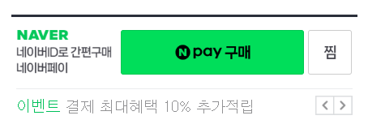

# 네이버페이 결제형 타입 셋업 가이드

네이버페이로 결제한 경우도 링크프라이스 실적 처리되어야 합니다. 사용중인 네이버페이 서비스타입에 맞게 가이드 선택하여 추가 셋업 해주시면 됩니다.

### 네이버페이 서비스 타입 확인

네이버페이는 아래와 같이 두 가지 서비스 타입으로 운영됩니다:

- **결제형**: 가맹점의 주문서에서 결제수단의 하나로 네이버페이 결제가 제공되는 타입
- **주문형**: 다음과 같은 가맹점의 상품 상세 페이지에 네이버페이 구매하기 버튼이 노출되는 타입

#### 주문형 연동 주의사항

주문형의 경우 **실적 연동이 어렵습니다**. 사용자가 네이버페이 사이트로 이동하여 결제하기 때문에, 광고주 사이트에서 트래킹이 불가능하여 연동에 제약이 있습니다.

관련 내용을 확인하시려면 [네이버페이 개발자 페이지](https://developer.pay.naver.com/introduce/naverpay)에서 확인해주세요.

## 1. 네이버페이 구매 실적처리

네이버페이 결제 완료 후 리턴 URL을 통해 광고주 결제 완료 페이지로 이동한다면, 네이버페이 결제 주문정보를 링크프라이스 실적 테이블(lpinfo 테이블)에 저장한 후 사용중인 셋업 버전에 맞게 실적처리 해주시면 됩니다.

* 실적 처리 방법은 셋업 버전별로 연동가이드를 참고해주세요.

  - [V2 버전](https://github.com/linkprice/MerchantSetup/blob/v2/Merchant%20Setup%20Guide_Kor_ver2.5.pdf) 

    작업내용: 실적 전송, 데일리픽스, 자동실적 취소

  - [V3 버전](https://github.com/linkprice/MerchantSetup/tree/v3/CPS) 

    작업내용: 실적 전송, 데일리픽스, 자동실적 취소 

  - [V4 버전](https://github.com/linkprice/MerchantSetup/tree/v4/CPS) 

    작업내용: 실적 전송, 실적 목록

- 셋업 버전을 모르는 경우 링크프라이스 담당자에게 연락주시면 됩니다. 
